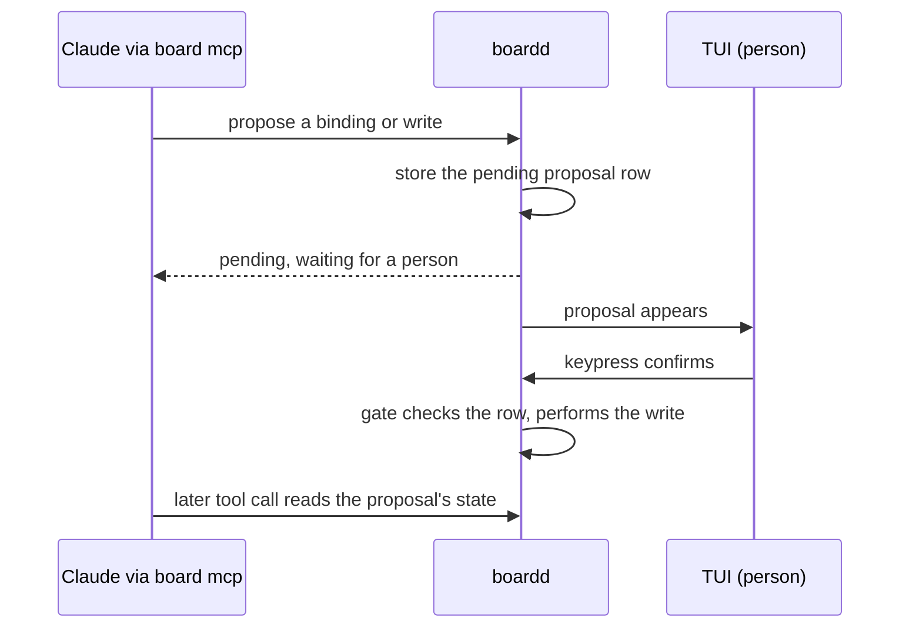

# Decision: the board owns the work store

**Status:** Proposed. Nothing described here is built.
**Date:** 2026-09-27
**Reopens:** [design.md](design.md) §9 item 7 ("No MCP — CLI only"), the "no MCP needed" line in §10, and the
"never writes … a plugin record or a SQLite row" contract in §13.

This record argues and decides. It does not plan the migration; a separate plan does that. The
open questions that plan must answer are at the end.

## Context

Two programs show the same Linear work, and they were never joined.

- **They group by different models.** The work plugin (`work@shrimpshack`) groups by `board.json`:
  4 levels (space, tab, column, row) by 8 fields (team, project, milestone, cycle, assignee, state,
  priority, parent), plus `label-group:<name>`, `ticket` and `sub-ticket`, with per-space
  overrides and a filter. The board groups on one flat axis (`LinearSnapshot.groups` in
  `crates/board-core/src/protocol.rs`), taken from a Linear custom view. A custom view cannot
  express the level-by-field model.
- **The wire between them ignores the plugin's own config.** boardd runs five plugin scripts
  (`crates/board-daemon/src/ops/linear.rs:29-33`, spawned at `:594`). The snapshot script hardcodes
  its mapping at shrimpshack `plugins/work/bin/work-snapshot.sh:419`
  (`"source": "default", "space": "project", "tab": "work", "pane": "session"`) and never reads
  `board.json`. So `board.json` drives the plugin's herdr sync, the script feeds the TUI, and
  nothing connects the two.
- **The store has four writers inside one plugin.** `~/.claude/work` holds `bindings`, `board`,
  `board.json`, `descriptions`, `layouts`, `scopes`, `shadow.log`, `workspaces` and
  `write-enabled`. Four separate record engines write it (shrimpshack `lib/record.sh`,
  `lib/repos.sh`, `lib/board-store.sh`, `lib/board-config.sh`), each with its own checks and a
  write-then-rename save, sharing one `mkdir` lock. `lib/board-sync.sh:82-115` adds a second lock.

Fixing the snapshot script to read `board.json` would close the display gap. It would also leave
two programs owning one set of data, which is the actual problem.

The original research planned for this step. [research.md](research.md) line 161 chose a tiny CLI
over MCP for v1 and said "MCP wrapper later"; line 160 said "JSON/md files race with concurrent
writers" and put SQLite behind a single daemon writer. This record is that "later" for MCP. Moving
the plugin's store into boardd goes further than line 161 did: it applies line 160's rule to data
that line 161 never covered.

## Decision

### One owner

boardd becomes the only owner and the only writer of the work store. The store's state becomes
rows in boardd's SQLite database (today schema v15, `schema.sql`), which holds no Linear data yet.
Nothing else writes those rows.

The board has three clients. None of them owns data:

| Client | Used by | Door |
|---|---|---|
| TUI | Shawn | the existing board socket |
| `board mcp` | Claude | a stdio MCP server that forwards to the board socket |
| `board` CLI | scripts and hooks | the existing board socket |

The herdr panes are where boardd dispatches work. They are not clients.

The CLI and its skill ([design.md](design.md) §10) stay. Scripts and hooks need a door that is not
MCP.

### The grouping model moves into the board

The board adopts the plugin's grouping model: 4 levels by 8 fields, per-space overrides, and a
filter. A Linear custom view becomes the fallback for a space with no grouping configured. It
stops being the source.

### Linear stays a direct GraphQL client

The board reads and writes Linear through its GraphQL API, with the API key from the macOS
Keychain, as the plugin does today (shrimpshack `lib/linear.sh`, `lib/secrets.sh`). It does not use
Linear's own MCP server. Those tools are shaped for agents (paginated, prose-shaped) and do not
guarantee the exact field set the grouping model needs.

### MCP is a door, not an owner

`board mcp` is a subcommand of the one `board` binary. It holds no state. It translates MCP tool
calls into board socket requests.

- **Finding it.** The user installs the server once, at user scope, for example
  `claude mcp add --scope user board -- board mcp`. Only the user can install it. The board writes
  no `.mcp.json` into the worktrees it creates. User scope covers every Claude session, including
  ones the board did not spawn, and a project file would need an approval per worktree and dirty
  every worktree.
- **Knowing who is calling.** An agent the board spawned already carries `HERDR_PANE_ID`,
  `BOARD_CARD_ID` and `BOARD_RUN_ID` in its environment, and `board mcp` inherits them. So a tool
  call arrives attributable to a card, a tab and a space by construction. The plugin does real work
  to discover this today. Paper and Open Design are GUI apps that are also MCP servers and default
  their tool calls to the user's current context; the board gets a stronger version because it
  started the agent. These variables are claims set by the caller, not proof: any process can set
  them. A rescued pane has an empty `BOARD_RUN_ID` on purpose, so its calls attribute to the card
  only.
- **Names.** MCP server and tool names avoid the word "linear". The plugin's PostToolUse hook
  matches `mcp__.*[Ll][Ii][Nn][Ee][Aa][Rr].*__.*` (shrimpshack `plugins/work/hooks/hooks.json`) and
  would fire on the board's own tools while the plugin is installed.

### Failure model

A stopped daemon is not an outage. `connect_or_start` (`crates/board-cli/src/daemon.rs:16-35`)
starts boardd when it is absent, by re-launching its own binary through `current_exe()`, not
through `PATH`. `board mcp` and any user-installed command that calls `board` get the same
behaviour. `board mcp` keeps stdout for the MCP stream and never prints through
`crates/board-cli/src/render.rs`.

The real failure is a missing or unfindable `board` binary. Then the MCP server does not start and
every command that calls `board` fails. Today the plugin works whether or not boardd is alive;
under this decision it does not work without the `board` binary.

### Consent

The plugin guards four kinds of write with a propose/confirm nonce: worktree, space and session
bindings; per-directory write consent (team, project, branch); per-space, per-field board consent;
and board questions. The code lives only in the plugin (shrimpshack `lib/record.sh:319-479`,
`lib/board-store.sh:370-456`, `lib/binding.sh:311`). The board has none today. So the board adopts
the nonce; it does not keep it.

A nonce handed back to the same caller orders a write. It does not prove a person saw it. The
plugin says so (shrimpshack `lib/binding.sh:12-27` and `:305-307`), and so does
[protocol.md](protocol.md) for `linear.bind_handoff`. Under MCP, Claude is the caller, so the
nonce alone would let Claude confirm its own proposal.

The decision:

1. Claude, through MCP, can **propose** a binding or a Linear write. boardd stores the proposal as
   a row and answers "pending, waiting for a person".
2. The TUI shows the pending proposal, built from the stored row: the exact write boardd will
   perform, not a summary the agent wrote.
3. A person confirms with a keypress in the TUI. boardd checks the row and performs the write.
4. No MCP tool confirms. No non-interactive CLI verb confirms.
5. The write gate lives in boardd, on the SQLite rows. The MCP tool list controls what Claude sees;
   it is not a security boundary. [design.md](design.md) §13 already says any client of the board
   socket can call any method.

Claude Code's own permission prompt is not the consent surface. A background agent auto-approves
it.

**What this guarantees.** An agent that uses only the board's tools (MCP and the skill) cannot
write Linear or change a binding without a person pressing a key in the TUI.

**What it does not guarantee.** A same-user agent with Bash that deliberately works around the
board can still write. The known bypasses:

- **herdr keystrokes.** Every pane the board dispatches can see the herdr socket
  ([herdr.md](herdr.md)). herdr can read any pane and send keys to it, including the TUI pane.
- **The board socket.** The TUI's keypress reaches boardd as an ordinary socket request. Any
  process running as the same user can send that request.
- **The keychain.** Any same-user process can read the Linear key and call Linear directly, never
  touching boardd.

The plugin accepts the same limit today. Closing it would need an OS-level presence check (such as
Touch ID) on every confirm, and on every read of the Linear key to close the third path. That
breaks unattended syncs, so it is rejected for now.

### Protocol changes stay additive

New fields are added, existing fields are never re-typed, and the version is bumped, so an older
client against a newer daemon sees a narrower result instead of failing to parse. This now applies
to boardd's own protocol ([protocol.md](protocol.md), v1).

The Linear document `schema` field stops being a cross-process contract once boardd reads Linear
itself; it matters only while the old plugin and the new board overlap. If that window needs a
schema bump, the two hard `schema != 1` rejects (`crates/board-daemon/src/ops/linear.rs:213` and
`:243`) must change together
([solution note](solutions/integration-issues/a-pinned-version-check-has-a-twin.md)). Any new
field that crosses a process boundary needs `Option<T>` or `null_as_empty`
([solution note](solutions/integration-issues/serde-default-rejects-explicit-null.md)). Today
`LinearGroup` and the snapshot types have neither.

## What this retires

- `plugins/work/bin/work-snapshot.sh` and its hardcoded mapping, and the four other bin scripts
  boardd runs (`work-spaces.sh`, `work-projects.sh`, `work-views.sh`, `work-issue.sh`).
- The cross-repo fixture contract: the vendored documents under
  `crates/board-core/tests/fixtures/linear-snapshot/` and `linear-issue/`, and the sha256 `VERSION`
  pin that both repos assert ([design.md](design.md) §13, "Fixture contract").
- Display parity as a wire problem. The TUI and Claude read the same rows at the same moment,
  instead of the TUI reading a script's output.
- The four record engines and both locks in `~/.claude/work`.
- The plugin's bash-only test gates, including the library-sourcing gate (shrimpshack PR #94), which
  exist because bash has no imports.
- In [design.md](design.md) §13: "The board never moves a card, edits an issue, or writes a Linear
  object, a plugin record or a SQLite row", "the daemon has no row for it", and "`board_changed`
  events are ignored, since no board row can change".

## Consequences

- **Test cost.** The plugin's suite is 38 bats files, 18,582 lines and 1,303 tests. Roughly 900 to
  1,000 behaviours are worth porting to Rust; the rest become obsolete with the bash. The per-class
  inventory is in [board-owns-the-store-tests.md](board-owns-the-store-tests.md).
- **One binary on the path.** Every door depends on the `board` binary being installed and
  findable.
- **Unattended writes wait for a person.** A background agent can propose, but a Linear write or a
  binding waits until someone opens the TUI and confirms.
- **The plugin shrinks.** Its hooks stay Claude Code hook scripts, made thin: they call `board`.

## Rejected options

- **Make `work-snapshot.sh` read `board.json`.** Fixes the display gap and keeps two owners of the
  same data.
- **Keep the store as JSON with boardd as the only writer.** Keeps four file formats and the lock
  logic for no benefit over the database boardd already owns.
- **The plugin and the board both writing the store.** Two writers on one store is the failure mode
  this record exists to design out.
- **MCP as a second owner of anything.** The MCP server holds no state.
- **Linear's MCP server as the board's Linear client.** Does not guarantee the fields the grouping
  model needs.
- **Claude Code's permission prompt as the consent surface.** A background agent auto-approves it.
- **An OS presence check on every confirm.** Stronger, but adds migration work and still leaves the
  keychain path open unless every key read needs it too.
- **A `.mcp.json` written into each worktree.** Needs an approval per worktree and dirties every
  worktree; user scope covers every session.

## Related

A small board status pane built on Claude Code function hooks (current card, run elapsed, agents
running, pending proposals) is a separate proposal. It overlaps this record in one place: the
pending proposals in the consent flow are what such a pane would show.

## Open questions for the migration plan

- Where user-authored grouping config lives: rows in SQLite, or a section of the board's existing
  TOML config (`RootConfig` in `crates/board-core/src/config.rs`). State is SQLite either way; this
  is only about the hand-edited mapping.
- Cut-over: whether the plugin reads through the board during a transition, or the move ships in one
  release.
- Which plugin hooks (`ground`, `board-behind`) stay as thin bash calling `board`, and which
  disappear.
- The plugin's herdr fakes disagree: `tests/fixtures/fake-herdr.sh` reports herdr 0.8.2 / protocol
  20 in its status output but 0.9.0 / protocol 22 in its canned snapshot, while
  `tests/fixtures/fake-herdr-socket.py` pins 0.9.0 / protocol 22. Which ported tests inherit which,
  given boardd accepts only 0.9.0 / protocol 22.
- What happens to a pending proposal when no TUI is open: how long it waits, and how the person
  learns it exists.
