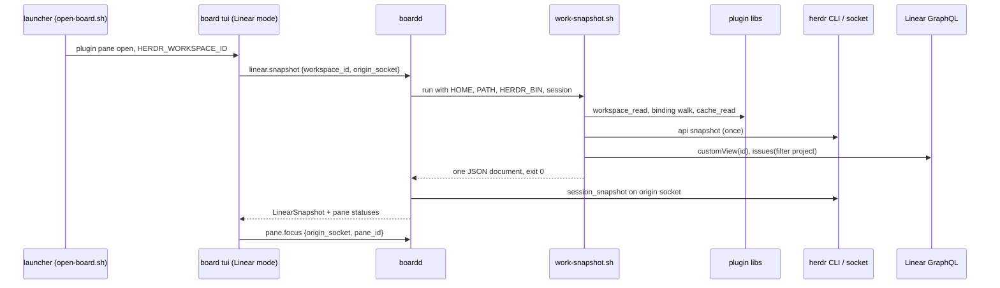
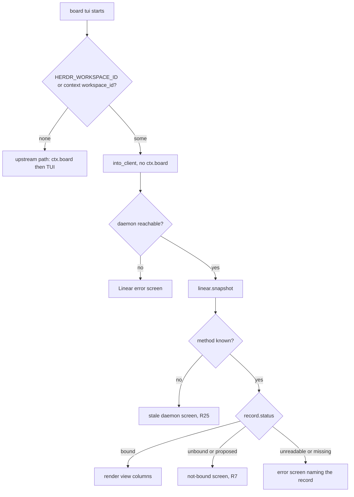
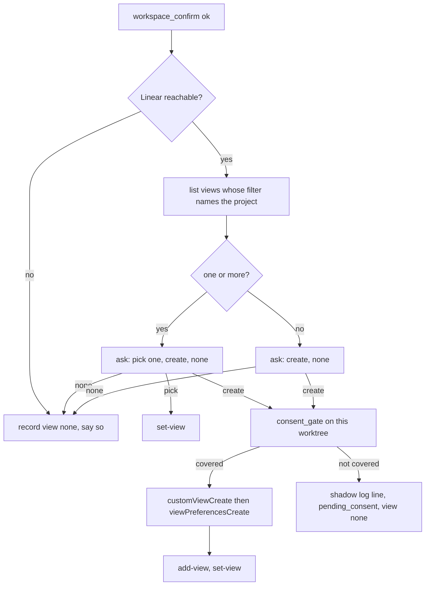
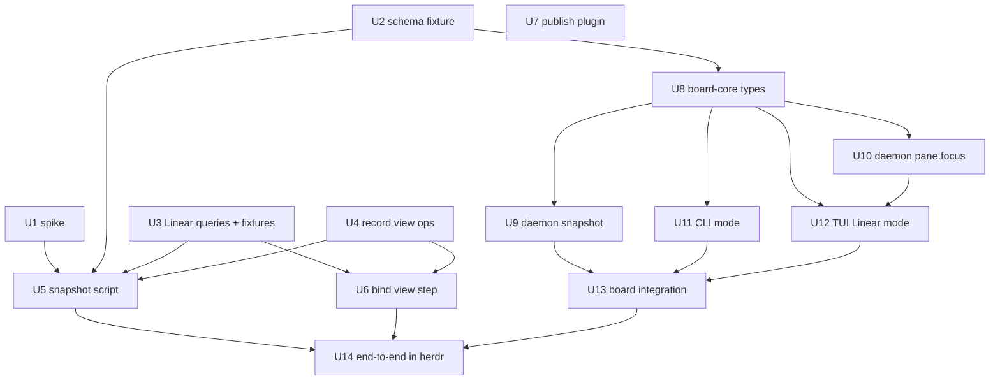

# herdr-board as a Linear view of the work plugin - Plan

**Target repos:** two. `herdr-linear-board` (this repo, branch `feature/herdr-board-work-interface`) holds the board. `shrimpshack` holds the work plugin under `plugins/work/`; its units land on a new branch off `feature/work-plugin-config`. Every path below is repo-relative; each unit names its repo.

## Goal Capsule

- **Objective:** A person who opens the board inside a herdr space sees that space's Linear project as a board: the issues of the chosen Linear view in the view's columns, each issue with its worktree, its recorded tab and panes, and the live agent status of those panes. The board never changes Linear, the plugin's records, or the herdr layout.
- **Means:** One read-only snapshot script in the work plugin, run by the board daemon, feeds a Linear mode in the existing board TUI (KTD1, KTD3).
- **Authority hierarchy:** the Requirements own product behaviour. Key Technical Decisions own mechanism inside those requirements. Units override neither.
- **Stop conditions:** stop and report if the spike (U1) shows herdr cannot tell the snapshot which session to read, or if the board cannot be started in Linear mode without writing a SQLite project row. Both invalidate a Key Technical Decision rather than a unit.
- **Execution profile:** two tracks in two repos, joined by one JSON contract (U2). The plugin track lands first as a PR against `feature/work-plugin-config`; the board track lands as a PR against `main` of this repo.
- **Finishes and ships:** Shawn reviews each PR. The board PR is verified inside a real herdr overlay pane before it is marked ready (U14).

---

## Product Contract

### Summary

The board fork becomes a read-only Linear view of the herdr space it opens in. The work plugin gains one snapshot script that prints everything the board needs for one space, and a view choice at bind time so a space's columns come from a Linear custom view. Outside a bound space the upstream board is unchanged.

### Problem Frame

The work plugin records how Linear work maps onto herdr: a space is bound to a project, a tab is one ticket, a pane is a session. Nothing renders that state; it lives in JSON records under `~/.claude/work/` and a shadow log. The fork of `nelsonPires5/herdr-board` is a kanban that already opens as a herdr overlay pane, but it owns its own cards, columns and runs in SQLite, dispatches agents itself, and labels tabs `card-<id>`. Two systems each believe they own the same space. The handoff named six collisions: source of truth, tab convention, scope key, placement, write authority, and upstream stance. The grilling session settled all six; this plan builds the result.

### Key Decisions

- **The board is a view. Every write stays in the work plugin.** (session-settled: user-approved — chosen over a controller in v1: a view is the missing surface and the write boundary drawn now keeps every later action a plugin verb.) Governs R1, R2, R3, R20, R21.
- **A card is the Linear entity at the tab level of the mapping. Today that is an issue.** (session-settled: user-directed — chosen over "issue" fixed in code: Part B of the config plan makes the mapping configurable, and the board must follow it.) Governs R4, R9.
- **Columns come from a Linear custom view recorded on the space at bind time.** (session-settled: user-directed — chosen over a plugin-owned group-by enumeration: Linear already stores filter and board layout on a view, so the plugin invents no vocabulary.) Governs R5, R6, R14, R15.
- **Version one runs on the default mapping, which the snapshot reports as a constant.** (session-settled: user-directed — chosen over waiting for the config plan's Part B or a board-side mapping reader: the default is the only mapping that exists today.) Governs R9, R10.
- **This board and the work plugin's layout mirror are separate products.** The plugin's new Part B ("Herdr Linear Board", shrimpshack `docs/plans/2026-09-14-1322-feat-herdr-linear-board-plan.md`) makes herdr's own layout a two-way mirror of Linear with its own mapping and filter. This board does not read that mapping, does not place, move or close panes, and shares only the workspace record keys and the plugin test harness with it. (session-settled: user-directed — chosen over pausing this plan to re-plan it as the mirror's surface, and over building this plan first and letting the mirror adapt: two independent features, coordinated only on shared files.) Governs R2, R9, R24.
- **Inside herdr with no workspace binding the board shows a not-bound screen and the way to bind. Outside herdr the upstream board runs unchanged.** (session-settled: user-directed — chosen over falling back to the upstream board inside herdr: the fallback writes an upstream project row for a herdr space and hides that the space is unbound.) Governs R7, R8.
- **Tabs and panes on a card come from the binding record only. Nothing is inferred from a pane's directory.** (session-settled: user-directed — chosen over inference by pane cwd labelled "inferred": the plugin rule is that a binding is the only authority for a tab.) Governs R13.
- **No dispatch and no board-made tabs or panes in version one.** (session-settled: user-approved — chosen over keeping dispatch with the plugin's tab scheme, or routing it to the plugin now: both are the controller step that comes later.) Governs R3, R20.
- **The snapshot is the plugin's, and Linear is reached only through the plugin.** (session-settled: user-approved — chosen over Rust parsing the records or a board-side Linear client: one client, one credential, one cache, and the binding rules stay in one place.) Governs R11, R12, R16.

### Requirements

**Board: mode and identity**

- R1. When the board starts in a herdr pane whose space has a bound workspace record, it runs in Linear mode and renders that space.
- R2. In Linear mode the board sends no write to Linear, to the plugin's records, or to the herdr layout. Focusing an existing pane is the one herdr call it makes.
- R3. In Linear mode the card-owning verbs (create, edit, duplicate, delete, move, comment, run, dispatch) are refused, and the daemon has no row to mutate for a Linear-mode board.
- R7. When the board starts in a herdr pane whose space has no bound workspace record, it shows a not-bound screen naming the space and the `/work:bind` command, and it makes no Linear call and writes no SQLite project row.
- R8. When the board starts outside herdr, the upstream board runs unchanged.
- R17. In Linear mode the board never sets the pane title, so the launcher's open-or-focus toggle keeps working.

**Board: rendering**

- R4. Each card is one issue that the recorded view's filter admits, with its title, identifier, state, assignee, and priority as the view lists them. With no usable view, every issue of the project that is not canceled is listed.
- R5. Columns are the groups of the recorded Linear view, in the view's column order, with hidden columns omitted. The board renders groupings by workflow state, assignee, priority, label, and project. A view with any other grouping renders as the fallback columns of R6 with a header note naming the grouping, and the document marks it `view.status: unsupported_grouping`.
- R6. When the record names no usable view, columns are the workflow states of the project's team, and the header says a view can be chosen with `/work:bind`. A project that spans teams uses the first team's states and says so in the header.
- R9. The board reads the mapping from the snapshot, which reports the default mapping as a constant. A mapping other than the default, if a later snapshot ever reports one, renders as the default with a header warning.
- R13. A card lists the tabs and panes recorded on its binding, and each pane shows its live agent status or `unknown`. A card with no recorded tab says so in place of the pane list.
- R18. Live tabs of the space that belong to no card are listed as an unmapped group with the binding state that explains them.
- R19. A partial snapshot renders as partial: each unavailable source is named in the header, and the last good snapshot stays on screen when a refresh fails.

**Board: actions**

- R20. From a card the person can focus one of its panes, open the issue in Linear, and copy its worktree path. No other action exists in Linear mode.
- R21. Refresh is manual. A refresh while one is in flight is dropped with a toast, and daemon board-changed events do not trigger a refresh in Linear mode. The one automatic refresh is the daemon reconnect signal, which fires after a daemon restart.

**Snapshot contract**

- R10. The snapshot is one JSON document per space, printed by a plugin script that takes the space id as an argument.
- R11. The document carries the mapping, the binding state of the space, the project, the view and its layout, the issues grouped as the view groups them, and per issue its worktree bindings with their states and recorded tabs and panes.
- R12. Every source in the document (record, linear, herdr, mapping, view) carries its own status: `ok`, `unavailable`, `unknown`, or `missing`. Exit 0 means a document was printed, never that every source was reachable.
- R16. A missing Linear credential prints a document with Linear marked unavailable and never reaches curl as an empty value.
- R22. Every string the document carries from Linear or herdr is sanitised before it is printed.

**Plugin: records and bind flow**

- R14. During `/work:bind`, after the space is bound, the person chooses a Linear view for the space from the views whose filter names the project, or none. The choice is recorded on the workspace record without changing the record's version.
- R15. The person can ask the plugin to create a view for the project. The create passes the consent gate. With no recorded consent it is written to the shadow log and nothing reaches Linear.
- R23. Running `/work:bind` in an already-bound space offers only the view step.

**Compatibility**

- R24. Upstream plugin id, binary name, SQLite schema version, and the herdr 0.9.0 / protocol 22 pins do not change.
- R25. A daemon that does not know `linear.snapshot` is reported as older than the board, naming the missing method and the command to restart it, instead of an opaque error. When the daemon and board versions also differ, both versions are shown; they are equal whenever both were built from the same release, so the missing method is the detector.

### Key Flows

- F1. Open in a bound space
  - **Trigger:** the launcher opens the board as an overlay pane in a space with a bound workspace record.
  - **Steps:** the board reads its space id from the environment, connects to the daemon, asks for the snapshot, renders the view's columns, then reads live pane status.
  - **Outcome:** the board for that project. Covered by R1, R4, R5, R13.
- F2. Choose a view at bind
  - **Trigger:** `/work:bind` confirms the workspace binding.
  - **Steps:** the plugin lists views whose filter names the project, asks the person to pick one, create one, or choose none, records the answer, and runs the consent gate only for a create.
  - **Outcome:** the workspace record names a view or none. Covered by R14, R15, R23.

### Acceptance Examples

- AE1. Bound space with a recorded board view.
  - **Covers:** R1, R4, R5, R13
  - **Given** a space bound to project P, a workspace record naming view V with layout board grouped by workflow state, and one issue with a binding that records tab T and pane X
  - **When** the board opens in that space
  - **Then** the columns are V's workflow states in V's order, the issue is a card in its state's column, and the card lists tab T and pane X with X's live agent status.
- AE2. Unbound space.
  - **Covers:** R7
  - **Given** a herdr space with no workspace record
  - **When** the board opens in that space
  - **Then** a not-bound screen names the space label and `/work:bind`, no Linear request is made, and the SQLite projects table gains no row.
- AE3. Outside herdr.
  - **Covers:** R8
  - **Given** no `HERDR_WORKSPACE_ID` and no plugin context in the environment
  - **When** `board tui` starts
  - **Then** the upstream board for the current directory opens exactly as before.
- AE4. Linear unavailable, cache warm.
  - **Covers:** R12, R19
  - **Given** a bound space and a Linear endpoint that returns a network error
  - **When** the board opens
  - **Then** the document carries `linear.status: unavailable`, cards render from the cache with a stale marker, and the header names Linear as unavailable.
- AE5. Plugin not installed.
  - **Covers:** R12, R19
  - **Given** no resolvable plugin root
  - **When** the board opens in a bound space
  - **Then** an error screen names the paths that were tried and the install step, and the board stays in Linear mode.
- AE6. Pane gone since the snapshot.
  - **Covers:** R20
  - **Given** a card whose recorded pane no longer exists
  - **When** the person focuses that pane
  - **Then** a toast says the pane is closed and suggests a refresh, and nothing else changes.
- AE7. Existing view chosen at bind.
  - **Covers:** R14
  - **Given** two views whose filters name project P
  - **When** `/work:bind` reaches the view step and the person picks the second
  - **Then** the workspace record carries that view's id and name, `version` stays 1, and no Linear write occurs.
- AE8. View create without consent.
  - **Covers:** R15
  - **Given** no recorded consent for the current worktree
  - **When** the person asks to create a view
  - **Then** the shadow log gains a line describing the create, the record gains no view, and Linear receives no mutation.
- AE9. Bound, no usable view.
  - **Covers:** R6
  - **Given** a workspace record with no view, or a view that Linear reports as not found
  - **When** the board opens
  - **Then** columns are the team's workflow states, and the header says no view is chosen.
- AE10. Stale daemon.
  - **Covers:** R25
  - **Given** a running daemon built before the snapshot method existed
  - **When** the board asks for a snapshot
  - **Then** the screen says the daemon lacks `linear.snapshot` and is older than the board, and names `board daemon stop`.
- AE11. Mutating verb in Linear mode.
  - **Covers:** R3
  - **Given** a board in Linear mode
  - **When** the driver receives a card-create effect
  - **Then** the effect is refused before any request leaves the process, and the daemon receives nothing.
- AE12. Missing credential.
  - **Covers:** R16
  - **Given** no keychain entry and no secrets file
  - **When** the snapshot script runs
  - **Then** it prints a document with `linear.status: unavailable`, exits 0, and the curl stand-in records no call.

### Scope Boundaries

- Controller verbs (start work from a card, move a card, comment) are later work. The write boundary is drawn now so they arrive as plugin verbs.
- The board does not create views. The plugin does, through the consent gate.
- No herdr version bump: the board keeps the 0.9.0 / protocol 22 pins.
- No rename of the plugin id or binary.
- No picker of bound spaces outside herdr.
- Focus pane and open issue URL are human-only actions; they are not plugin verbs.
- The work plugin's layout mirror (its Part B) is a separate product. This board never places, moves, or closes panes, never reads the mirror's mapping or filter, and does not wait for it.
- Only `board tui` has a Linear mode. CLI verbs such as `board card list` keep the upstream scope rule in every environment, including a bound herdr pane.

#### Deferred to Follow-Up Work

- Backfill `tab` on existing binding records. Every live binding today has no tab, and a tab is recorded only when the plugin opens the session (`/work:new`, or `/work:start` with `HERDR_LINEAR_OPEN_SESSION=true`), so cards for work started any other way show no panes until then. The backfill is plugin work and needs its own consent story.
- A standalone change-view verb and a create-view verb outside bind. Version one changes the view by re-running `/work:bind` (R23).
- Deleting a view the plugin created. `created_views` records ownership; no verb removes a view yet.
- Rendering a non-default mapping. No plugin surface reports one today; the config plan's Part B that would have added a per-space mapping is superseded.
- Live refresh from records or herdr events.
- A CHANGELOG entry in the fork. The docs gate `scripts/tests/test_docs.py:28-30` requires every unreleased entry to link an upstream PR, so the fork leaves `[Unreleased]` untouched and the PR body carries the change note.

### Outstanding Questions

None blocking. Deferred to implementation:

- How the `herdr` CLI selects a session when several run, and whether it honours `HERDR_SOCKET_PATH` from the environment or only a `--session` flag. U1 answers it before U5 is written; the answer decides whether the plugin gains a session setting (U5) or the daemon passes the socket path (KTD10).
- The session building the plugin's Part B has confirmed: every new workspace-record key lands under `version: 1` with no constant bump, the superseded Part B of the config plan is being marked as such, and that branch publishes nothing before this plan's plugin PR merges.
- Whether `viewPreferencesCreate` accepts the field names that `ViewPreferencesValues` exposes on read. U3's probe answers it against a throwaway view.
- The exact `preferences` keys the board must read for `columnOrderBoard` and `hiddenColumns` when a view was never opened in board layout. U3 records what the API returns.
- Whether the no-view fallback of R6 should also hide completed issues. R4 lists every non-canceled issue, so a Done column exists; U14 shows whether that reads as noise, and the answer is a one-line change to the fallback filter.

### Sources / Research

- `docs/handoff.md` — the brief that framed the six collisions.
- `docs/design.md` (Scope selection) and `docs/herdr.md` — the board's current scope rule and herdr contract.
- shrimpshack `CONCEPTS.md` — Binding, Unbound, Misplaced, Stale, Mapping, Scheme. The snapshot uses these names.
- shrimpshack `docs/plans/2026-09-13-1146-feat-work-plugin-config-plan.md` — Part A landed (draft PR #83, "Work plugin configuration, Part A"); its Part B is superseded. KTD6 there ("own version constant") is corrected by KTD6 here.
- shrimpshack `docs/plans/2026-09-14-1322-feat-herdr-linear-board-plan.md` — the plugin's layout mirror, a separate product; read for the shared-file boundary only.
- shrimpshack `docs/plans/2026-09-11-0753-refactor-ticket-derived-worktree-location-plan.md` KTD13 — a binding is the only authority for a space or tab.
- Linear GraphQL introspection (2026-09-14): `CustomView.filterData` holds the filter; `viewPreferencesValues` holds `layout`, `issueGrouping`, `columnOrderBoard`, `hiddenColumns`; `customViewCreate` then `viewPreferencesCreate` create a board view.
- shrimpshack `docs/solutions/logic-errors/a-tally-keyed-on-exit-status-reports-work-that-never-happened.md` — per-section status, not one exit code.
- shrimpshack `docs/solutions/logic-errors/exporting-an-empty-credential-is-worse-than-exporting-none.md` — the credential guard in R16.
- shrimpshack `docs/solutions/best-practices/default-deny-for-an-unattended-agent.md` — the closed allow sets in KTD8 and KTD11.

---

## Planning Contract

### Key Technical Decisions

- KTD1. **One snapshot script in the plugin, run by the board daemon.** `plugins/work/bin/work-snapshot.sh` is the third `bin/` script and copies the shape of `bin/linear-cache-refresh.sh` (lib dir from its own path, `set -uo pipefail`, credential to curl on stdin). The daemon runs it and the TUI never does. An agent in a session can run the same script, so context parity needs no second path. (session-settled: user-approved — chosen over Rust parsing the JSON records: the mapping and binding rules live in the plugin and would drift the day Part B lands.)
- KTD2. **The board identifies its space from `HERDR_WORKSPACE_ID` first, then `HERDR_PLUGIN_CONTEXT_JSON.workspace_id`, never from a directory.** herdr exports the id into every pane it owns (verified in this session's pane); the plugin context is set only by `plugin pane open` and every field there is nullable. `BOARD_SCOPE_PATH` is ignored in Linear mode with a note on stderr.
- KTD3. **Mode is decided in the CLI before `ctx.board()`.** `crates/board-cli/src/main.rs:102-105` persists a project row for the cwd before the TUI exists. With a space id present the CLI goes straight to `into_client()` and Linear mode, and every later failure renders inside Linear mode. There is no fall-through to the upstream board once a space id was read.
- KTD4. **The SQLite schema stays at v15 and Linear mode writes no rows.** Selection and recents are keyed by project and board ids (`schema.sql:40-72`), which a Linear-mode board never has. (session-settled: user-approved — chosen over removing the store or caching plugin state in it; the settled wording "reduced to layout, selection, recents" is sharpened here: upstream pins v15 in `schema.sql`, `crates/board-core/src/db/migrations.rs:11`, `crates/board-core/tests/db/migrations.rs:46` and `scripts/tests/test_docs.py:147`, so any table change costs a migration on every merge and buys nothing.)
- KTD5. **Thin adapter: new files plus additive edits.** New `crates/board-daemon/src/ops/linear.rs`, new `crates/board-tui/src/app/linear.rs` and `crates/board-tui/src/view/linear.rs`, additive DTOs in `crates/board-core/src/protocol.rs`, one `Deserialize` extension in `crates/board-core/src/scope.rs`, one branch in `main.rs`, and edits to `HELP_KEYS` with its contract tests. Everything else upstream owns stays byte-identical. (session-settled: user-approved — chosen over a hard fork: upstream shipped v0.17.0 yesterday and stays mergeable.)
- KTD6. **The view lands on the workspace record as new keys; the record version does not move.** The loader in `plugins/work/lib/binding.sh:144-184` returns ABSENT when `version` exceeds 1, and unknown keys round-trip. A new `_py` op `set-view` writes `view: {id, name, layout, fetched_at}` and `add-view` appends to `created_views`; both are reached through `_mutate_at` like `workspace_propose`. (session-settled: user-approved — the settled wording "under its own version constant" cannot work for this record family; the precedent it cited, `lib/repos.sh`, is a separate family with its own reader.)
- KTD7. **Per-section status inside the document, closed exit-code table outside it.** Exit 0 means a document was printed. Exit 2 means the argument was refused. Exit 3 means herdr answered and listed no such space while no record exists. With no record and no herdr answer the script cannot tell an unknown id from an unbound live space, so it prints an unbound document with `herdr.status: unavailable` and exits 0. Any other exit means the script crashed and printed nothing. The daemon renders a partial document as partial and never reads exit 0 as complete.
- KTD8. **Mutating verbs are refused in Linear mode by a closed allow set of driver effects.** In Linear mode the driver executes only `Refetch`, `LinearSnapshot`, `FocusPane`, `OpenIssueUrl`, `CopyWorktreePath`, and screen navigation; every other effect is refused with a toast before a request is built. The daemon guarantee is structural: a Linear-mode board holds no board or card id, so no mutating method can name a row. A mutation test proves the allow set is load-bearing. (see research: research-learnings.md — hiding keys is decoration; the refusal is the gate.)
- KTD9. **Plugin root resolution: `BOARD_WORK_PLUGIN_ROOT` env, then `[daemon] work_plugin_root` in the board TOML, then the `user`-scope record of the `work@shrimpshack` list in `~/.claude/plugins/installed_plugins.json` (each plugin holds a list of scope, installPath and version records) and its `installPath`.** The daemon reads `.claude-plugin/plugin.json` at the resolved root and refuses a version below the floor this board needs, naming both versions. The installed copy on this machine is 0.1.0 and lacks the script, so end-to-end verification (U14) points `BOARD_WORK_PLUGIN_ROOT` at the plugin worktree and U7 republishes after the plugin PR merges.
- KTD10. **The daemon runs the script with a held child handle, a budgeted deadline, and a prefix-filtered environment; the TUI calls it from a worker thread.** The child pattern is `crates/board-daemon/src/session.rs:136-190` (piped and drained stdout and stderr, `try_wait` loop, kill and reap on timeout). The daemon sets `HERDR_LINEAR_TIMEOUT_SECONDS` and `HERDR_LINEAR_RETRY_MAX` in the child environment so the script's worst case is bounded: with the plugin defaults one rate-limited query costs 25.5 seconds (`lib/linear.sh:39-47`) and the script makes two Linear calls, so the defaults do not fit any sane deadline. The daemon derives the deadline from the values it sets plus the herdr calls plus a margin, and the arithmetic is written in `ops/linear.rs`. The child environment is `HOME`, `PATH`, the origin session (socket path or name, per U1), every `HERDR_LINEAR_*` and `LINEAR_*` variable present in the daemon's environment, and `HERDR_BIN` only when `HERDR_BIN_PATH` is non-empty and names an existing regular file (the plugin's resolver treats a set but unusable override as no herdr at all and never falls through to `PATH`, `plugins/work/lib/herdr-read.sh`); everything else is dropped. `ops/linear.rs` logs neither the child's argv nor its environment at any level. Forwarding by prefix keeps KTD1's parity claim: the script sees the same settings whether the daemon or an agent runs it. On the TUI side the snapshot worker owns its own `UnixClient` opened from `reconnect_path()`, exactly as the subscription supervisor does (`crates/board-tui/src/runtime.rs`), because the driver's `Box<dyn BoardClient>` carries no `Send` bound; it delivers a new subscription signal carrying the snapshot result on the existing channel. The reducer in `app/linear.rs` owns the in-flight flag and the requested and arrived messages, so the one-in-flight rule and the dropped-refresh toast do not depend on the transport. When the client has no reconnect path (the fake tier), the driver runs `linear.snapshot` synchronously and feeds the same arrival message. `UnixClient` has no request read timeout (`crates/board-core/src/client/unix.rs`), so a synchronous production call would freeze the TUI for the whole deadline.
- KTD11. **View create is one more named consent-gate site; the write bound does not widen.** `herdr_linear::write_allowed` (`plugins/work/lib/linear.sh:340-363`) permits the bound issue and `created_children` today and stays so: the create goes through the gate, not through the bound, and `created_views` is recorded for the follow-up change-view verb, which adds the `customViewUpdate` allow by name when it first calls it. The bind skill gates the create against the worktree directory the person stands in and its question names the create as a Linear write. The seventh call site needs the seventh named red test in `plugins/work/tests/run-tests.sh:481-488`.
- KTD12. **Views are matched to a project by filter, not by a field.** `CustomView` has no project field for issue views. A view belongs to project P when `modelName` is `Issue` and `filterData` contains `project.id.in` with P. Create uses `shared: false` and preferences `type: user`, the smallest blast radius.
- KTD13. **Live pane status is a second read after the snapshot, best effort.** The daemon calls `session_snapshot()` on the origin socket and maps pane ids through `crates/board-daemon/src/herdr_snapshot.rs:14`. When `Daemon.herdr` is `None` (the CLI test daemon) every status is `unknown`.
- KTD14. **Focus is a new daemon method `pane.focus` modelled on `pane.set_title`.** `run.focus` needs a `runs` row (`crates/board-daemon/src/rescue.rs:26-29`). The new method takes the origin socket and a pane id and trusts the socket from the caller exactly as `pane.set_title` does, after `normalize_socket` and `connect_checked`; only the caller knows which herdr it runs inside, and the daemon has no run row to compare against. `pane_get` on that socket is the liveness and membership check: a pane from another session reads as gone.
- KTD15. **The snapshot fixture is the contract between the repos.** `plugins/work/tests/fixtures/snapshot/` holds the canonical documents. The board vendors copies under `crates/board-core/tests/fixtures/linear-snapshot/` (the board repo keeps fixtures per crate, never at the root). A `VERSION` file in the board copy records the plugin version and a sha256 per fixture file; a board test asserts the on-disk fixtures match the hashes, and the plugin's `snapshot.bats` asserts the same hashes from its side, so drift is a failing test rather than a reviewer's eye.

### High-Level Technical Design

Components and the read path:



Mode detection in the CLI:



The snapshot document, directional:

```json
{
  "schema": 1,
  "workspace": {"id": "wR", "label": "AI-Editor", "live": true},
  "mapping": {"status": "ok", "space": "project", "tab": "work", "pane": "session", "source": "default"},
  "record": {"status": "ok", "state": "bound", "project_id": "…"},
  "project": {"id": "…", "name": "Cue MVP Launch", "team_key": "AI", "url": "…"},
  "view": {"status": "ok|none|not_found|archived|unreadable", "id": "…", "name": "…",
           "layout": {"grouping": "workflowState", "column_order": ["…"], "hidden": ["…"]}},
  "linear": {"status": "ok|unavailable", "cache_age_seconds": 0},
  "herdr": {"status": "ok|unavailable", "session": "…"},
  "groups": [{"key": "…", "label": "In Progress", "issues": ["AI-308"]}],
  "issues": {"AI-308": {"identifier": "AI-308", "title": "…", "url": "…", "state": {"name": "…", "type": "started"},
             "assignee": "…", "priority": 2,
             "bindings": [{"worktree_path": "…", "state": "bound|proposed|misplaced|stale|worktree_missing",
                           "tab": {"id": "wR:t3", "label": "AI-308"}, "panes": ["wR:p7"]}]}},
  "unmapped": [{"tab_id": "wR:t1", "label": "shell", "reason": "no_binding|misplaced|unbound|stale", "panes": ["wR:p2"]}]
}
```

Bind-time view choice:



Linear mode refusal (KTD8), directional:

```text
on effect in Linear mode:
  if effect in {Refetch, LinearSnapshot, FocusPane, OpenIssueUrl, CopyWorktreePath, navigation}: execute
  else: toast "not available in Linear mode"; never build a request
```

### Implementation Constraints

Board repo (`herdr-linear-board`):

- Gates: `cargo fmt --all --check`, `cargo clippy --workspace --all-targets --all-features -- -D warnings`, `cargo test --workspace --all-features`, `python3 -m unittest discover scripts/tests`. `AGENTS.md` asks for `./scripts/sandbox.sh gates`; Docker is not running on this machine, so host `cargo test` is the documented exception and the PR says so.
- A new daemon method fails `crates/board-daemon/src/ops/tests/parity.rs` until `FakeBoardClient` implements it (`crates/board-core/src/client/fake.rs`).
- `view::HELP_KEYS` is frozen by `crates/board-tui/tests/interaction_contract.rs` and checked by `tests/help.rs`; every new or hidden key updates both.
- `scripts/tests/test_docs.py` pins the `docs/README.md` contract table, the schema version string, and the CHANGELOG link shape; `docs/protocol.md` has no gate, so its new rows are a reviewer check.
- Commits follow Conventional Commits grouped by crate (`feat(daemon):`, `feat(tui):`). Versions are never bumped by hand.
- Comment density upstream is high. New code follows the why-only bar and does not match it.
- The divergence set is closed. Upstream-owned lines this plan edits: the `routes!` table (`crates/board-daemon/src/ops/mod.rs:52-115`), `KNOWN_UNIMPLEMENTED` (`crates/board-daemon/src/ops/tests/parity.rs`), `fake_methods!` (`crates/board-core/src/client/fake.rs`), `HELP_KEYS` with `interaction_contract.rs` and `help.rs`, `docs/protocol.md`, `crates/board-cli/src/main.rs:102-105`, `crates/board-core/src/scope.rs:11-14`, the `Effect` and `Screen` enums, the `Driver` constructor, the `App` struct, and the `docs/README.md` contract table. Also touched, per the units: `crates/board-daemon/src/settings.rs`, `crates/board-core/src/config.rs`, `crates/board-cli/src/context.rs`, `crates/board-tui/src/runtime.rs`, `crates/board-tui/src/driver/dispatch.rs`, `crates/board-tui/src/driver/load.rs`, `crates/board-tui/src/testkit.rs`, `crates/board-tui/tests/snapshots.rs`. No other upstream file changes. Each is a rebase site on every upstream release.

Plugin repo (`shrimpshack`, `plugins/work/`):

- The whole gate is `bash plugins/work/tests/run-tests.sh all`, run through `~/.claude/tools/honest-run/run.sh --expect PASS`.
- `HERDR_LINEAR_MIN_SUITES` is 22 at `plugins/work/tests/run-tests.sh:41`. `snapshot.bats` (U5) raises it to 23 and `views.bats` (U6) to 24, each in the commit that adds the file. Part B's `config.bats` adds one more; whichever branch lands second rebases and re-bumps.
- Every new `.bats` file loads `setup_common`, requires bats 1.5.0, and uses `refute_match` instead of negated assertions.
- `skill_lib_sync_check` covers skills and commands only. The snapshot script's sourcing is pinned by running it under the fakes.
- `identifier_path_check` globs `bin/*.sh`: any path segment built from a variable calls `is_safe_identifier` in the same function.
- `consent_mutation_check` derives the list of consent sites from `lib/`; the seventh site needs its named entry in `expect` at `run-tests.sh:481-488`.
- Any `${HERDR_LINEAR_*:-}` read under `lib/` needs a row in `plugins/work/docs/settings.md`; reads inside `bin/` are exempt.
- `brand_scan`: no organisation name anywhere, fixtures included.
- The rubric block in every skill stays byte-identical (`rubric_sync_check`).
- Fake Linear routes any body containing `project(id:` to the teams shape (the `project(id:` arm of the body router case statement in `tests/fixtures/fake-linear.sh`); the issue listing must not use that spelling.

### Assumptions

- herdr 0.9.0 exports `HERDR_WORKSPACE_ID` into a pane opened by `plugin pane open`, as it does into this session's pane. U1 confirms it.
- The `herdr` CLI can be pointed at the origin session from the daemon's child environment. U1 confirms the mechanism; if none exists, herdr sections are `unknown` whenever the origin session is not the default and R13 degrades to `unknown` status.
- `viewPreferencesCreate` accepts `layout` and `issueGrouping` under `preferences`. U3 proves it once.
- The plugin's layout mirror, when it lands, keeps its mapping and filter in its own configuration file, not on the workspace record; the snapshot keeps reporting the default mapping as a constant (R9).
- The daemon's inherited environment is the environment of the first `board` process that autostarted it (`crates/board-cli/src/daemon.rs:37-80`, no `env_clear`), which the person does not control. KTD10's prefix forwarding is what makes the child's settings predictable.
- The daemon executes whatever script sits at the resolved plugin root, checked only by the version floor. That is a same-user trust decision: the root comes from the person's own environment, config, or plugin install, and the daemon already runs as that user with the same access.
- The login keychain is unlocked when the daemon's child runs `security`. A daemon started from an SSH shell may see a locked keychain; the `~/.secrets` fallback and R16 cover it, and the header names Linear as unavailable.

### System-Wide Impact

- **The TUI event loop.** Upstream refetch reads SQLite in milliseconds; a Linear-mode refresh runs a subprocess. KTD10 moves the call to a worker thread so input and redraw continue.
- **The daemon's environment.** The daemon inherits the first `board` process's environment. KTD10 forwards plugin settings by prefix so the script behaves the same under the daemon and under an agent, forwards `HERDR_BIN` only when it names a real file, and never logs the child's environment.
- **The subscription thread.** Linear mode keeps the subscription, ignores board-changed signals, and treats the reconnect signal as its one automatic refresh (R21). That moment is the stale-daemon-fixed case of R25.
- **The Driver constructor.** It sets the pane title and requires a board before any effect runs (`crates/board-tui/src/driver/mod.rs`). R17 gates construction, not only effects; U12 decides how `App` carries no board in Linear mode.
- **Two `board` binaries.** The herdr manifest runs `./target/release/board`; the install script copies a second to the user's path. The running daemon matches whichever ran first, and both report the same version string when built from the same release, so R25 keys on the missing method and shows versions only as a hint.
- **Session selection.** The plugin reaches herdr through the CLI with no session argument (`plugins/work/lib/herdr-read.sh`). Whatever U1 finds, the script learns the session from a value the daemon sets; if that is a new lib setting it needs a settings-doc row.
- **Workspace-record readers are unaffected.** Every reader outside `binding.sh` reads `state` and `issue_identifier` through `workspace_state` and `workspace_project` (`lib/context.sh`, `lib/states.sh`, `lib/herdr-write.sh`, `lib/propose.sh`); both hooks source `binding.sh` and touch no other key. `view` and `created_views` are invisible to them.
- **The `tab` field.** The record holds a tab id string; `""`, `null`, and an absent key all mean no tab. The `{id, label}` object in the document is the script's enrichment from the herdr snapshot.
- **The launcher toggle.** Unchanged because Linear mode sets no title (R17). U14 checks a second herdr session too.
- **CLI verbs.** Only `board tui` has a mode; every other verb keeps the upstream scope rule (Scope Boundaries).

### Risks & Dependencies

| Risk | Evidence | Mitigation | Carrier |
|---|---|---|---|
| The script outruns the daemon deadline and prints nothing, losing the per-section status | plugin defaults give 25.5 s per rate-limited query, two queries per snapshot | the daemon sets the plugin's timeout and retry knobs in the child environment and derives the deadline from them (KTD10) | U5, U9 |
| A sibling branch bumps the record version, which makes every bound space read unbound | the superseded Part B of the config plan said "under its own record-version constant"; `load()` refuses `version > 1` | U4's version-2 refusal test pins the guard; the Part B session has confirmed new keys stay under version 1 and is marking the old text superseded; Sequencing states the landing order | U4, Sequencing |
| Publishing the plugin ships 71 unrelated commits, including hooks, into every session | installed copy is 0.1.0; the branch is 0.2.0 | U14 runs against `BOARD_WORK_PLUGIN_ROOT`; U7 moves after the plugin PR merges; the branch gate is green before any publish | U7, U14 |
| Fixture drift between two repos | no cross-repo test exists | sha256 per file in the board's `VERSION`, asserted by both sides (KTD15) | U2 |
| The fake herdr describes 0.8.2 / protocol 20 | the `status server` and `api snapshot` responses in `tests/fixtures/fake-herdr.sh` | U1 captures one real 0.9.0 `api snapshot` body with secrets removed; U5 aligns the fake for the fields the script reads | U1, U5 |
| The sanitiser's jq-less fallback leaves U+202E | `lib/sanitize.sh:73-80` | the script strips in its python heredoc with the same codepoint table; the board strips the same set before rendering, error text included | U5, U12 |
| A view create is an organisation-visible object under a consent given for issue writes | consent is keyed on a worktree directory | `shared: false` (KTD12); the bind question names the create as a Linear write; the probe's create and delete run once by a person in one transcript | U3, U6 |
| The keychain is locked when the daemon's child runs | daemon started from SSH | `~/.secrets` fallback and R16; header names Linear unavailable | U5 |
| Upstream releases conflict with the fork | v0.17.0 shipped 2026-09-13 | the closed divergence set in Implementation Constraints | all board units |

### Sequencing



Parallelism:

| Wave | Units | Notes |
|---|---|---|
| 1 | U1, U2 | Independent. U1 is a read-only spike inside herdr; U2 writes the contract. |
| 2 | U3, U4, U8 | U3 and U4 are plugin units with no shared files. U8 needs only U2. |
| 3 | U5, U6, U9, U10, U11 | U5 and U6 both touch `binding.sh` ops from U4 but different functions; land U4 first, then run them in parallel. U9, U10, U11 are separate crates or modules. |
| 4 | U12 | U12 can start against `FakeBoardClient` from U8 before U9 finishes; it needs U10 for focus. |
| 5 | U13 | Needs U9, U11, U12. |
| 6 | U14 | Needs U5, U6 and U13. Manual, inside a real herdr overlay pane, against the plugin worktree through `BOARD_WORK_PLUGIN_ROOT`. |
| 7 | U7 | After the plugin PR merges. Not a dependency of anything in this plan. |

Landing order against the plugin's Part B (the layout mirror): this plugin PR lands first, because Part B has no implementation plan yet. Whichever lands second rebases, re-bumps the suite floor, and re-bumps the plugin version once. Shared files are `lib/binding.sh`, `tests/unit/binding.bats`, the suite floor, and the plugin version.

---

## Implementation Units

| U-ID | Title | Repo | Key files | Depends on |
|---|---|---|---|---|
| U1 | Spike: herdr session selection and plugin context | both | `docs/herdr.md` (note) | — |
| U2 | Snapshot schema fixture | shrimpshack, board | `plugins/work/tests/fixtures/snapshot/`, `plugins/work/docs/snapshot.md` | — |
| U3 | Linear queries, fixture arms, probe | shrimpshack | `plugins/work/lib/linear.sh`, `tests/fixtures/fake-linear.sh`, `tests/probe/` | — |
| U4 | Workspace record view ops | shrimpshack | `plugins/work/lib/binding.sh`, `tests/unit/binding.bats` | — |
| U5 | The snapshot script | shrimpshack | `plugins/work/bin/work-snapshot.sh`, `tests/unit/snapshot.bats`, `tests/run-tests.sh` | U1, U2, U3, U4 |
| U6 | Bind-time view step and gated create | shrimpshack | `plugins/work/skills/bind/SKILL.md`, `lib/views.sh`, `lib/linear.sh`, `tests/unit/views.bats` | U3, U4 |
| U7 | Publish and install the plugin | shrimpshack | `.claude-plugin/plugin.json`, marketplace | plugin PR merged |
| U8 | Board-core types and space identity | board | `crates/board-core/src/scope.rs`, `protocol.rs`, `client/traits.rs`, `client/fake.rs` | U2 |
| U9 | Daemon `linear.snapshot` | board | `crates/board-daemon/src/ops/linear.rs`, `settings.rs`, `docs/protocol.md` | U8 |
| U10 | Daemon `pane.focus` | board | `crates/board-daemon/src/ops/panes.rs`, `docs/protocol.md` | U8 |
| U11 | CLI mode detection | board | `crates/board-cli/src/main.rs`, `scope.rs` | U8 |
| U12 | TUI Linear mode | board | `crates/board-tui/src/app/linear.rs`, `view/linear.rs`, `driver/dispatch.rs`, `view/mod.rs` | U8, U10 |
| U13 | Board integration tests and docs | board | `crates/board-cli/tests/integration/linear.rs`, `tests/fixtures/`, `docs/design.md` | U9, U11, U12 |
| U14 | End-to-end verification in herdr | both | checklist in the PR | U5, U6, U13 |

### U1. Spike: herdr session selection and plugin context

- **Goal:** Two facts are known before any code depends on them: what `plugin pane open` exports into the board's pane, and how the `herdr` CLI chooses a session when the daemon runs it for another session.
- **Requirements:** R1, R13, KTD2, KTD10.
- **Dependencies:** none.
- **Files:** board `docs/herdr.md` (one short subsection recording the answers). No code.
- **Approach:**
  1. Open the board through `scripts/open-board.sh` in a bound space and dump `env` plus `HERDR_PLUGIN_CONTEXT_JSON` from inside that pane. Record whether `HERDR_WORKSPACE_ID` and `workspace_id` are filled.
  2. Run `herdr pane get <id>` and `herdr api snapshot` from a shell whose `HERDR_SOCKET_PATH` points at a different session, with and without a session flag or variable. Record which mechanism selects the session and whether the CLI honours `HERDR_SOCKET_PATH` from the environment. `herdr --help` is the source of truth for flags; do not guess one. Save one real `api snapshot` body from 0.9.0 with secrets removed for U5's fixture alignment.
  3. Write the two answers into `docs/herdr.md`. If no mechanism selects a session, record that the snapshot reads the default session only and KTD13 degrades to `unknown` for other sessions.
- **Execution note:** read-only. No pane is created beyond the one the launcher opens.
- **Patterns to follow:** `crates/board-tui/src/origin.rs:19-34` for the variables the board already reads.
- **Test scenarios:** Test expectation: none -- a fact-finding spike; its output is the doc subsection.
- **Verification:** `docs/herdr.md` names both mechanisms with the herdr version they were observed on.

### U2. Snapshot schema fixture

- **Goal:** The JSON contract between the plugin and the board exists as files before either side is written, and both repos pin the same documents.
- **Requirements:** R10, R11, R12, KTD7, KTD15.
- **Dependencies:** none.
- **Files:** shrimpshack `plugins/work/docs/snapshot.md`, `plugins/work/tests/fixtures/snapshot/bound-with-view.json`, `bound-no-view.json`, `unbound.json`, `linear-unavailable.json`, `herdr-unavailable.json`, `record-unreadable.json`, `worktree-missing.json`; board `crates/board-core/tests/fixtures/linear-snapshot/` (the same files plus `VERSION` naming the plugin version and a sha256 per file).
- **Approach:**
  1. Write `snapshot.md`: every key, every status value, the exit-code table from KTD7, and the rule that absent keys never mean null (a chosen-none view is `view.status: none`, not a missing key). State that the record's `tab` is a string with three empty forms (`""`, `null`, absent) and that the document's `{id, label}` tab object is the script's enrichment.
  2. Write one fixture per state the board must render. Each fixture is a full document; a fixture cannot express "present but empty" unless it carries the key.
  3. Copy the fixtures into the board repo with a `VERSION` file carrying the plugin version and a sha256 per fixture. A board test asserts the copies match the hashes and parse into the DTOs of U8; `snapshot.bats` asserts the same hashes and that the script's output for the same setup equals the fixture after key sorting.
- **Patterns to follow:** the `api snapshot` response in `plugins/work/tests/fixtures/fake-herdr.sh` for the shape the herdr snapshot has today.
- **Test scenarios:**
  - Every fixture parses as JSON and carries `schema`, `workspace`, `mapping`, `record`, `linear`, `herdr`, `view`, `groups`, `issues`, `unmapped` at the top level.
  - `bound-no-view.json` carries `view.status: none` and `groups` keyed by workflow state.
  - A fixture with `view.status: unsupported_grouping` carries workflow-state groups and the grouping name the header must show.
  - `unbound.json` carries `record.state: unbound`, empty `groups` and `issues`, and `linear.status: unknown` (no call was made).
- **Verification:** both repos hold identical fixture bytes, and the plugin doc lists every status value the fixtures use.

### U3. Linear queries, fixture arms, and the probe

- **Goal:** The plugin can list a project's issues, list the views that name a project, read one view with its board layout, and create a view, all against the fake and once against the real API.
- **Requirements:** R4, R5, R14, R15, KTD12.
- **Dependencies:** none.
- **Files:** shrimpshack `plugins/work/lib/linear.sh`, `plugins/work/tests/fixtures/fake-linear.sh`, `plugins/work/tests/unit/linear.bats`, `plugins/work/tests/unit/fake-linear.bats`, `plugins/work/tests/probe/customviews.sh`.
- **Approach:**
  1. Run the probe first against the real API: `customViews` filtered to the organisation, one `customView(id)` with `viewPreferencesValues`, the `filterData` of a UI-created single-project view and of a view that combines a project with another filter (so the KTD12 matcher covers the forms Linear actually saves, not only `project.id.in`), one `issues(filter:)` call that passes a view's `filterData` through unchanged, and one `customViewCreate` plus `viewPreferencesCreate` on a throwaway view that the probe deletes at the end. The create-and-delete arm runs only with `--mutate` and a TTY on stdin and refuses with a named exit code otherwise; `tests/probe/README.md` records it as the one mutation the probe directory carries. Capture the bodies the way the canned response functions in `fake-linear.sh` were captured.
  2. Add read functions: `view_issues <filter-json>` that passes the view's `filterData` unchanged as the `issues(filter:)` argument, pages until the connection is exhausted, and reports truncation when a page cap is hit; `project_issues <project-id>` as the no-view fallback using `issues(first:, filter:{project:{id:{eq:}}, state:{type:{neq:"canceled"}}})`, both with the fields of `HERDR_LINEAR_ISSUE_FIELDS`; `project_views <project-id>` that pages `customViews` and keeps views per KTD12; `view_read <view-id>` returning id, name, filter, and layout fields.
  3. Add the mutation `view_create <project-id> <name>` as two bodies with `data.<op>.success` checks, following `lib/reconcile.sh:192-232`. It is called only through U6's gate.
  4. Add fixture arms for `customViews`, `customView(`, `customViewCreate`, `viewPreferencesCreate`, routed by body text before mode like the existing arms of the body router case statement in `fake-linear.sh`, and a mode `views:none|one|many`. Mutations need `FAKE_LINEAR_ALLOW_MUTATION=1`.
- **Patterns to follow:** `herdr_linear::fetch_issue` in `lib/linear.sh`, `_candidate_query` in `lib/propose.sh` for a list query, the fixture's selection-set pruning helper in `fake-linear.sh`.
- **Test scenarios:**
  - `project_issues` with the fixture returns the issues in `.data.issues.nodes`, never a teams-shaped body, and never a canceled issue.
  - `view_issues` with a filter that excludes completed issues yields no completed issue, and the fixture's recorded body carries the filter unchanged.
  - `view_issues` over a fixture with more nodes than one page pages through all of them; a fixture that caps the connection makes the result carry a truncation marker.
  - `project_views` with mode `many` returns only views whose `filterData` names the project and whose `modelName` is `Issue`; a view naming two projects including this one is kept; a project-model view is dropped.
  - `view_read` on an archived view returns the archived marker; on an unknown id returns `HERDR_LINEAR_NOT_FOUND`.
  - `view_create` without `FAKE_LINEAR_ALLOW_MUTATION` exits with the fixture's refusal code and sends nothing.
  - The credential reaches the fixture on stdin; the fixture's argv record contains no key (Covers AE12 partially).
- **Verification:** the probe transcript is committed under `tests/probe/` reduced to the accepted field names and response shapes, with ids, names, URLs and user fields replaced the way `fake-linear.sh` replaces them (the repository is public), and every new arm has a test in `fake-linear.bats`.

### U4. Workspace record view ops

- **Goal:** A workspace record can carry the chosen view and the views the plugin created, and old records read unchanged.
- **Requirements:** R14, R15, KTD6.
- **Dependencies:** none.
- **Files:** shrimpshack `plugins/work/lib/binding.sh`, `plugins/work/tests/unit/binding.bats`.
- **Approach:**
  1. Add `_py` ops `set-view`, `clear-view`, `add-view`, `owns-view`, and a `view` read, beside `add-document` and `owns-document` (`lib/binding.sh:330-350`).
  2. Add `rec.setdefault("view", None)` and `rec.setdefault("created_views", [])` in `load()` beside `tab` so the read shape is stable.
  3. Expose `workspace_set_view`, `workspace_view`, `workspace_add_view`, `workspace_owns_view` through `_mutate_at` and the read helpers at `binding.sh:724-772`. Do not touch `HERDR_LINEAR_RECORD_VERSION`.
- **Patterns to follow:** `workspace_propose` and `workspace_confirm` (`lib/binding.sh:758-764`), `created_documents` (`lib/documents.sh:156-159`).
- **Test scenarios:**
  - `set-view` on a bound record writes `view.id`, `view.name`, `view.layout`, `view.fetched_at`, keeps `version` at 1, and keeps mode 600.
  - A record written before this change reads with `view` present and null, and `created_views` present and empty; assert key presence, not only the value.
  - `owns-view` is true only for an id in `created_views`.
  - `set-view` on a record whose `version` is 2 is refused as ABSENT, unchanged from today.
  - Two concurrent `set-view` calls serialise through the lock and the last one wins with an intact file.
- **Verification:** `binding.bats` passes and `identifier_path_check` passes with the new functions.

### U5. The snapshot script

- **Goal:** `bin/work-snapshot.sh <workspace-id>` prints the document of U2 for a space, with every source's status, in one run.
- **Requirements:** R10, R11, R12, R13, R16, R18, R22, KTD1, KTD7.
- **Dependencies:** U1, U2, U3, U4.
- **Files:** shrimpshack `plugins/work/bin/work-snapshot.sh`, `plugins/work/tests/unit/snapshot.bats`, `plugins/work/tests/run-tests.sh` (suite floor), `plugins/work/tests/fixtures/fake-herdr.sh` (a second space with tabs and panes, selectable through `FAKE_HERDR_WORKSPACES`; canned `api snapshot` body aligned to the 0.9.0 shape U1 captured), `plugins/work/docs/snapshot.md`; conditional on U1: `plugins/work/lib/herdr-read.sh` (session selection) and `plugins/work/docs/settings.md` (its row).
- **Approach:**
  1. Copy the shape of `bin/linear-cache-refresh.sh`: lib dir from `BASH_SOURCE`, `set -uo pipefail`, source `sanitize.sh secrets.sh binding.sh linear.sh herdr-read.sh context.sh` in that order.
  2. Validate the argument with the rule of `_workspace_record_path` (`lib/binding.sh:731-737`); refuse with exit 2 otherwise. Never call `workspace_id()`: it would resolve the daemon's own pane.
  3. Read the record raw first. A missing file is `record.status: missing`; a file that `_mode_ok` refuses is `unreadable`; otherwise `workspace_read` gives the state. An unbound or proposed space stops here with `linear.status: unknown` and prints the document (R7 needs no Linear call).
  4. Read herdr once: `live_spaces` for the label, one `snapshot` filtered to this workspace id. The session comes from the value the daemon sets (KTD10): if U1 found the CLI honours `HERDR_SOCKET_PATH`, nothing changes in the libs; otherwise `herdr_linear::bin` prepends `--session <name>` when a new `HERDR_LINEAR_HERDR_SESSION` setting is set, with its settings-doc row. Any failure marks `herdr.status: unavailable` and empties the herdr sections.
  5. Read Linear: `view_read` for the recorded view (status `none`, `not_found`, `archived`, `unreadable`, or `unsupported_grouping` as it falls out), then `view_issues` with the view's filter, or `project_issues` when no view is usable. A truncated listing sets `linear.status: truncated`. On unavailability, fall back to `cache_read` per issue identifier known from bindings and mark `linear.status: unavailable` with the cache age. The credential is resolved through `herdr_linear::credential`; an empty result marks Linear unavailable and never exports.
  6. Walk `bindings/*.json` and keep records whose `issue_identifier` is in the project's issues. Report `binding_read`'s effective state; a binding whose worktree directory is gone reads raw and reports `worktree_missing`. Tabs and panes come from the record's `tab` only, then panes are the snapshot's panes in that tab.
  7. Group issues by the view's grouping over the fields the issue query returned; with no usable view group by workflow state. Tabs of the space not claimed by any card go to `unmapped` with the reason.
  8. Assemble the whole document in one python3 heredoc and strip display controls inside that heredoc with the codepoint table of `HERDR_LINEAR_SANITIZE_JQ_DEF`, so the result does not depend on jq. Print it, exit 0. On a crash print nothing and exit non-zero.
- **Execution note:** write `snapshot.bats` against the U2 fixtures first; the script is done when each fixture scenario reproduces its fixture byte for byte after key sorting.
- **Patterns to follow:** `bin/migrate-credential.sh` and `tests/unit/migrate.bats:56` for running a bin script under the fakes; `project_spaces` (`lib/herdr-write.sh:104-118`) for the store walk; `_py` heredoc style (`lib/binding.sh:133`).
- **Test scenarios:**
  - Covers AE1. Bound space, view recorded, fake Linear `views:one`, fake herdr with a tab recorded on the binding: output equals `bound-with-view.json`.
  - Covers AE9. Bound space, no view: output equals `bound-no-view.json` with workflow-state groups.
  - A view grouped by cycle: `view.status: unsupported_grouping`, workflow-state groups, the grouping named.
  - Covers AE2. No record for the id: output equals `unbound.json`, the fake Linear argv record is empty.
  - Covers AE4. Fake Linear `http_500`, cache warm: `linear.status: unavailable`, `cache_age_seconds` set, cards from cache.
  - Covers AE12. No keychain entry, no secrets file: `linear.status: unavailable`, exit 0, no curl call.
  - Fake herdr `not_running`: `herdr.status: unavailable`, issues still present, `unmapped` empty.
  - Record file mode 644: `record.status: unreadable`, not `unbound`.
  - Binding whose `worktree_path` was deleted: state `worktree_missing`, path still reported.
  - Binding with `tab: null`, and again with `tab: ""`: card carries no tabs and no panes; nothing is inferred from pane cwd.
  - Fake Linear `rate_limited` with the daemon's timeout and retry values in the environment: the script finishes inside the budget KTD10 states, with `linear.status: unavailable` and a printed document.
  - A live tab with no binding: appears under `unmapped` with reason `no_binding`.
  - Argument `../x`: exit 2, empty stdout.
  - Unknown id, herdr up and listing no such space: exit 3, empty stdout.
  - Unknown id with herdr down: an unbound document with `herdr.status: unavailable`, exit 0.
  - Every string field survives a title containing U+202E only in sanitised form.
- **Verification:** `run-tests.sh all` prints PASS with the floor at 23, and the script's output for each fixture setup matches the fixture.

### U6. Bind-time view step and the gated create

- **Goal:** `/work:bind` lets the person choose or create the space's view after the workspace binding, and a create passes the consent gate.
- **Requirements:** R14, R15, R23, KTD11, KTD12.
- **Dependencies:** U3, U4.
- **Files:** shrimpshack `plugins/work/skills/bind/SKILL.md`, `plugins/work/lib/views.sh` (new), `plugins/work/lib/linear.sh` (`write_allowed`), `plugins/work/tests/unit/views.bats`, `plugins/work/tests/run-tests.sh` (`expect` entry, floor 24 if `config.bats` has not landed, else 25), `plugins/work/docs/settings.md` if any new lib setting appears.
- **Approach:**
  1. `lib/views.sh` composes U3 and U4: `views_for_space <workspace-id>` lists candidates with the one-known-answer shape of `project_teams` (`lib/context.sh:112-162`); `view_choose <workspace-id> <view-id>` records; `view_create_gated <dir> <team> <project> <name>` calls `consent_gate`, then `view_create`, then `add-view` and `set-view`.
  2. `write_allowed` does not widen: no verb in this plan issues `customViewUpdate`. `created_views` is recorded so the follow-up change-view verb can add that allow by name when it first needs it.
  3. The bind skill gains a fence after `workspace_confirm` (`skills/bind/SKILL.md:221-228`) that lists views and asks with the host's blocking question; a second fence records the answer. In an already-bound space the skill offers only this step. The rubric block stays byte-identical.
  4. Add the seventh named red test to `expect` in `run-tests.sh:481-488`.
- **Patterns to follow:** `skills/bind/SKILL.md:154-157` for propose-then-confirm with a question; `lib/documents.sh:168` for a consent-gated create with ownership recording.
- **Test scenarios:**
  - Covers AE7. Fake Linear `views:many`: `views_for_space` prints every matching view; choosing the second writes it to the record and sends no mutation.
  - Covers AE8. No consent recorded: `view_create_gated` appends a `SHADOW would create view` line, sets `pending_consent`, sends no mutation, and the record has `view` null.
  - Consent recorded: both mutations are sent in order, `created_views` gains the id, `view` is set; the second mutation failing leaves the view recorded with layout `list` and a reported reason.
  - `write_allowed` refuses `customViewUpdate` for every id, including one in `created_views`, because nothing calls it yet.
  - Mutation test: remove the gate call and the named red test in `run-tests.sh` fails.
- **Verification:** `consent_mutation_check` lists the new site, `skill_lib_sync_check` passes for the bind skill, and `rubric_sync_check` passes.

### U7. Publish and install the plugin

- **Goal:** The board daemon on this machine can resolve a plugin root that contains `bin/work-snapshot.sh`.
- **Requirements:** KTD9.
- **Dependencies:** the plugin PR merged. Nothing in this plan depends on U7; U14 uses `BOARD_WORK_PLUGIN_ROOT`.
- **Files:** shrimpshack `plugins/work/.claude-plugin/plugin.json`, `.claude-plugin/marketplace.json` (version in both, `version_sync_check`).
- **Approach:**
  1. Bump the plugin version once for this change and publish through the marketplace workflow in memory `project_shrimpshack_marketplace_publish_workflow`. The publish ships the whole branch, hooks included, into every session, so it happens only after the branch gate is green and the PR is merged.
  2. Install so `~/.claude/plugins/installed_plugins.json` points at the new cache path.
  3. For development before publish, `BOARD_WORK_PLUGIN_ROOT` points at the worktree.
- **Test scenarios:** Test expectation: none -- packaging; U14 proves it by running the board.
- **Verification:** the installed `plugin.json` version equals the board's floor and `bin/work-snapshot.sh` exists at the install path.

### U8. Board-core types and space identity

- **Goal:** The board's shared crate knows the space it is in and carries the DTOs for the two new daemon methods.
- **Requirements:** R1, R8, R10, KTD2, KTD15.
- **Dependencies:** U2.
- **Files:** board `crates/board-core/src/scope.rs`, `crates/board-core/tests/scope.rs`, `crates/board-core/src/protocol.rs`, `crates/board-core/src/client/traits.rs`, `crates/board-core/src/client/fake.rs`, `crates/board-core/tests/fixtures/linear-snapshot/`, `crates/board-core/tests/linear_fixtures.rs`.
- **Approach:**
  1. Extend `PluginContext` (`scope.rs:11-14`) with `workspace_id`, `tab_id`, `focused_pane_id`, all optional. Add a `space_identity()` resolver: `HERDR_WORKSPACE_ID`, then the context field, else none.
  2. Add DTOs: `LinearSnapshotParams {workspace_id, origin_socket}`, `LinearSnapshot` mirroring U2 with `serde(default)` on every section so a partial document parses, `PaneFocusParams {origin_socket, pane_id}`, `PaneFocusResult`.
  3. Add typed wrappers on `BoardClient` and implement both in `FakeBoardClient` returning a configurable fixture or error, so the parity guard passes.
- **Patterns to follow:** `active_runs` on `BoardSnapshot` (`protocol.rs:555-565`) for additive `serde(default)` fields; `PaneSetTitleParams` (`protocol.rs:1011-1016`).
- **Test scenarios:**
  - Every U2 fixture deserialises into `LinearSnapshot`; a document missing `unmapped` still parses with an empty list.
  - Every fixture's sha256 equals the hash in `VERSION`; changing one byte of a fixture fails the test.
  - `space_identity()` with only `HERDR_WORKSPACE_ID` returns it; with only the context JSON returns `workspace_id`; with neither returns none; with an invalid context JSON and the env set returns the env value.
  - Existing `crates/board-core/tests/scope.rs` cases pass unchanged.
- **Verification:** `cargo test -p board-core` and the parity guard pass.

### U9. Daemon `linear.snapshot`

- **Goal:** The daemon runs the plugin script for a space and returns the parsed document with live pane status.
- **Requirements:** R10, R12, R13, R19, R25, KTD9, KTD10, KTD13.
- **Dependencies:** U8.
- **Files:** board `crates/board-daemon/src/ops/linear.rs` (new), `crates/board-daemon/src/ops/mod.rs` (routes), `crates/board-daemon/src/settings.rs`, `crates/board-core/src/config.rs` (`[daemon] work_plugin_root`), `crates/board-daemon/src/ops/tests/linear.rs`, `docs/protocol.md`.
- **Approach:**
  1. Resolve the plugin root per KTD9 and read `plugin.json`; refuse below the floor with both versions in the error.
  2. Run the script per KTD10: prefix-filtered environment, the plugin's timeout and retry knobs set, the origin session forwarded as U1 found, the deadline derived from the budget. Parse stdout into `LinearSnapshot`; a parse failure or empty stdout is an error carrying the sanitised stderr tail.
  3. When `Daemon.herdr` is present, open the origin socket, take one `session_snapshot`, and attach a status per pane id named in the document; otherwise `unknown`.
  4. Route the method, add the protocol doc row, and pick or add an error code in `board-core` for "plugin unavailable" beside `HerdrUnavailable`.
- **Patterns to follow:** `crates/board-daemon/src/session.rs:136-190` for the bounded child; `space_list` (`ops/discovery.rs:66-88`) for a read-only herdr-touching handler; `snapshot_pane_statuses` (`herdr_snapshot.rs:14`).
- **Test scenarios:**
  - Fixture script under `tests/fixtures/` that prints `bound-with-view.json`: the result carries the document and, with the testkit herdr server answering `session.snapshot`, a status per pane.
  - Script that sleeps past the deadline: the child is killed, reaped, and the error names the timeout; no zombie remains.
  - Script that exits 0 with truncated JSON: parse error, no panic.
  - Script that exits 1 with empty stdout: error with the stderr tail.
  - Covers AE5. No root resolvable: error names the env var, the TOML key, and the installed-plugins path.
  - Root with `plugin.json` below the floor: error names both versions.
  - `Daemon.herdr` is `None`: every pane status is `unknown` and the call succeeds.
  - The child's environment, observed from inside the fixture script and never from a daemon log, contains `HOME`, `PATH`, the session value, and the timeout and retry knobs; a daemon started with `HERDR_LINEAR_STORE_DIR` set passes it through; a daemon started with an unrelated variable does not.
  - With `HERDR_BIN_PATH` naming a file the child sees `HERDR_BIN` equal to it; with `HERDR_BIN_PATH` unset the child environment contains no `HERDR_BIN`.
  - The deadline is longer than the worst case the knobs allow; a script that takes exactly the budget is not killed.
- **Verification:** `cargo test -p board-daemon` passes and `docs/protocol.md` gains the `linear.snapshot` row, checked by the reviewer.

### U10. Daemon `pane.focus`

- **Goal:** The board can focus a pane named by the snapshot without a run row.
- **Requirements:** R20, KTD14.
- **Dependencies:** U8.
- **Files:** board `crates/board-daemon/src/ops/panes.rs`, `crates/board-daemon/src/ops/mod.rs`, `crates/board-daemon/src/ops/tests/panes.rs`, `docs/protocol.md`.
- **Approach:**
  1. Add the method beside `pane.set_title`: normalise and check the origin socket, `pane_get`, then `pane_focus`. A pane that does not exist on that socket, including a pane of another session, returns a typed "pane gone" result rather than an error.
- **Patterns to follow:** `ops/panes.rs` (`pane.set_title`), `rescue.rs:63-92` for the pane sequence.
- **Test scenarios:**
  - Testkit herdr returns the pane: `pane.focus` is called once with that id.
  - Covers AE6. Testkit herdr returns no pane: result is "gone", `pane.focus` is never called.
- **Verification:** parity guard passes with the fake implementing the method.

### U11. CLI mode detection

- **Goal:** `board tui` chooses Linear mode before it touches the store, and a stale daemon is named as such.
- **Requirements:** R1, R7, R8, R25, KTD2, KTD3.
- **Dependencies:** U8.
- **Files:** board `crates/board-cli/src/main.rs`, `crates/board-cli/src/scope.rs`, `crates/board-cli/src/context.rs`, `crates/board-cli/tests/integration/exit_codes.rs`.
- **Approach:**
  1. In `Cmd::Tui`, call `space_identity()` first. With a space id, skip `ctx.board()` and start the TUI in Linear mode with the client and origin context. Without one, run the upstream path unchanged.
  2. On connect, read `daemon.status.version` and hand it to the TUI beside the board's own version. The R25 screen (U12) renders on the method-not-found error for `linear.snapshot`; the versions are shown in it when they differ.
  3. Log one stderr line when `BOARD_SCOPE_PATH` is set in Linear mode and ignore it.
- **Patterns to follow:** `context_board` (`scope.rs:31-56`) is left intact for the upstream path.
- **Test scenarios:**
  - Covers AE3. No env, no context: the projects table gains a row for the cwd exactly as today (characterise before changing).
  - `HERDR_WORKSPACE_ID` set with the daemon started: the projects table gains no row, and the first request is `linear.snapshot`.
  - `HERDR_WORKSPACE_ID` set and `BOARD_SCOPE_PATH` set: one stderr line, no row.
  - Covers AE10. Daemon without the method: the TUI receives the method-not-found error and no row is written.
- **Verification:** the CLI integration suite passes with the new cases.

### U12. TUI Linear mode

- **Goal:** The board renders the snapshot as a Linear board, refuses card-owning verbs, and offers the three actions.
- **Requirements:** R2, R3, R4, R5, R6, R9, R13, R17, R18, R19, R20, R21, R25, KTD5, KTD8.
- **Dependencies:** U8, U10.
- **Files:** board `crates/board-tui/src/app/linear.rs` (new state and reducer), `crates/board-tui/src/view/linear.rs` (new views), `crates/board-tui/src/app/mod.rs` (`Mode`, `Screen` variants), `crates/board-tui/src/app/effect.rs`, `crates/board-tui/src/driver/dispatch.rs`, `crates/board-tui/src/driver/mod.rs`, `crates/board-tui/src/runtime.rs`, `crates/board-tui/src/view/mod.rs` (`HELP_KEYS`), `crates/board-tui/src/testkit.rs`, `crates/board-tui/tests/interaction_contract.rs`, `crates/board-tui/tests/help.rs`, `crates/board-tui/tests/snapshots.rs`.
- **Approach:**
  1. Add `Mode { Upstream, Linear }` on `App`, set from the CLI and threaded like `OriginContext` through the driver constructor. Linear mode owns its own state in `app/linear.rs`; the `Mode` field gates `update()` and `view()` at their entry so no upstream reducer or view branch runs in Linear mode; `App.board` stays a non-optional `BoardSnapshot` that Linear mode never reads; Linear-mode construction goes through a new `Driver` constructor that calls neither `board_get` nor `set_pane_title`. The 44 upstream reads of `app.board` stay untouched.
  2. Add `Screen::LinearBoard`, `Screen::LinearDetail`, `Screen::LinearNotBound`, `Screen::LinearError { last_good }`. The board screen renders `groups` as columns in the document's order with hidden columns omitted, the unmapped group below, and a header with project, view, space label, fetched age, and each unavailable source. A non-default mapping adds the R9 warning.
  3. Detail lists bindings, tabs, and panes with a pane cursor. `o` focuses the selected pane through `pane.focus`; a "gone" result toasts (AE6). A URL key opens the issue with the platform opener; a copy key writes the worktree path with OSC 52 and falls back to the platform clipboard tool.
  4. Effects: `LinearSnapshot`, `FocusPane`, `OpenIssueUrl`, `CopyWorktreePath`. The driver's Linear-mode allow set (KTD8) refuses every other effect with a toast. `LinearSnapshot` runs on a worker thread and delivers on the subscription channel (KTD10); the header shows a refreshing state meanwhile. `board_changed` is ignored in Linear mode, the reconnect signal is the one automatic refresh (R21), one snapshot is in flight at a time, and a refresh during one is dropped with a toast.
  5. Render the R25 screen on the method-not-found error for `linear.snapshot`, showing both versions when they differ. Never emit `SetPaneTitle` in Linear mode, in construction or in effects. Strip the codepoint set of `HERDR_LINEAR_SANITIZE_JQ_DEF` (C0, DEL, C1, and the format characters) from every document string and from the U9 error text before rendering.
  6. Update `HELP_KEYS` and both contract tests for the Linear-mode key set.
- **Patterns to follow:** `OriginContext` threading (`driver/mod.rs:75`); `Msg::Refresh` and `Effect::Refetch` (`driver/load.rs:19`); the runs cursor in card detail for the pane cursor; `DemoClient` seeding (`testkit.rs`).
- **Test scenarios:**
  - Covers AE1. Insta snapshot of the board screen from `bound-with-view.json`: columns in fixture order, the issue in its column, header names the view.
  - Covers AE9. Snapshot from `bound-no-view.json`: workflow-state columns and the header hint.
  - Covers AE2. `unbound.json`: the not-bound screen names the space label and `/work:bind`.
  - Covers AE4. `linear-unavailable.json`: cards carry a stale marker and the header names Linear.
  - `herdr-unavailable.json`: pane statuses render as `unknown`, cards still render.
  - Non-default mapping fixture: the warning line appears and columns render as default.
  - Covers AE11. In Linear mode a `CardCreate` effect is refused before the fake client sees a request; the fake's request log is empty.
  - Refresh while in flight: second request is not sent; a toast appears.
  - A `board_changed` event in Linear mode sends no request; a reconnect signal sends exactly one `linear.snapshot`.
  - A key pressed while a snapshot is in flight is handled and the frame redraws; the request completes later and replaces the board.
  - Detail with two panes: the cursor starts on the working pane; `o` sends `pane.focus` with the selected id; a "gone" result toasts.
  - Copy path on a `worktree_missing` binding: the path is copied and the toast says the directory is gone.
  - Method-not-found error renders the R25 message with `board daemon stop`.
  - No `pane.set_title` request reaches the fake client across construction and a full Linear-mode session.
  - Mutation test: removing the allow-set check makes the AE11 test fail.
- **Verification:** `cargo test -p board-tui --features fake-client` passes, snapshot files are reviewed, and `tests/help.rs` covers every Linear-mode key.

### U13. Board integration tests and docs

- **Goal:** The whole board path, CLI to daemon to script, is proven against a fake script, and the docs describe Linear mode.
- **Requirements:** R1, R7, R8, R19, R24.
- **Dependencies:** U9, U11, U12.
- **Files:** board `crates/board-cli/tests/integration/linear.rs` (new), `crates/board-cli/tests/integration/support.rs`, `crates/board-cli/tests/fixtures/fake-work-snapshot.sh` (new), `docs/design.md` (Linear mode section), `docs/herdr.md`, `docs/protocol.md`, `README.md` (one paragraph).
- **Approach:**
  1. The fake script echoes a chosen U2 fixture by name from an env var, or sleeps, or exits with a chosen code, so every daemon branch is reachable from a real `board daemon --foreground`.
  2. Tests run `board` with `HERDR_WORKSPACE_ID` and `BOARD_WORK_PLUGIN_ROOT` pointing at a temp root that holds the fake script and a `plugin.json` at the floor version.
  3. `docs/design.md` gains a Linear mode section: identity rule, mode decision, the read path, the allow set, and the pane-title rule. `docs/protocol.md` rows come from U9 and U10.
- **Patterns to follow:** `support.rs::TestDaemon`, `board_with_env`, and the existing `--json` assertions in `crates/board-cli/tests/integration/`.
- **Test scenarios:**
  - `board linear snapshot --json` style read (or the TUI's first request through the daemon) returns the fixture document with statuses attached.
  - A root whose `plugin.json` is below the floor yields the version error through the CLI.
  - `scripts/tests` docs tier passes with the new protocol rows and unchanged version strings.
- **Verification:** all four board gates pass on the host, and the PR notes the sandbox exception.

### U14. End-to-end verification in herdr

- **Goal:** The board works in a real herdr overlay pane against the plugin worktree and the real Linear project.
- **Requirements:** R1, R6, R7, R13, R20, R21.
- **Dependencies:** U5, U6, U13.
- **Files:** a checklist in the board PR body. No code.
- **Approach:**
  1. Point `BOARD_WORK_PLUGIN_ROOT` at the plugin worktree. In the bound space on this machine, open the board with the launcher. Confirm columns, cards, the header, and the recorded tabs. Note that existing bindings show no panes until re-recorded (Scope Boundaries).
  2. Press the toggle key twice: the overlay focuses then closes; no second overlay appears.
  3. Refresh with Linear unreachable (network off): partial render, last good snapshot kept.
  4. Open an unbound space: the not-bound screen.
  5. Run `/work:bind` in the bound space: the view step lists views; choose one; reopen the board; the columns follow the view.
  8. Start one ticket through `/work:new` so its binding records a tab; its card shows the tab and pane with live status.
  6. Focus a recorded pane from a card.
  7. Open the board in a second herdr session and press the toggle key twice: focus, then close, no second overlay.
- **Test scenarios:** Test expectation: none -- manual verification; each step's result is recorded in the PR.
- **Verification:** every step recorded with a screenshot or the exact text observed, and `cargo test` plus the plugin gate green on the final commits.

---

## Verification Contract

| Repo | Command | Proves |
|---|---|---|
| board | `cargo fmt --all --check` | formatting |
| board | `cargo clippy --workspace --all-targets --all-features -- -D warnings` | lints on new modules |
| board | `cargo test --workspace --all-features` | U8 to U13, parity guard, interaction contract, insta snapshots |
| board | `python3 -m unittest discover scripts/tests` | protocol doc rows, version pins, CHANGELOG untouched |
| board | `./scripts/sandbox.sh gates` | the documented full gate; not runnable while Docker is down, so the host commands above stand in and the PR says so |
| shrimpshack | `bash ~/.claude/tools/honest-run/run.sh --expect PASS -- bash plugins/work/tests/run-tests.sh all` | U3 to U6, suite floor, consent sites, brand and secret scans |
| shrimpshack | `bats --count plugins/work/tests/unit/snapshot.bats` compared with TAP `ok` lines | declared equals passing for the new suite |
| both | the sha256 hashes in `crates/board-core/tests/fixtures/linear-snapshot/VERSION` pass on both sides | the contract did not drift |
| herdr | U14 checklist | the real thing works |

No verdict line from honest-run means the run did not finish. Every new test is seen red once by mutating the line it pins before it is trusted.

---

## Definition of Done

Global:

- Both PRs open, each green on its gates above, each body naming the sandbox or fixture exceptions it relies on.
- The plugin is published and installed at a version the board accepts, after the plugin PR merges.
- U14 recorded in the board PR.
- No abandoned experiment code remains in either diff; the U1 spike leaves only its doc subsection.
- Upstream pins unchanged: plugin id, binary, schema v15, herdr 0.9.0 / protocol 22, `[Unreleased]` in the CHANGELOG.

| Unit | Done when |
|---|---|
| U1 | `docs/herdr.md` names how the pane gets its space id and how the CLI selects a session |
| U2 | Fixtures and `snapshot.md` exist in both repos and both parse tests pass |
| U3 | Redacted probe transcript committed; all fixture arms tested; no credential in argv |
| U4 | Old records read unchanged; new ops tested; version constant untouched; `mapping` is not a key this plan writes |
| U5 | Script reproduces every fixture; floor at 23; PASS from honest-run |
| U6 | Seventh consent site named and red-tested; bind skill offers the step; rubric intact |
| U7 | Installed `plugin.json` at the floor version with the script present |
| U8 | Fixtures deserialise; identity resolver tested; parity guard green |
| U9 | Timeout, parse, root, and version branches tested; protocol row added |
| U10 | Gone branch tested; protocol row added and checked by the reviewer |
| U11 | No project row written when a space id is present; characterisation for the upstream path |
| U12 | Snapshot tests for every fixture; AE11 mutation test red when the allow set is removed; help contract updated |
| U13 | Real daemon exercised through the fake script; design doc section written |
| U14 | Eight checklist steps recorded with observed text |
