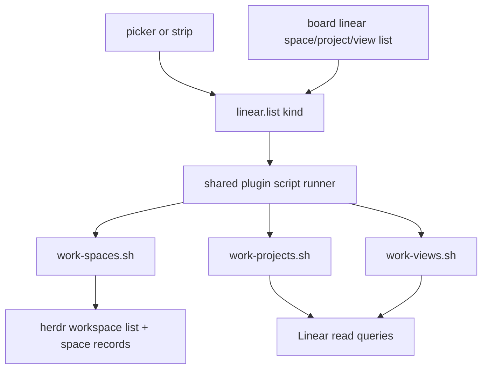
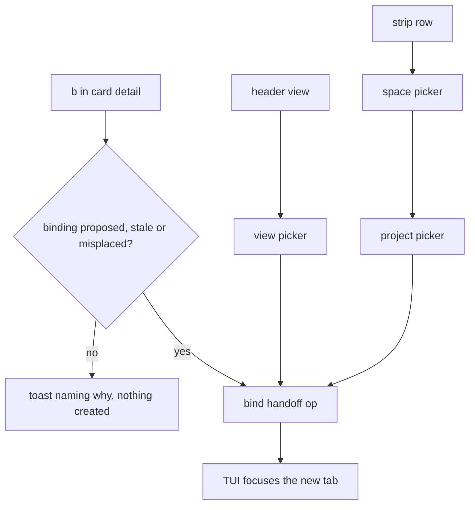
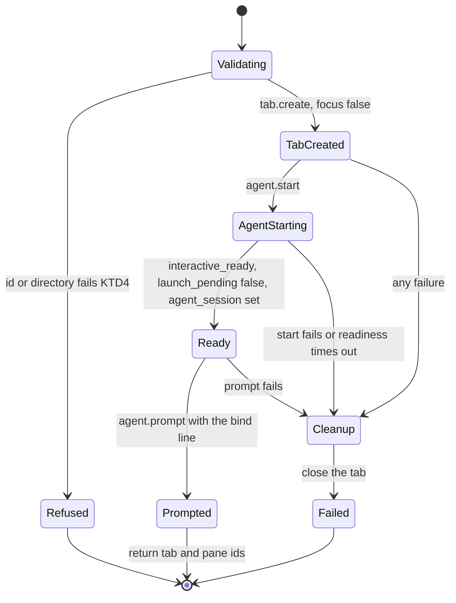
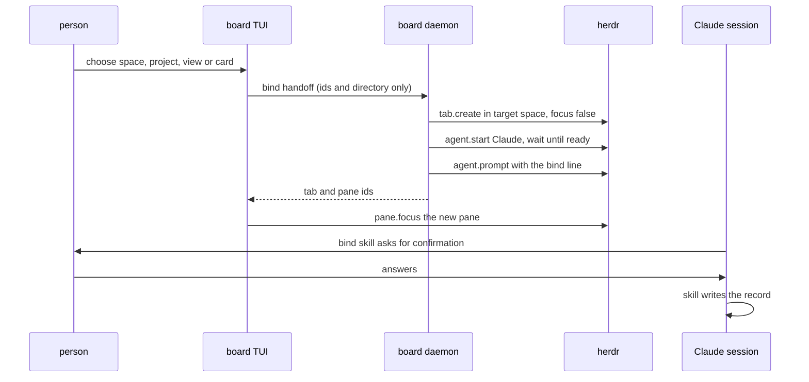
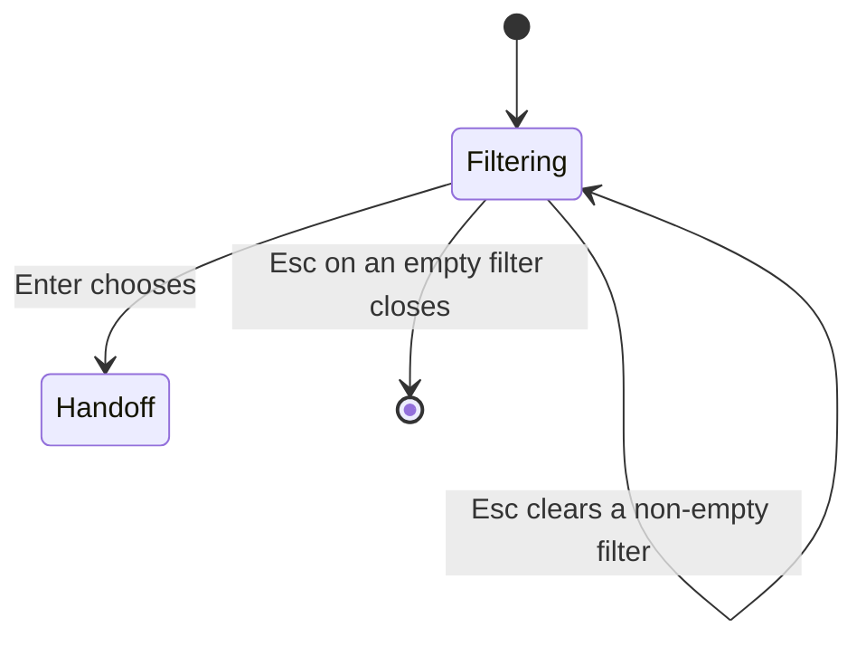

# Linear Mode Pickers, Layout and Bind Handoff - Plan

**Target repos:** this repo (`herdr-linear-board`) and `shrimpshack` for the `work` plugin. Plugin paths are repo-relative to `shrimpshack`; every other path is repo-relative to this repo.

---

## Goal Capsule

- **Objective:** a person working in herdr can read their Linear project at a glance on a small screen, and can bind a space, project, view or issue from the board without leaving it to hunt for the right pane.
- **Means:** roomier card and column geometry, a stacked narrow layout, mouse selection, three type-to-filter pickers fed by one new read op over three plugin scripts, and a handoff that starts an interactive Claude session in a new herdr tab and prompts it with the plugin's bind skill (KTD2, KTD3).
- **Authority:** product behaviour is owned by the R-IDs; implementation mechanism by the KTDs. Where this plan contradicts the earlier Linear-view plan, this plan wins for what it restates, and U15 rewrites the superseded text in place.
- **Stop conditions:**
  - Stop the handoff units (U12, U18, U19, U20) if no pinned herdr call delivers a slash command into a new pane as a person-level user turn (U12 probe).
  - Stop the project picker (U8, U18) if Linear exposes no way to list the projects a person is a member of (U8 probe). Do not substitute an assignee-derived list.
  - Stop the mouse unit (U4) if herdr does not forward mouse events into plugin panes. The keys already cover everything.
  - Stop the title unit (U5) if widening the launcher's pane matcher breaks its open-or-focus toggle.
  - The layout and header units (U1, U2, U3, U6) depend on none of these probes and ship regardless.
- **Execution profile:** two pull requests, plugin first. The person running this finishes and ships both.

---

## Product Contract

### Summary

The board's Linear mode becomes usable at split-pane widths, gains mouse selection, and grows three pickers that turn "this space has no project" into a binding you can start from the board. The pickers hand a chosen space, project, view or issue to the plugin's bind skill, running in a Claude session in a new herdr tab. The skill still asks for confirmation and still owns every write.

### Problem Frame

Linear mode today renders one screen well and everything else badly. At the width of a herdr split the columns are 24 cells wide, card titles are cut mid-word, and cards run together because nothing separates them. The header says "no view chosen" while showing a working board of issues, which reads as a defect rather than a default. A person who sees a space with no project, or a view they would rather use, has to leave the board, find a pane in the right space, start Claude, and remember the skill name.

Mouse clicks do nothing, because Linear mode drops every mouse event. The board cannot say which herdr spaces are unbound, because the snapshot covers one space per run.

Behind all of that sits a deliberate boundary: Linear mode writes nothing and touches no herdr layout. Binding is unreachable from the board for that reason, and three of the ten changes cross it. They are admissible as a stated reversal in which the plugin keeps every write and a person still answers every confirmation.

### Key Decisions

- **The bind skill gains an argument contract.** Governs R9, R10, R11, R12. (session-settled: user-directed - chosen over advisory pickers that re-ask inside the skill: without arguments the view picker has nothing to hand off and the space picker cannot name its space.)
- **The board sets its pane title and the launcher learns the new shape.** Governs R13, R14. (session-settled: user-directed - chosen over a title that fits the launcher's existing `Board [...]` shape: the title should say Linear and name the bound object.)
- **The bind skill's confirmation orders every write after a proposal in an interactive session, and stops a session binding on its own initiative.** It is not proof that a person saw it: any board-socket client can start the skill in an unfocused tab. The skill's existing statement that its flag and nonce are not capability boundaries stays. The board can now start the skill, so "a person typed the command" no longer holds and no longer carries the guarantee. Governs R9, R26, R29.

### Requirements

**Layout and readability**

- R1. A blank row separates cards in a column.
- R2. A column is at least 36 cells wide before a second column appears.
- R3. A card title wraps to two lines at every width, measured in display cells, then truncates.
- R4. When the body cannot hold two minimum-width columns, the board shows one group at a time, filling the width, and the left and right keys move between groups.
- R5. The group a person is on survives a resize across the stacking threshold.
- R6. A terminal too short for one card still renders the header and says the body is too short, rather than saying the snapshot has no columns.

**Orientation**

- R7. The `?` sheet carries a herdr section listing the keys the person has set in their herdr config, read once when the board starts. Herdr's built-in defaults are not listed.
- R8. The header names the default issues view when no view is recorded, instead of saying no view is chosen.

**Binding from the board**

- R9. Every bind the board offers starts the plugin's bind skill in an interactive Claude session in a new herdr tab. The board writes no Linear object, no plugin record and no SQLite row.
- R10. From a card's detail, one key starts a bind for the selected binding of that card's issue, in a tab whose working directory is that binding's worktree. It acts on a binding the plugin reports as `proposed`, `stale` or `misplaced`, so a person can confirm or repair it. A `bound` binding, a `worktree_missing` one, and a card with no binding are each refused with a toast naming why.
- R11. The strip under the board lists the herdr spaces that no binding claims. Choosing one opens a picker of the Linear projects the person is a member of, by Linear's project membership. Choosing a project starts a bind for that space and project.
- R12. Choosing the view in the header opens a picker of the bound project's views. Choosing one starts a bind that records that view for the space.
- R13. In Linear mode the board's herdr pane is titled `Linear: <bound object>`, with brackets and control characters stripped from the object's name.
- R14. The launcher's open-or-focus toggle still focuses the board pane rather than opening a second overlay, with that title set.
- R15. The board's effect gate permits exactly three new effects: the list read, setting its own pane title, and starting a bind handoff. It is a guard on the board's own code, not a boundary on what a socket client may ask the daemon for.
- R16. An identifier reaches a handoff only if it matches the one permitted shape in KTD4, and each identifier also passes the membership check KTD4 assigns it. Names never reach a handoff.
- R20. Before a handoff the picker line names the space and the id the bind will open with. After the handoff the board focuses the new tab, and on return the board names the refresh key. The board does not poll.
- R28. A handoff that fails after its tab exists closes that tab and reports the failure, leaving nothing behind.
- R29. No argument, flag or template pre-answers the bind skill's confirmation, and the session the handoff starts is interactive.

**Pickers**

- R17. Typing filters the open picker. The filter is local: it reaches no command, path or request.
- R18. Each picker distinguishes an empty list from a failed read, using the status vocabulary `ok`, `unavailable`, `partial` and `unknown`.
- R19. A picker survives a snapshot arrival and a daemon reconnect, keeping its filter and its selection by identifier.
- R27. Every picker row shows a discriminator a name cannot forge beside the name: the team key for a project, the id for a space or a view.

**Mouse**

- R21. A click selects and opens a card. A click on a column header focuses that group. A click on a strip row opens the space picker. A click on a picker row chooses it. Scrolling moves the selection.
- R22. Every mouse action reaches the same reducer as its key, and adds no capability the keys lack.

**Parity and safety**

- R23. The three lists are reachable on the command line as `board linear space list`, `board linear project list` and `board linear view list <PROJECT_ID>`, served by the same daemon op and request shape as the pickers. `space list` returns every space with its binding state.
- R24. Every string a new read carries from Linear or herdr is sanitised on arrival, by walking the deserialised value rather than naming fields.
- R25. `board linear snapshot` and `board linear space list` take their space from `HERDR_WORKSPACE_ID` when the positional argument is absent.
- R26. The bind handoff has no command-line verb, and the agent-facing contract says why.

### Success Criteria

- A person at 60 columns can read a card's full title and tell where one card ends and the next begins.
- A person who opens the board in an unbound space can start a correct bind without typing a skill name or changing pane by hand.
- The launcher's toggle key still opens, focuses and closes exactly one board overlay after the title change.

### Acceptance Examples

- AE1. **Given** a body 70 cells wide, **when** the board draws, **then** one group fills the width and the left and right keys move between groups.
- AE2. **Given** a card title of 90 characters, **when** the card draws at 36 cells, **then** two title lines appear and the second ends in an ellipsis.
- AE3. **Given** a space picker open with a filter typed and a snapshot arriving, **when** the snapshot is applied, **then** the picker is still open with its filter and the same space selected.
- AE4. **Given** a Linear project named `Launch\nrm -rf ~`, **when** a handoff is built for it, **then** the prompt text carries the project id only, contains no newline, and the name appears on screen in sanitised form.
- AE5. **Given** a project the person is not a member of, **when** the project picker opens, **then** that project is absent.
- AE6. **Given** the herdr read behind the space list fails, **when** the strip draws, **then** it says the space list is unavailable, not that every space is bound.
- AE7. **Given** the board pane titled `Linear: Example Launch`, **when** the launcher's toggle key is pressed twice, **then** the overlay focuses and then closes, and no second overlay appears.
- AE8. **Given** a card with no binding, or a card whose selected binding is already `bound`, **when** the bind key is pressed, **then** a toast says why and no tab is created.
- AE9. **Given** a handoff whose agent start fails after the tab was created, **when** the op returns, **then** the tab is closed and the board toasts the failure.

### Scope Boundaries

- The board never moves a card, edits an issue, or writes a Linear object, a plugin record or a SQLite row.
- No automatic refresh after a bind. A person presses the refresh key.
- The kanban board's geometry, mouse contract and pane title are untouched.
- The project picker lists projects the person is a member of. Every visible project in the workspace is out of scope.
- The handoff op having no command-line verb is a convenience boundary, not a security one. Any client on the board socket can call the op.
- A bind tab stays open after the skill finishes, is declined, or is left waiting. The person closes it.

#### Deferred to Follow-Up Work

- A board-visible pending-bind state. Today a handoff into a space the person never visits leaves a Claude session parked at its confirmation, and nothing on the board records it.
- A board-side record of the chosen view, so the view picker could take effect without a bind.
- Fuzzy matching in the pickers. The filter is a case-insensitive substring match.
- Restoring the pane title when the board quits.
- Confusable-character defence in names. R27's discriminator is the mitigation this plan ships.
- A card-level bind for an issue with no binding yet, which needs the worktree-creating flow the plugin's start skill owns.

---

## Planning Contract

### Key Technical Decisions

- KTD1. **The plugin's bind skill gains arguments and a rewritten safety argument; the board never re-implements binding.** The argument form accepts a space, a project, an optional view and an optional issue, confirms once in the session, then reuses today's propose-and-confirm path. The skill's own text says `disable-model-invocation` and its nonce are not capability boundaries, and that a binding is attended because a person typed the command. The handoff makes that last clause false, so U21 rewrites it to the invariant in the Key Decisions. (session-settled: user-directed - chosen over advisory pickers: without arguments the view picker has no consumer.) Governs R9, R10, R11, R12, R29.
- KTD2. **One list op, three plugin scripts, three verbs, one shared runner.** A single `linear.list` op takes a `kind` of `spaces`, `projects` or `views`, plus the one id that kind needs, and returns one envelope for all three. Three separately routed ops would cost roughly thirty board edits and nine protocol-document sites for one behaviour. Three plugin scripts stay, because the plugin's gates are per file and each script keeps its own exit-code table closed. The snapshot runner is generalised to run any named plugin script with its own argument, deadline and exit-code table, and keeps its output cap, its prefix-allowlisted environment, its cancel-on-disconnect and its discarded stderr. The snapshot document and its pinned fixtures do not change. The repos still move in lockstep, through the plugin version floor (KTD17).
- KTD3. **The handoff starts an interactive Claude session and prompts it; it never types into a shell.** A tab's root pane runs the person's login shell, and the bind skill only runs inside Claude, so text typed at a shell prompt fails. The daemon already owns the route that works: `agent.start` with the installed Claude integration and no arguments, then a wait for `interactive_ready`, `launch_pending` false and a non-empty `agent_session`, then `agent.prompt` with the bind line. That is the readiness contract `docs/herdr.md` records for card runs, for the reason it records: herdr settles before pressing Enter, and a prompt sent early is dropped. The sequence is:
  1. Validate every id and the working directory (KTD4). Refuse before any herdr call.
  2. `tab.create` in the target space, `focus` false, label `bind`, empty environment, and the working directory KTD6 assigns.
  3. `agent.start` with a name unique to this handoff, `bind-<tab id>`, because herdr refuses a name an open pane already holds. Then wait for `interactive_ready` and `launch_pending` false with the card-run bound, and for a non-empty `agent_session`. Unlike a card run, a timeout on the session wait is a failure, not a warning: a prompt sent too early is dropped, and the op would report success over an idle tab. The session wait gets its own bound, set from the U12 probe.
  4. `agent.prompt` with the text `/work:bind --space <space> --project <project>`, followed by ` --view <view>` or ` --issue <issue>` when present.
  5. Return the tab and pane ids.

  Any failure after step 2 closes the tab, copying the compensation `create_card_tab` performs, and reports herdr-unavailable. The label `bind` matches no card-tab pattern and no harness name, so placement never adopts it. The environment stays empty so no `LINEAR_*` value reaches a pane where every process can read it.
- KTD4. **One identifier rule for both repos, plus a membership check per identifier.** An id matches `^[A-Za-z0-9][A-Za-z0-9_-]{0,63}$`. The first character is alphanumeric so no id reads as an option, the charset is closed, and the length is capped. The plugin's existing `is_safe_identifier` admits `.` and has no cap, so U10 applies this stricter rule to the bind arguments without loosening the library rule. Membership:
  - The daemon checks the space against the caller's session `workspace.list`.
  - The skill checks the project, view and issue against its own Linear reads, and refuses a view that does not name the project.

  The working directory is a second shape: absolute, canonicalised, existing, and inside either the plugin's projects root or its worktrees root, with no symlink leaving that root. Ticket worktrees live under the worktrees root, which the plugin keeps apart from the projects root on purpose. The daemon resolves both roots the way `plugins/work/lib/contain.sh` does, including its environment overrides and their fallbacks. Existence alone is not the check.
- KTD5. **The effect gate gains exactly three members, and a structural test classifies every effect.** `LinearList`, `SetLinearPaneTitle` and `BindHandoff` join Linear mode's allow set. A test iterates every `Effect` variant and requires each to sit in the allow set or in a named deny list, so a new variant fails the build until someone classifies it. The mutation tests stay on top, proving each new arm is load-bearing. The gate constrains the board's own driver only (R15).
- KTD6. **The handoff tab opens in the target space without focus; the board focuses it.** The op creates the tab with `focus` false and returns its pane, and the TUI issues the already-permitted `pane.focus` for a handoff it started. The op is then not a view-moving primitive for every socket client, which is the reason pane focus has no command-line verb today. The working directory is the card's worktree for a card handoff, and the plugin's projects root for a space or view handoff, where the skill binds no worktree.
- KTD7. **The picker extends the existing picker rather than forking it.** One picker state gains a filter string, a string-id row, and Linear purposes, with a single visible-rows function that both drawing and click zones index into. The filter is a plain string buffer, not the form text area, which brings multiline editing into a one-line field. While a picker is open its key handler runs before Linear mode's global keys, because Linear mode intercepts `r` and `?` ahead of screen dispatch and typing "refresh" would otherwise fetch a snapshot. Printable characters are text, including `?`, `f`, `q`, `j` and `k`. Escape clears a non-empty filter and closes an empty one.
- KTD8. **The default view name is a board constant.** The document reports no view, so there is nothing to name from the plugin. The header says the board shows the project's issues. The fixtures stay untouched, and `view.status` already tells an agent no view is recorded.
- KTD9. **A single click opens a card in Linear mode.** The kanban selects on the first click and opens on the second. Linear mode is read-only, so opening on one click costs nothing and matches the pickers.
- KTD10. **The strip shows unmapped spaces by default and toggles to unmapped tabs.** Replacing the tabs outright would remove the only place that answers "why is my work not on a card", so one key swaps the strip.
- KTD11. **Two-line titles promote existing behaviour.** The kanban already wraps titles to two lines in its compact layout; Linear mode applies that at every width.
- KTD12. **Cards are five rows, columns at least 36 cells, and widths are display cells.** Identifier, two title lines, assignee, then a blank separator. Wrapping measures display width with the width crate ratatui already pulls in, because today's truncation counts characters and overflows on wide glyphs.
- KTD13. **Overlays survive a snapshot arrival, and selection is re-resolved by identifier.** Today every successful snapshot resets the screen to the board's home screen, which closes the help sheet on a reconnect and would close a picker mid-filter.
- KTD14. **Herdr keys are read once, rendered in their own section, and never merged into the board's key table.** The key table is a compile-time constant frozen by two contract tests. The rows come from `[keys]` named actions and `[[keys.command]]` entries.
- KTD15. **The launcher's matcher widens in the same unit as the title, and the title sink strips control characters.** The matcher is an allowlist whose failure is silent: an unmatched title makes the toggle open a new overlay every press. The daemon's title op strips control and format characters at the sink. Brackets are stripped only from the object name in the TUI, because the kanban's own title contains brackets. A Linear title starts with `Linear:`, so no project name can forge the kanban's `Board [...]` shape.
- KTD16. **The stacking threshold derives from the minimum column width.** Two columns need 72 cells. The upstream compact breakpoint of 60 answers a different question, so Linear mode does not reuse it.
- KTD17. **The plugin version floor rises to the release carrying the new scripts, and the fixture pin does not.** Leaving the floor alone would let an old plugin pass the version check and fail as a missing script. The vendored fixtures stay byte-identical, so their `VERSION` pin keeps naming the release they were captured from.
- KTD18. **The membership probe commits query shapes only.** The committed artefact is hand-written query and variable shapes, not a captured session, and the plugin's secret and brand scans cover it. Every other credential path in this system is closed by construction; a hand-redacted transcript would be the exception.

### High-Level Technical Design

Read path, one op for three lists:

Three entry points converging on one handoff:

The handoff op, with its compensation arm:

The write path end to end:

Filter-key routing inside an open picker:

The list envelope, shared by all three kinds, with one row shape per kind:

| Field | Meaning |
|---|---|
| `status` | `ok`, `unavailable`, `partial` or `unknown` |
| `message` | a short reason when `status` is not `ok` |
| `rows` for `spaces` | `id`, `label`, `live`, `state`, `project_id`, `project_name` |
| `rows` for `projects` | `id`, `name`, `team_key` |
| `rows` for `views` | `id`, `name` |

### Assumptions

- Herdr forwards mouse events into plugin panes. The design doc records this as unverified, so U4 proves it first.
- `agent.prompt` with a slash command reaches the Claude integration as a user turn. U12 proves it before the picker units depend on it.
- Linear exposes project membership for the authenticated person. U8 proves it before writing the query.

### Sequencing

Plugin pull request first: U7, U8, U9, U10, U21. Board pull request second.

U1 to U6 depend on nothing in the plugin and can start at once, in parallel with the plugin units. U11 can also start at once, because the envelope above pins the document shapes. The rest follow the dependency column in the unit index.

---

## System-Wide Impact

**Action parity.**

| Action | Person | Agent | Note |
|---|---|---|---|
| Read the space, project and view lists | picker, strip | three verbs | same op, same request shape (R23) |
| Read a bound space's board | TUI | `board linear snapshot` | unchanged |
| Set the board's pane title | TUI | not offered | uses the existing title op |
| Start a bind handoff | pickers, card key | not offered | an agent can run the bind skill itself (R26) |
| Answer a bind confirmation | in the Claude session | not offered | the load-bearing gate |
| Focus a pane | TUI | not offered | existing precedent |

**Context parity.** An agent sees every list the person sees, including the binding state the strip filters out. Two asymmetries are accepted: the herdr key rows are a person's orientation aid, and the default-view label is a board constant that `view.status` already conveys.

**Shared workspace.**

- A handoff creates a durable tab in the person's live herdr session, holding a Claude session waiting at a confirmation.
- A handoff into a space the person then leaves stays parked, and nothing on the board records it. This is accepted for this scope and deferred.
- A failed handoff leaves nothing behind (R28).
- The tab is labelled `bind`, which no human or matcher reads as board-owned.

**Approval boundaries.**

| Layer | What it is | What it buys |
|---|---|---|
| TUI effect gate | an allow set in the board's driver | catches a regression that adds a write path; bounds nothing a socket client does |
| The handoff op | session membership for the space, KTD4 shapes, a fixed interactive template, empty environment | bounds the blast radius to one validated prompt in the caller's own session |
| The bind skill's confirmation | a blocking question the skill asks before any write | the only write gate; it orders the write, and does not prove a person saw it |

**Execution lifecycle.** The handoff has a start (focus moves to the new tab), no progress signal, no completion signal and no failure channel after the prompt lands. Refresh is manual.

**Credentials.** The three scripts reach Linear only through the plugin library, which passes the key to curl on stdin. The shared runner discards the child's stderr, because a script tracing its own run would print the key. The runner's environment is prefix-allowlisted, not cleared: every new `HERDR_LINEAR_*` or `LINEAR_*` name a script reads is forwarded automatically, so adding one is a trust decision and gets a settings row.

**Documents this work falsifies.** `docs/design.md`'s Linear-mode effect and pane-title paragraphs, `docs/protocol.md`'s claim that `linear.snapshot` is the only command raising code 6, `skill/SKILL.md`'s "writes nothing, no pane title" sentence, and the bind skill's own safety paragraph.

---

## Implementation Units

| U-ID | Title | Key files | Depends on |
|---|---|---|---|
| U1 | Card and column geometry | `crates/board-tui/src/view/linear.rs` | - |
| U2 | Stacked narrow layout | `crates/board-tui/src/view/linear.rs` | U1 |
| U3 | Herdr keys in the help sheet | `crates/board-tui/src/herdr_keys.rs` | - |
| U4 | Mouse on the board | `crates/board-tui/src/app/mouse.rs` | U1, U2 |
| U5 | Pane title and launcher matcher | `scripts/open-board.sh`, `crates/board-tui/src/app/effect.rs` | - |
| U6 | Header names the default view | `crates/board-tui/src/view/linear.rs` | U1 |
| U7 | Plugin: spaces with binding state | `plugins/work/bin/work-spaces.sh` | - |
| U8 | Plugin: the person's projects | `plugins/work/bin/work-projects.sh` | - |
| U9 | Plugin: a project's views | `plugins/work/bin/work-views.sh` | - |
| U10 | Plugin: bind argument parsing and validation | `plugins/work/lib/binding.sh` | - |
| U21 | Plugin: bind skill invocation contract and release | `plugins/work/skills/bind/SKILL.md` | U10 |
| U11 | List protocol types and client parity | `crates/board-core/src/protocol.rs` | - |
| U16 | The list op and the shared runner | `crates/board-daemon/src/ops/linear.rs` | U11, U7, U8, U9 |
| U17 | The three list verbs | `crates/board-cli/src/commands/discovery.rs` | U16 |
| U12 | The bind handoff op | `crates/board-daemon/src/ops/linear.rs` | U11, U21 |
| U13 | The filter picker | `crates/board-tui/src/app/picker.rs` | U11 |
| U14 | The strip: unmapped spaces and tabs | `crates/board-tui/src/app/linear.rs` | U13, U16 |
| U18 | Space and project handoff | `crates/board-tui/src/driver/linear.rs` | U5, U12, U14 |
| U19 | View picker and card bind key | `crates/board-tui/src/app/linear.rs` | U18 |
| U15 | Written contracts | `docs/design.md`, `docs/protocol.md` | U19 |
| U20 | Live scenario and catalog | `e2e/41-linear-bind-handoff.sh` | U19 |

### U1. Card and column geometry

- **Goal:** cards are readable at a herdr split's width.
- **Requirements:** R1, R2, R3.
- **Dependencies:** none.
- **Files:** `crates/board-tui/src/view/linear.rs`, `crates/board-tui/tests/linear/mod.rs`, and these snapshots under `crates/board-tui/tests/linear/snapshots/`: `snapshots__linear__linear_bound_with_view.snap`, `snapshots__linear__linear_bound_no_view.snap`, `snapshots__linear__linear_error_over_last_good.snap`, `snapshots__linear__linear_herdr_unavailable.snap`, `snapshots__linear__linear_non_default_mapping.snap`, `snapshots__linear__linear_unavailable.snap`, and a new `snapshots__linear__linear_card_two_line_title_36.snap`.
- **Approach:**
  1. Apply KTD12's geometry.
  2. Build the card body as identifier line, two wrapped title lines, assignee, then a blank row.
  3. Wrap on word boundaries by display width, then truncate the second line with an ellipsis.
- **Patterns to follow:** the kanban's compact-layout title wrapping.
- **Test scenarios:**
  - A 90-character title at 36 cells produces two lines, the second ending in an ellipsis. Covers AE2.
  - A one-word title longer than the column breaks mid-word rather than overflowing.
  - A title of wide glyphs wraps by display width and does not overflow the column.
  - A one-line title leaves the second title row blank rather than pulling the assignee up.
  - An empty title and a missing assignee each render a placeholder, not a collapsed card.
  - A column of zero cards at the new height renders its header and nothing else.
  - A body 36 cells wide draws one column; 72 draws two.
- **Verification:** the six regenerated snapshots show separated cards with two-line titles, the kanban snapshots under `crates/board-tui/tests/snapshots/` are byte-unchanged, and `linear_detail`, `linear_unbound` and `linear_stale_daemon` are unchanged.

### U2. Stacked narrow layout

- **Goal:** below two columns, one group fills the width.
- **Requirements:** R4, R5, R6.
- **Dependencies:** U1.
- **Files:** `crates/board-tui/src/view/linear.rs`, `crates/board-tui/tests/linear/mod.rs`, new snapshots `linear_stacked_70`, `linear_stacked_100`, `linear_two_column_200` and `linear_body_too_short`.
- **Approach:**
  1. Stack below the KTD16 threshold, drawing the selected group alone across the full width with its position in the header.
  2. Keep the left and right keys moving the selected group.
  3. Clamp the selected group and card on every draw.
  4. Replace the short-body message: today a body under three rows says the snapshot has no columns.
- **Test scenarios:**
  - A 70-cell body shows one group, and the right key moves to the next. Covers AE1.
  - Resizing from 200 to 70 cells keeps the selected group selected.
  - Resizing from 70 to 200 keeps the same group in view.
  - A body two rows tall renders the header and a body-too-short line.
  - A stacked board with zero groups says the snapshot has no columns.
- **Verification:** the four new snapshots render, the stacked ones showing one group and its position, and the short-body one showing the header.

### U3. Herdr keys in the help sheet

- **Goal:** the help sheet answers "how do I get around herdr from here".
- **Requirements:** R7.
- **Dependencies:** none.
- **Files:** `crates/board-tui/src/herdr_keys.rs`, `crates/board-tui/src/lib.rs`, `crates/board-tui/src/view/linear.rs`, `crates/board-tui/tests/linear/mod.rs`, `crates/board-tui/tests/linear/fixtures/herdr-config.toml`, and `snapshots__linear__linear_help.snap`.
- **Approach:**
  1. Resolve the config path the way herdr documents it: `XDG_CONFIG_HOME`, then `~/.config/herdr/config.toml`. Read it once at start with a size cap.
  2. Parse `[keys]` named actions into key plus action name, and `[[keys.command]]` entries into key plus the entry's description or its plugin and entrypoint.
  3. Sanitise every row and render them as their own help section (KTD14).
- **Execution note:** verify the parsed shape against the installed config rather than assuming it; the project's instructions forbid assuming a herdr shape from memory.
- **Test scenarios:**
  - The fixture config yields named-action rows and command rows, in file order.
  - A missing config yields no section and no error.
  - An unreadable config yields no section and no error.
  - A malformed config yields no section and no panic.
  - A config with an empty keys table yields no section.
  - A label carrying a control character or a bidi override is stripped.
  - A config larger than the cap yields no section.
  - The board's key table and its two contract tests are untouched.
- **Verification:** the help snapshot shows a herdr section built from the fixture, and pointing the reader at a missing file removes the section.

### U4. Mouse on the board

- **Goal:** clicking works on the board and adds nothing the keys lack.
- **Requirements:** R21, R22.
- **Dependencies:** U1, U2.
- **Files:** `crates/board-tui/src/app/mouse.rs`, `crates/board-tui/src/widgets/mod.rs`, `crates/board-tui/src/app/linear.rs`, `crates/board-tui/src/view/linear.rs`, `crates/board-tui/src/view/mod.rs`, `crates/board-tui/tests/interaction_contract.rs`, `crates/board-tui/tests/linear/mod.rs`.
- **Approach:**
  1. Prove herdr forwards mouse events into a plugin pane. If it does not, stop this unit and report it.
  2. Stop dropping mouse messages in Linear mode's reducer and route them to the shared mouse handler.
  3. Add Linear zone kinds keyed by issue identifier and group, pushed while drawing, using the per-frame hit map.
  4. Translate a click into the message its key produces (KTD9), and a scroll into the selection-moving message.
  5. Add the Linear mouse rows to the help table and its frozen mirror.
- **Patterns to follow:** the kanban's hit map, where the last zone drawn wins so an overlay shadows the board.
- **Test scenarios:**
  - A click on a card selects and opens that card's detail.
  - A click on a column header selects that group without opening anything.
  - A click on the gap between cards changes nothing.
  - A click on a card whose data changed since the frame was drawn resolves by identifier or does nothing.
  - Scrolling down moves the card selection and stops at the last card.
  - A click while the detail overlay is open does not reach the board behind it.
  - `mouse_input_is_ignored_in_linear_mode` is replaced, not left asserting the old behaviour.
- **Verification:** in a live herdr pane, clicking a card opens its detail and clicking outside the overlay leaves the board unchanged.

### U5. Pane title and launcher matcher

- **Goal:** the board's pane says what it shows, and the launcher still finds it.
- **Requirements:** R13, R14, R15.
- **Dependencies:** none.
- **Files:** `crates/board-tui/src/app/effect.rs`, `crates/board-tui/src/driver/linear.rs`, `crates/board-tui/src/driver/dispatch.rs`, `crates/board-tui/src/view/linear.rs`, `crates/board-daemon/src/ops/panes.rs`, `crates/board-daemon/src/ops/tests/panes.rs`, `scripts/open-board.sh`, `scripts/tests/test_open_board.py`, `docs/README.md`, `.github/workflows/ci.yml`, `crates/board-tui/tests/update/pane_title.rs`, `crates/board-tui/tests/linear/mod.rs`.
- **Approach:**
  1. Add a title effect carrying a string. The existing title effect carries the kanban's filter, not a title.
  2. Add it to the allow set, and title the pane `Linear: <project>`, falling back to the space label, then the space id.
  3. Strip brackets and control characters from the object name in the TUI, and strip control and format characters in the daemon's title op (KTD15).
  4. Widen the launcher's matcher to the `Linear:` shape, keeping its fall-through for anything else.
  5. Add the matcher's Python test module to the documented gate block and to the CI workflow, which the docs gate requires.
  6. Drop the title result as the kanban does, so a failed rename never surfaces over the board.
  7. Replace the `(KTD8)` citation in the allow set's doc comment, which names the superseded plan.
- **Test scenarios:**
  - A bound space titles the pane with the project name.
  - An unbound space titles the pane with the space label.
  - A project name carrying a bracket, a newline or a bidi override reaches the title stripped.
  - A title op call with an escape sequence strips it at the daemon, even from a client that skipped the TUI's strip.
  - A title failure is swallowed and no toast appears.
  - The matcher resolves a `Linear:` title to focus, and an unrelated title to open.
  - With one pane titled `Board [ALL]` and one titled `Linear: X`, the matcher picks the right pane for each launcher.
  - Removing the matcher's Linear arm turns the named test red.
  - Outside a herdr plugin pane, no title request is sent.
  - `no_pane_set_title_or_board_get_across_construction_and_a_session` is rewritten to assert the new title and still assert no board read.
- **Verification:** with the board open in a bound space, the launcher toggle focuses and then closes one overlay, and no second overlay appears. Covers AE7.

### U6. Header names the default view

- **Goal:** the header stops calling a working board "no view chosen".
- **Requirements:** R8.
- **Dependencies:** U1, whose regenerated no-view snapshot this unit rebases onto.
- **Files:** `crates/board-tui/src/view/linear.rs`, `crates/board-tui/tests/linear/mod.rs`, `snapshots__linear__linear_bound_no_view.snap`.
- **Approach:**
  1. When the document reports no recorded view, name the default issues view (KTD8).
  2. Keep the other view statuses as they are, including the one that says a recorded view no longer names the project.
- **Test scenarios:**
  - A document with no recorded view shows the default-view label and no skill prompt.
  - A document with a recorded view shows that view's name.
  - A missing, archived or out-of-project view still names the view and says why it is unusable.
  - `bound_no_view_renders_team_states_and_the_bind_hint` and `a_view_linear_no_longer_has_falls_back_and_says_no_view_is_chosen` are rewritten to the new phrasing.
- **Verification:** the no-view header reads as the default view, and the fixture files and their hashes are unchanged.

### U7. Plugin: spaces with binding state

- **Goal:** one read answers which herdr spaces are bound, and to what.
- **Requirements:** R11, R18, R23.
- **Dependencies:** none.
- **Files:** `plugins/work/bin/work-spaces.sh`, `plugins/work/lib/binding.sh`, `plugins/work/docs/spaces.md`, `plugins/work/tests/unit/spaces.bats`, `plugins/work/tests/fixtures/spaces/`, `plugins/work/tests/run-tests.sh`, `plugins/work/docs/settings.md`.
- **Approach:**
  1. Copy the snapshot script's sourcing block, including a visible `sanitize.sh` source, which the identifier-path gate requires. Leave out the keychain preflight: this script makes no Linear call.
  2. Add a library reader that walks the space records, and join it with the live space list in one Python pass. Report each space's effective state without re-deriving it.
  3. Emit the KTD2 envelope with a closed exit-code table.
  4. Keep fixtures under `tests/fixtures/spaces/`. The snapshot fixture directory is pinned byte-for-byte by the board.
  5. Raise the suite floor constant, and add a settings row for any new environment seam read under `lib/`. The settings test fails a row for a name read only in `bin/`.
- **Test scenarios:**
  - Two live spaces, one bound and one not, both appear with their states.
  - A recorded space with no live space appears as not live.
  - The herdr read failing yields `unavailable` and a non-empty document. Covers AE6.
  - No spaces yields an empty list with `ok`.
  - A label carrying a separator or a bidi override is sanitised.
  - A bad argument exits with the refusal code, and an unreadable library exits non-zero with empty output.
  - Forcing the status to `ok` on a failed read turns the AE6 test red.
- **Verification:** running the script against two live spaces prints both with their states, and the same run with the herdr read forced to fail prints `unavailable` with a non-empty document.

### U8. Plugin: the person's projects

- **Goal:** one read lists the Linear projects the person is a member of.
- **Requirements:** R11, R18, R23, R24.
- **Dependencies:** none.
- **Files:** `plugins/work/lib/linear.sh`, `plugins/work/bin/work-projects.sh`, `plugins/work/tests/probe/projects-shapes.md`, `plugins/work/tests/probe/README.md`, `plugins/work/tests/fixtures/fake-linear.sh`, `plugins/work/tests/unit/fake-linear.bats`, `plugins/work/tests/unit/projects.bats`.
- **Approach:**
  1. Prove against the real API that Linear lists the authenticated person's project memberships, and stop if it does not.
  2. Commit the query and variable shapes only, hand-written (KTD18), with a row in the probe index.
  3. Add the paged read beside the existing project reads, with the same page cap and partial code. Build no request outside the library.
  4. Add the entry script and a routing arm in the fake. An unmatched query otherwise gets an unrelated canned body.
- **Execution note:** prove the membership query against the real API before trusting any test here.
- **Test scenarios:**
  - A page of projects returns ids, names and team keys.
  - A second page is followed, and the page cap reports `partial`.
  - A missing credential reports `unavailable` rather than an empty list.
  - A refused credential is distinguished from an unreachable API.
  - A project name carrying a newline or a bidi override is sanitised.
  - The fake refuses the query when its variable type is wrong.
  - The committed shapes file passes the secret and brand scans.
- **Verification:** running the script against the fake prints the membership list, and against a fake refusing the credential prints `unavailable`.

### U9. Plugin: a project's views

- **Goal:** one read lists the views that name a project.
- **Requirements:** R12, R18, R23.
- **Dependencies:** none.
- **Files:** `plugins/work/bin/work-views.sh`, `plugins/work/tests/unit/views.bats`.
- **Approach:**
  1. Wrap the existing project-views read in an entry script shaped like U7's.
  2. Map the read's partial code to `partial` with a message.
  3. Add tests beside, not in place of, `a view is not created when nobody has answered`, which the consent mutation list names.
- **Test scenarios:**
  - A project with two matching views lists both with ids and names.
  - A project with none lists none with `ok`.
  - The page cap yields `partial` and a message.
  - A missing credential yields `unavailable`, and a refused one is distinguished from an unreachable API.
  - A view name carrying a control character is sanitised.
  - A view id outside the KTD4 shape is dropped rather than passed through.
- **Verification:** running the script for a project prints its views, and with the page cap at one prints `partial` with its message.

### U10. Plugin: bind argument parsing and validation

- **Goal:** the library accepts a space, project, optional view and optional issue, and refuses anything unsafe.
- **Requirements:** R9, R10, R11, R12, R16.
- **Dependencies:** none.
- **Files:** `plugins/work/lib/binding.sh`, `plugins/work/lib/views.sh`, `plugins/work/tests/unit/binding.bats`.
- **Approach:**
  1. Parse the argument form and validate each id against KTD4, without loosening the library's existing identifier rule.
  2. Refuse a space that is not the pane's own space.
  3. Refuse a view that does not name the project, and an issue that the worktree's branch contradicts.
  4. Leave the confirm call in the skill. The placement-caller gate permits only project creation to confirm from `lib/`.
- **Test scenarios:**
  - A valid space, project and view parse and validate.
  - A space that is not the pane's space is refused.
  - `-rf`, `--exec`, a leading dot, `..`, an embedded newline, an embedded space, an empty string and a 65-character id are each refused before any read.
  - A view that does not name the project is refused.
  - An issue contradicting the worktree's branch is refused.
  - Removing the first-character rule turns the option-shaped id test red.
- **Verification:** the library refuses every hostile shape in the list above, and accepts the valid set.

### U21. Plugin: bind skill invocation contract and release

- **Goal:** the skill runs from arguments with an honest safety argument, and ships.
- **Requirements:** R9, R26, R29.
- **Dependencies:** U10.
- **Files:** `plugins/work/skills/bind/SKILL.md`, `plugins/work/.claude-plugin/plugin.json`, `.claude-plugin/marketplace.json`, `plugins/work/tests/unit/binding.bats`.
- **Approach:**
  1. Teach the skill the argument form. Argument values are candidates, never conclusions: the skill always asks through the host's blocking question tool before any propose or confirm call. This overrides the skill's shared rule that it resolves derivable values itself.
  2. Name each object in that question with its id beside its sanitised name, and the project's team key, so a handoff started outside the board still shows R27's discriminator. Treat every project and view name as untrusted text, as the skill already does for issue titles.
  3. Rewrite the safety paragraph to the invariant in the Key Decisions (KTD1).
  4. Add no argument or flag that pre-answers the confirmation.
  5. Keep the rubric block byte-identical, which the rubric sync gate checks across skills.
  6. Bump the plugin version in both manifests, which the version sync gate checks together.
- **Test scenarios:**
  - A confirm with no matching proposal nonce is refused.
  - A valid argument set records only through propose then confirm.
  - Replaying a confirmation's nonce for a second binding is refused.
  - Whether the skill asks before writing, and whether a declined answer writes nothing, is model behaviour a bats test cannot see. U20 and the Definition of Done check it live.
- **Verification:** the plugin suite passes including its sync and placement gates, and the skill's safety paragraph no longer claims a person typed the command.

### U11. List protocol types and client parity

- **Goal:** the typed contract for the list op exists before the op does.
- **Requirements:** R18, R23, R24.
- **Dependencies:** none.
- **Files:** `crates/board-core/src/protocol.rs`, `crates/board-core/src/client/traits.rs`, `crates/board-core/src/client/fake.rs`, `crates/board-core/tests/protocol.rs`, `crates/board-daemon/src/ops/tests/parity.rs`.
- **Approach:**
  1. Add the list parameter type with its kind and id, and the envelope with a row type per kind, every field defaulting.
  2. Add the client method and the fake's implementation before routing, the order that keeps the parity guard green.
  3. Add the handoff parameter and result types for U12.
- **Test scenarios:**
  - Each kind's envelope round-trips.
  - An envelope missing its message and rows parses with defaults.
  - An unknown status value fails to parse rather than becoming `ok`.
  - The fake returns a configured envelope for each kind.
- **Verification:** the new types round-trip in the protocol suite, and the parity guard passes with the fake ahead of the route.

### U16. The list op and the shared runner

- **Goal:** the daemon serves the three lists from the plugin.
- **Requirements:** R18, R23, R24.
- **Dependencies:** U11, U7, U8, U9.
- **Files:** `crates/board-daemon/src/ops/linear.rs`, `crates/board-daemon/src/ops/mod.rs`, `crates/board-daemon/src/ops/tests/linear.rs`.
- **Approach:**
  1. Generalise the snapshot runner per KTD2, replacing its hard-coded script name in every error message with the script it ran.
  2. Validate each kind's id against KTD4 before spawning.
  3. Route `linear.list`, and give it a client timeout paired with its own deadline.
  4. Raise the plugin version floor (KTD17), keeping the message that names both versions.
  5. Sanitise the envelope on arrival by walking the value.
- **Test scenarios:**
  - Each kind returns its script's envelope for a healthy run.
  - A script exiting non-zero surfaces code 6 naming that script.
  - A script printing non-JSON surfaces code 6.
  - A plugin below the new floor is refused naming both versions.
  - A script that ignores termination is killed after the grace period, leaving no strays.
  - A client disconnecting mid-run cancels the child.
  - Output past the cap is refused and the run still ends.
  - A script printing to stderr leaves nothing in the result or the daemon's output.
  - An id outside the KTD4 shape is refused before any spawn.
  - The snapshot op's existing tests still pass against the generalised runner.
- **Verification:** against a real daemon each kind returns the plugin's envelope, and a plugin below the floor is refused with both versions named.

### U17. The three list verbs

- **Goal:** an agent reads what the pickers read.
- **Requirements:** R23, R25, R26.
- **Dependencies:** U16.
- **Files:** `crates/board-cli/src/args/discovery.rs`, `crates/board-cli/src/commands/discovery.rs`, `crates/board-cli/src/render.rs`, `crates/board-cli/src/args/tests.rs`, `crates/board-cli/tests/integration/linear.rs`.
- **Approach:**
  1. Add `board linear space list`, `board linear project list` and `board linear view list <PROJECT_ID>`.
  2. Render each envelope through the single table helper, with a status line when the status is not `ok`. Output follows the global `--json` flag, not a per-handler branch.
  3. Default the space from `HERDR_WORKSPACE_ID` for `space list` and `snapshot`, exiting 64 when neither is present (R25).
- **Test scenarios:**
  - Each verb prints a table, and its JSON under `--json`.
  - `snapshot` with no positional uses `HERDR_WORKSPACE_ID`, and exits 64 with neither.
  - A plugin failure exits 6 with empty stdout and an error envelope on stderr.
  - A `partial` list exits 0 and prints its status line.
  - Run with no herdr socket, `space list` reports `unavailable` while `project list` answers fully.
  - A name carrying a bidi override prints stripped.
  - `board linear bind` and `board bind` each exit 64 as unknown commands (R26).
- **Verification:** each verb prints the same rows a picker shows for the same space and project.

### U12. The bind handoff op

- **Goal:** one op starts a bind in a new herdr tab, safely.
- **Requirements:** R9, R16, R20, R28, R29.
- **Dependencies:** U11, U21.
- **Files:** `crates/board-daemon/src/ops/linear.rs`, `crates/board-daemon/src/ops/mod.rs`, `crates/board-daemon/src/ops/tests/linear.rs`, `crates/board-core/src/client/fake.rs`, `crates/board-herdr/src/params.rs`.
- **Approach:**
  1. Before building anything, prove against a live herdr session that `agent.prompt` with a slash command reaches the Claude integration as a user turn. Stop the plan if it does not.
  2. Implement the KTD3 sequence with KTD4's checks and KTD6's working directory.
  3. Hold the prompt text in one named template with the ids appended, so a change to the plugin's argument form fails a board test.
  4. Trust the origin socket as the existing pane ops do, and refuse a space the socket's session does not list.
- **Test scenarios:**
  - A valid call creates one tab labelled `bind` in the target space, unfocused, with an empty environment.
  - The agent starts with no arguments, and the prompt is sent only after readiness.
  - The prompt text equals the template with the ids, and contains no newline, carriage return or tab.
  - The template carries no print, headless or non-interactive flag, and mutating it to the headless form turns a named test red.
  - A failure at agent start closes the tab and returns herdr-unavailable. This is the daemon half of AE9.
  - A timeout on the interactive-ready wait closes the tab.
  - A timeout on the session wait closes the tab and sends no prompt.
  - A prompt failure closes the tab.
  - A second handoff while the first session is still open starts its agent under a different name and succeeds.
  - A card worktree under the plugin's worktrees root is accepted.
  - An id outside the KTD4 shape is refused before any herdr call, and removing that check turns the test red.
  - A relative working directory and one outside the projects root are each refused before the tab exists.
  - A space the session does not list is refused.
  - An unreachable socket reports herdr-unavailable and creates nothing.
  - Called from a plain client, the op leaves a Claude session waiting at its confirmation, with no Linear call, no record change and no SQLite row.
  - Two handoffs in a row create two tabs and interfere with neither.
- **Verification:** against a live herdr session, one `bind` tab appears in the target space with the bind skill waiting at its confirmation, and a refused id leaves the session unchanged.

### U13. The filter picker

- **Goal:** a list you can type to narrow.
- **Requirements:** R17, R18, R19, R27.
- **Dependencies:** U11.
- **Files:** `crates/board-tui/src/app/picker.rs`, `crates/board-tui/src/app/state.rs`, `crates/board-tui/src/app/linear.rs`, `crates/board-tui/src/app/mod.rs`, `crates/board-tui/src/driver/linear.rs`, `crates/board-tui/src/view/overlays.rs`, `crates/board-tui/src/widgets/mod.rs`, `crates/board-tui/src/view/mod.rs`, `crates/board-tui/tests/help.rs`, `crates/board-tui/tests/interaction_contract.rs`, `crates/board-tui/tests/linear/mod.rs`, new snapshots `linear_project_picker_filtered`, `linear_picker_empty_list`, `linear_picker_read_failed` and `linear_picker_loading`.
- **Approach:**
  1. Extend the picker per KTD7, with the filter routed ahead of Linear mode's global keys.
  2. Filter on the sanitised visible text, character-wise and case-insensitive, and clamp the selection after every keystroke.
  3. Collapse tabs and newlines inside the row renderer, not at call sites, and draw the discriminator before the name (R27).
  4. Generalise the driver's arrival channel beyond the snapshot type, so the three lists do not each rebuild it.
  5. Keep the overlay and re-resolve selection by identifier when a snapshot or list arrives (KTD13).
  6. Track a local in-flight flag per list, as the snapshot screen already does, and render a loading line while it is set. An in-flight read must not look like an empty list or a failed one. This is board state, not a new envelope status.
  7. Add the picker's help rows and their mirror, and map any new handler file in the help test, which panics on an unmapped file.
- **Test scenarios:**
  - Typing narrows the list and clamps the selection.
  - A filter matching nothing says so, and Enter does nothing.
  - `?`, `r` and `q` are literal while filtering: no help sheet, no fetch, no quit.
  - Escape clears the filter, and a second Escape closes the picker.
  - A snapshot arriving leaves the picker open with its filter and selection. Covers AE3.
  - A reconnect leaves the picker open.
  - A row whose name carries a newline and a tab draws on one row, and the filter matches its collapsed form.
  - Two rows with identical names are distinguishable by their discriminators.
  - A multi-byte filter matches character-wise.
  - A row longer than the picker truncates without pushing the discriminator off.
  - `ok` with no rows and `unavailable` render differently.
  - A picker opened before its list arrives shows the loading line, then the rows when they land.
- **Verification:** the filtered, empty, failed and loading picker snapshots render, and typing a question mark into a filter shows it in the filter line.

### U14. The strip: unmapped spaces and tabs

- **Goal:** the strip shows which spaces need a project, and still shows unmapped tabs on demand.
- **Requirements:** R11, R18, R21.
- **Dependencies:** U13, U16.
- **Files:** `crates/board-tui/src/app/linear.rs`, `crates/board-tui/src/app/mouse.rs`, `crates/board-tui/src/view/linear.rs`, `crates/board-tui/src/view/mod.rs`, `crates/board-tui/tests/interaction_contract.rs`, `crates/board-tui/tests/linear/mod.rs`, new snapshots `linear_strip_spaces`, `linear_strip_tabs` and `linear_strip_spaces_unavailable`.
- **Approach:**
  1. Fetch the space list alongside the snapshot, and show the unbound spaces by default.
  2. `t` toggles the strip between spaces and tabs (KTD10).
  3. `s` moves focus to the strip, where up and down select a row and Escape returns focus to the board, so the keyboard reaches every row a click can (R22).
  4. Enter on a focused strip row, or a click on one, opens the space picker.
  5. Add `s` and `t` to the help table and its mirror.
- **Test scenarios:**
  - The strip lists unbound spaces with their ids.
  - The toggle key swaps to unmapped tabs and back.
  - A failed space read says the list is unavailable. Covers AE6.
  - Before the first space read lands the strip shows a loading line, not an empty list.
  - A click on a strip row opens the space picker.
  - `s`, then down, then Enter opens the space picker for the second row, and Escape from the strip returns focus to the board.
  - A click inside an open picker chooses the row under the pointer and does not reach the board.
- **Verification:** the three strip snapshots render, and toggling shows today's unmapped tabs unchanged.

### U18. Space and project handoff

- **Goal:** choosing a space and a project starts a bind.
- **Requirements:** R11, R15, R20, R27.
- **Dependencies:** U5, U12, U14.
- **Files:** `crates/board-tui/src/app/effect.rs`, `crates/board-tui/src/app/linear.rs`, `crates/board-tui/src/driver/linear.rs`, `crates/board-tui/src/driver/dispatch.rs`, `crates/board-tui/tests/linear/mod.rs`, new snapshot `linear_space_picker`.
- **Approach:**
  1. Choosing a space opens the project picker for it; the picker line names the space and its id before Enter.
  2. Choosing a project emits the handoff effect, then focuses the returned pane.
  3. Add the list and handoff effects to the allow set, and add the structural classification test (KTD5).
  4. On a handoff error, toast and keep the picker open.
- **Test scenarios:**
  - Choosing a space then a project sends one handoff carrying both ids and no names. Covers AE4.
  - A project the person is not a member of never appears. Covers AE5.
  - After a successful handoff the board focuses the returned pane.
  - When the person returns to the board after a handoff, the board names the refresh key.
  - A handoff returning herdr-unavailable toasts and leaves the picker open.
  - A handoff whose agent start failed toasts the failure. This is the board half of AE9.
  - While a handoff is in flight the picker says so, and a second Enter sends nothing.
  - A refused effect toasts and builds no request.
  - Removing the handoff arm, the list arm or the title arm from the allow set each turns a named test red.
  - Adding an unclassified effect variant fails the classification test.
- **Verification:** in an unbound space, choosing a space and a project moves focus to a new tab where the bind skill waits for confirmation.

### U19. View picker and card bind key

- **Goal:** the header's view and a card each start a bind.
- **Requirements:** R10, R12, R20.
- **Dependencies:** U18.
- **Files:** `crates/board-tui/src/app/linear.rs`, `crates/board-tui/src/view/linear.rs`, `crates/board-tui/src/view/mod.rs`, `crates/board-tui/tests/interaction_contract.rs`, `crates/board-tui/tests/linear/mod.rs`, new snapshot `linear_view_picker`.
- **Approach:**
  1. Choosing or clicking the header's view opens the view picker for the bound project.
  2. Choosing a view sends a handoff with space, project and view.
  3. In the card detail, `b` sends a handoff with space, project, issue and the selected binding's worktree as the working directory. It acts on `proposed`, `stale` and `misplaced` bindings and refuses the others with a toast (R10).
  4. `v` on the board opens the view picker, as a click on the header's view does. Add `b` and `v` to the help table and its mirror.
- **Test scenarios:**
  - Choosing a view sends a handoff with space, project and view ids.
  - `b` on a `proposed` binding sends a handoff with that binding's directory and the issue id.
  - `b` on a card with two bindings uses the one selected in the detail.
  - `b` on a card with no binding toasts and sends nothing. Covers AE8.
  - `b` on a `bound` binding toasts that it is already bound and sends nothing. Covers AE8.
  - `b` on a `worktree_missing` binding toasts and sends nothing.
  - The view picker on an unbound space says there is no project to list views for.
- **Verification:** from a bound space, choosing a view and pressing the card key each open a tab with the bind skill waiting, carrying the right arguments.

### U15. Written contracts

- **Goal:** the written contracts match the code.
- **Requirements:** R14, R15, R22, R23, R26.
- **Dependencies:** U19.
- **Files:** `docs/design.md`, `docs/protocol.md`, `docs/tui-interactions.md`, `docs/configuration.md`, `docs/implementation.md`, `skill/SKILL.md`, `crates/board-tui/src/app/linear.rs`, `CHANGELOG.md`.
- **Approach:**
  1. Rewrite, in place, every document System-Wide Impact lists as falsified, and the Linear-mode module comment.
  2. Record `linear.list`, the handoff op, the three verbs and the new floor in the three places `docs/protocol.md` lists a method.
  3. State in `skill/SKILL.md` that the handoff has no verb and why, in the shape the pane-focus paragraph uses.
  4. Leave `[Unreleased]` untouched, since the docs gate requires upstream PR links this fork does not have, and carry the change note in the PR body.
- **Test scenarios:** Test expectation: none - documentation. `docs/protocol.md` has no mechanical gate, so the search below is the proof.
- **Verification:** a search of `docs/` and `skill/` finds no sentence saying Linear mode sets no pane title, makes no herdr write, or that `linear.snapshot` alone raises code 6.

### U20. Live scenario and catalog

- **Goal:** the handoff has a live test, and the catalog stays whole.
- **Requirements:** R9, R14, R28.
- **Dependencies:** U19.
- **Files:** `e2e/41-linear-bind-handoff.sh`, `e2e/run-all.sh`, `e2e/README.md`, `docs/README.md`, `AGENTS.md`, `README.md`, `docs/testing.md`.
- **Approach:**
  1. Run in an ephemeral `hb-e2e-*` session with a disposable workspace, prefixing every mutation as the project requires.
  2. Start a handoff and assert the `bind` tab, and that the skill's confirmation question is on screen naming the ids.
  3. Decline it, and assert the plugin store is unchanged.
  4. Close the tab so a waiting prompt cannot hang the suite.
  5. Make the script executable, add it to the runner's list, and move the catalog bound to 41 everywhere it is pinned, including the ungated prose in `docs/README.md`.
- **Test scenarios:** Test expectation: none - the scenario is itself the test, verified by running it.
- **Verification:** the scenario passes against a live herdr session and leaves no tab behind, and the docs gate passes with the catalog at 41.

---

## Verification Contract

| Gate | Command | Applies to |
|---|---|---|
| Format | `cargo fmt --all --check` | U1 to U6, U11 to U20 |
| Lint | `cargo clippy --workspace --all-targets --all-features -- -D warnings` | U1 to U6, U11 to U20 |
| Board tests | `cargo test --workspace --all-features` | U1 to U6, U11 to U20 |
| Docs | `python3 -m unittest discover scripts/tests -p 'test_*.py'` | U5, U15, U20 |
| Live scenario | `e2e/41-linear-bind-handoff.sh` | U12, U18, U19, U20 |
| Plugin suite | `bash ~/.claude/tools/honest-run/run.sh --expect PASS -- bash plugins/work/tests/run-tests.sh all` | U7 to U10, U21 |

- The sandbox gate script is the documented route for the board's gates. This machine has no running Docker, so the host commands stand in, as the project's instructions allow.
- The plugin suite's validation step needs `claude` on the path, or `HERDR_LINEAR_SKIP_VALIDATE` set. Without either it reports a plain failure.
- The key-table and help tests fail loudly on a missing row, so they are not where a mutation earns its place. The guards that fail silently are the launcher matcher, the plugin's per-file consent derivation, the effect allow set and the handoff template. Each of those is broken on purpose once and seen to turn a named test red.
- Nothing rejects an unreferenced snapshot. A unit that renames a snapshot test deletes the old snapshot file by name.

---

## Definition of Done

- Every requirement is implemented or listed in Scope Boundaries with a reason.
- Each feature-bearing unit's test scenarios exist as tests, and each silent-failure guard has been broken on purpose once.
- The plugin pull request is merged and the plugin republished before the board pull request is merged.
- The launcher toggle has been pressed twice by hand in a bound space, with one overlay opening, focusing and closing.
- A handoff has been run by hand from each of the three entry points, and each left one `bind` tab with the skill asking before it writes.
- One of those handoffs was declined by hand, and the plugin store was unchanged afterwards.
- The documents System-Wide Impact lists as falsified carry no superseded sentence.
- Abandoned experiments are removed from the diff, and no probe output beyond the committed query shapes exists anywhere in either repo.

---

## Risks and Dependencies

| Risk | Why it matters | Mitigation |
|---|---|---|
| A slash command may not reach Claude as a user turn through `agent.prompt` | the handoff would have no mechanism | U12 proves it first; a stop condition covers it |
| Herdr may not forward mouse events into plugin panes | the mouse unit would ship a dead feature | U4 proves it first and stops if false |
| Linear may not expose project membership | the project picker would need a different predicate | U8 proves it first and stops rather than substituting |
| The handoff op is reachable by any local process on the board socket | a process can cause a bind prompt to appear | no verb; the confirmation is named as the only write gate; the op creates without focus |
| The launcher's matcher is an allowlist that fails silently | an unmatched title opens a new overlay per press | widened in the same unit, with a mutation and a two-pane test |
| A hostile name picks the wrong object without injecting anything | the sanitiser does not defend confusables, and Enter now starts a bind | rows carry a discriminator; the pre-handoff line names the id |
| A handoff fails between herdr calls | an orphan tab in someone's space | every post-creation failure closes the tab |
| A handoff lands in a space the person never visits | a Claude session waits at a confirmation indefinitely | the board focuses the tab it created; a pending-bind state is deferred |
| The runner's environment forwards every `HERDR_LINEAR_*` and `LINEAR_*` name | a new seam is trusted the moment it is named | each new name gets a settings row, treated as a trust decision |
| The plugin floor rises | every Linear-mode read refuses on the old plugin | the plugin ships first, and the refusal names both versions |

---

## Sources and Research

- Linear mode's view, constants and strip: `crates/board-tui/src/view/linear.rs`.
- The effect gate and its refusal: `crates/board-tui/src/driver/linear.rs`, `crates/board-tui/src/driver/dispatch.rs`; the title effect's filter payload: `crates/board-tui/src/app/effect.rs`.
- The key table and the tests that freeze it: `crates/board-tui/src/view/mod.rs`, `crates/board-tui/tests/interaction_contract.rs`, `crates/board-tui/tests/help.rs`.
- The kanban picker, its rendering and click zones: `crates/board-tui/src/app/picker.rs`, `crates/board-tui/src/app/state.rs`, `crates/board-tui/src/view/overlays.rs`, `crates/board-tui/src/app/mouse.rs`.
- The launcher's pane matcher: `scripts/open-board.sh`; the gate that requires a new Python test module in CI: `scripts/tests/test_docs.py`.
- The managed readiness-and-prompt contract, and why the board does not type text and a synthetic Enter: `docs/herdr.md`.
- Tab creation and its compensation: `crates/board-daemon/src/spawner/placement/alloc.rs`; tab parameters including focus and environment: `crates/board-herdr/src/params.rs`.
- The newest daemon op, the route table and the parity guard: `crates/board-daemon/src/ops/panes.rs`, `crates/board-daemon/src/ops/mod.rs`, `crates/board-core/src/client/fake.rs`, `crates/board-daemon/src/ops/tests/parity.rs`.
- The snapshot runner, its stderr rule, its environment allowlist and the plugin version floor: `crates/board-daemon/src/ops/linear.rs`.
- The document's view section, which carries no name when no view is recorded: `crates/board-core/tests/fixtures/linear-snapshot/bound-no-view.json`; the fixture pin: `crates/board-core/tests/linear_fixtures.rs`.
- The plugin's Linear reads, paging caps and credential handling: `plugins/work/lib/linear.sh`; the identifier rule and its option-shaped reasoning: `plugins/work/lib/sanitize.sh`.
- The bind skill's invocation flag and its safety argument: `plugins/work/skills/bind/SKILL.md`.
- The plugin suite's gates, including consent, placement callers, rubric sync, identifier paths and version sync: `plugins/work/tests/run-tests.sh`.
- The fake that stands in for curl and routes on query text: `plugins/work/tests/fixtures/fake-linear.sh`.
- The learning that a fake API cannot refuse a wrong GraphQL variable type: `docs/solutions/logic-errors/a-fake-api-cannot-refuse-a-wrong-graphql-variable-type.md` in `shrimpshack`.
