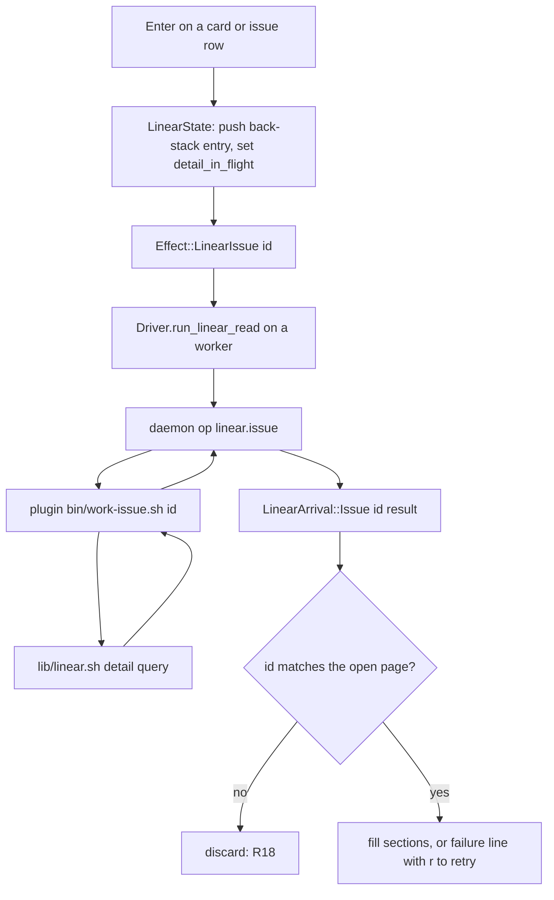

# Issue Detail Parity with Linear - Plan

## Goal Capsule

- **Objective:** A person who opens an issue from the board in Linear mode reads it without leaving the terminal: every section Linear's issue page has, in the same order, with the same properties, plus the board's own binding block in the sidebar. Reactions, subscribers and attachment previews stay in Linear, and writing to the issue still goes through Linear or the work plugin's consent gate.
- **Means:** A full-screen issue page in the board TUI, fed by a new one-issue read in the work plugin that the board calls when the page opens.
- **Product authority:** Shawn (sole user and owner of both the board and the work plugin).
- **Open blockers:** the work plugin's PR stack (shawnroos/shrimpshack#86, #88) and this repo's PR #1 / PR #2 stack must land before implementation can start; planning can proceed against their described contracts.

---

## Product Contract

### Summary

The Linear-mode card detail becomes a full-screen issue page laid out like Linear's: a main column with title, description, sub-issues and an Activity timeline, and a sidebar with every Linear property plus the board's own block at the bottom.
Below 72 cells the page collapses to one column with no border.
The page fetches the issue's full details from the work plugin when it opens, and renders description and comments as Markdown.

### Problem Frame

The Linear mode pickers work (PR #2, "pick a space, project or view and start /work:bind from the board") shipped a thin card detail overlay: one meta line (state, priority, assignee), labels, URL, and the bound worktree, tab and panes.
To read the description, the comments, the sub-issues or when the issue last moved, Shawn has to press `u` and switch to Linear in a browser.
Because the two pages share no structure, moving between them means re-finding each piece of information.

The board never reads Linear directly: every Linear field arrives through the work plugin, via a daemon op, as a typed protocol struct.
The current snapshot carries only id, identifier, title, url, state, assignee, priority, labels, stale and bindings, so nearly every section Linear shows needs data the board does not have today.

### Key Decisions

- **All of Linear's sections are in scope, not a subset.** Parity is the point; a partial page still sends the reader to Linear. Governs R1, R5, R9. (session-settled: user-directed — chosen over a reduced subset of sections: a person moving between the two tools must find things in the same place)
- **Details come from a one-issue fetch when the page opens.** Widening the snapshot would carry 250+ descriptions and comment threads on every refresh. Governs R14, R15, R16, R17, R18. (session-settled: user-directed — chosen over widening the space snapshot: keeps the snapshot light and fetches only what is being read)
- **Description and comments render as Markdown.** Linear content is written in Markdown and reads poorly as raw text. Governs R6. (session-settled: user-directed — chosen over plain unrendered text: descriptions use headings, lists and code heavily)
- **Activity shows comments and history events in one timeline.** This matches Linear, and answers "when did this move to Done" on the page. Governs R8, R8a. (session-settled: user-directed — chosen over comments only and over collapsed history runs: closest to Linear's own Activity)
- **Linked issues open in place with a back stack.** This matches clicking through in Linear. Governs R11, R12. (session-settled: user-directed — chosen over display-only rows and over jumping to the issue's board card: keeps the reader in the page)
- **The page is a full view at every width.** Linear's issue page is a page, not a modal. The narrow case drops all modal chrome and reads as its own view. Governs R2, R3. (session-settled: user-directed — chosen over a bordered overlay on wide screens with a full view only under 72 cells: one behaviour at every width)
- **The board's own block sits at the bottom of the sidebar.** The main column stays identical to Linear's. Governs R10. (session-settled: user-directed — chosen over the top of the main column and over a section after Activity, from a visual comparison of all three)
- **Markdown covers text structure; rich media degrades to a placeholder.** A terminal cannot draw images, tables or embeds well. Governs R6.
- **The page opens instantly on snapshot data and fills in.** The reader never waits on a blank page, and a failed fetch still leaves a useful page. Governs R14, R15, R17.
- **An older work plugin degrades the page instead of blocking Linear mode.** Raising the minimum plugin version would lock the whole of Linear mode until the plugin updates. Governs R16. (session-settled: user-approved — proposed over raising the minimum plugin version for all Linear ops; accepted when the scope was confirmed)
- **One cursor moves through every selectable row in reading order.** Today j/k moves only between panes; the page now has issue rows too. Governs R11, R13. (session-settled: user-approved — proposed with the tradeoff shown; accepted when the scope was confirmed)
- **An issue that is not on the board shows "not on this board" and cannot be bound from the page.** Binding from the page needs an existing worktree binding. Governs R10, R13. (session-settled: user-approved — proposed with the tradeoff shown; accepted when the scope was confirmed)

### Requirements

**Page shape and layout**

- R1. The page shows, in Linear's order, a main column (title, description, sub-issues, Activity) and a properties sidebar (status, priority, assignee, labels, project, milestone, cycle, estimate, due date, parent, relations), with the board's own block last in the sidebar.
- R2. The page replaces the board view at every width; it has no modal border, and the board does not show around its edges.
- R3. When the board body is under 72 cells wide (the width at which Linear mode already stacks its columns), the page shows one column in this order: title, compact properties, description, sub-issues, Activity, then the board block; parent and relation rows stay selectable in the compact properties, as they are in the wide sidebar.
- R4. Status, priority, assignee, labels, project, milestone, cycle, estimate and due date always keep their sidebar row, showing an empty marker when Linear has no value; parent and relations appear only when the issue has them. An explicit null from the plugin is treated as unset, and neither case renders an error.
- R5. The whole page scrolls vertically as one unit when its content is taller than the view, sidebar included. The selected row always stays on screen, with at least one line above and below it where the content allows.

**Content**

- R6. Description and comment bodies render headings, bold, italic, inline code, code blocks, bulleted and numbered lists, checkboxes, block quotes and links; images, tables and embeds render as a one-line placeholder that carries their link.
- R7. Sub-issues list each child's identifier, title and status, with a done-count summary (for example "1/3").
- R8a. The one-issue read caps or pages comments and history so it returns inside the budget in Dependencies; when it truncates, Activity says so and offers a key to load more.
- R8. Activity shows comments and history events (state, assignee, label, priority and similar changes) in one timeline, each with its actor and relative time, ordered by history-event time and by the time a comment thread started; replies stay nested under their parent comment whatever their own timestamps, as on Linear's page.
- R9. The sidebar shows the parent issue and every relation type Linear has (blocks, blocked by, related, duplicate). Every linked issue the read returns — sub-issue, parent or relation — carries its id, identifier, title and status, so any of them can open a page under R14.
- R10. The board block at the bottom of the sidebar lists every binding the issue has — each one's worktree, tab and panes — as the current detail does; for an issue with no board binding it shows "not on this board".

**Navigation and keys**

- R11. One cursor moves through every selectable row (sub-issues, parent, relations, panes) in the order the page draws them, top to bottom: the main column then the sidebar when wide, the single column when narrow. A section with no rows is skipped, not shown as an empty stop. The selected row carries the same marker the kanban card detail uses, and the page keeps a hint line naming its keys.
- R12. Enter on an issue row opens that issue's page in place; Esc returns to the previous issue, and Esc on the first issue returns to the board.
- R13. Each key's behaviour follows the row the cursor is on: Enter opens the issue on an issue row and focuses the pane on a pane row; `o` focuses the selected pane and does nothing on an issue row. `u`, `y` and `b` always act on the page's own issue, never the highlighted row — `u` opens it in Linear, `y` copies its worktree path, and `b` starts a bind when it has a board binding.

**Data and loading**

- R14. The page opens immediately with the fields the board already has (identifier, title, status, priority, assignee, labels, board block) and fills in the remaining sections when the fetch returns; an issue opened through a link that is not in the snapshot opens with the identifier, title and status from its link row.
- R15. When the fetch fails, the page keeps the fields it already shows, displays one line naming the failure, and offers `r` to retry.
- R16. With a work plugin that does not support the one-issue read, the page shows the snapshot fields and one line telling the reader to update the work plugin; the rest of Linear mode is unaffected. "The plugin cannot do this read" reaches the board as its own signal, distinct from "the read ran and failed", so the page never offers a retry for a missing plugin or an update line for a network failure.
- R17. Each page open (including each issue opened through a link and each back-step) fetches fresh details; fetched details are not cached between opens. A back-step is the exception to the loading state, not to the fetch: it re-shows what that page last displayed while its fresh fetch runs, replaces that content when the fetch returns, and keeps it under the R15 failure line when the fetch fails.
- R18. A fetch result applies only to the issue the page is currently showing: every result carries the identifier it was requested for, and a result (or failure) for an issue the reader has navigated away from is discarded.
- R19. The page stays read-only: it shows Linear data and board bindings and never edits the issue.

### Acceptance Examples

- AE1. **Covers R14, R15.** **Given** the plugin is slow, **when** the reader presses Enter on a card, **then** the page appears at once with title, status, priority, assignee, labels and the board block, and the description, sub-issues, Activity and remaining properties show a loading marker until the fetch returns. **When** the fetch then fails, **then** the loading markers are replaced by one failure line and `r` retries.
- AE2. **Covers R11, R12, R10, R13.** **Given** the reader is on ENG-412, **when** they move the cursor to sub-issue ENG-414 and press Enter, **then** ENG-414's page opens. **When** ENG-414 has no board binding, **then** its board block reads "not on this board" and `b` is unavailable. **When** they press Esc, **then** ENG-412's page returns; a second Esc returns to the board.
- AE3. **Covers R16.** **Given** the installed work plugin predates the one-issue read, **when** the reader opens a card, **then** the page shows the snapshot fields and a line telling them to update the work plugin, and the board, pickers and bind flow keep working.
- AE4. **Covers R3, R2.** **Given** the board sits in a 60-cell split, **when** the reader opens a card, **then** the page fills the split with no border and shows one column in the R3 order.
- AE5. **Covers R6.** **Given** a description with a heading, a checklist, a fenced code block and an embedded image, **when** the page renders it, **then** the heading, checklist and code block are styled, and the image appears as a one-line placeholder with its link.

### Scope Boundaries

- Editing the issue: status, assignee, comments, or anything else. Writes to Linear stay behind the work plugin's consent gate and are out of scope.
- Emoji reactions, subscribers, attachment previews and inline images.
- Caching fetched details between opens, and live refresh while the page is open (beyond `r` after a failure).
- The kanban (non-Linear) card detail is unchanged.

### Dependencies / Assumptions

- The work plugin (shrimpshack `plugins/work`) ships a one-issue read and a version bump. R16's degradation needs no new version machinery: the daemon already checks each script's presence separately from the global minimum version, so a plugin at the current minimum that lacks the one-issue script fails only that one op while the rest of Linear mode keeps working. Raising the global minimum instead would block all of Linear mode, which R16 exists to avoid. The plugin PR stack (shawnroos/shrimpshack#86, #88) is unmerged, so this work stacks on it.
- This branch stacks on PR #2 ("pick a space, project or view and start /work:bind from the board"), which stacks on PR #1 ("read-only Linear mode for a herdr space bound by the work plugin"); Linear mode does not exist on `main`.
- Linear's API exposes description, comments with replies, issue history, children, parent, relations, project, milestone, cycle, estimate and due date for one issue in a bounded number of requests (assumed; to confirm in planning).
- The daemon gives each Linear API call 8 seconds and one attempt, and derives a script deadline from the worst-case number of calls a script makes. The one-issue read declares its own call budget the same way, and the number of Linear calls it makes — driven by comment and history volume — is what R8a bounds.

### Outstanding Questions

**Deferred to Planning**

- How to render Markdown in ratatui: an existing crate or a small in-house renderer covering R6's list.
- Which history event types Linear returns and how each is phrased on one line (R8).
- The exact contract of the new plugin script and daemon op, and how the board records the plugin versions that support it.
- What a board daemon that predates the one-issue op does: degrade the page as R16 does for the plugin, or fall back to the existing stale-daemon screen.

### Sources / Research

- `docs/handoff.md` — the brief for this worktree.
- `crates/board-tui/src/view/linear.rs` (`detail_lines`, `draw_detail`) — current overlay detail.
- `crates/board-tui/src/app/linear.rs` (`detail_key`, `bind_detail_card`) — current detail keys; `b` refuses without a binding.
- `crates/board-core/src/protocol.rs` (`LinearIssue`) — current snapshot row fields.
- `crates/board-daemon/src/ops/linear.rs` (`PLUGIN_VERSION_FLOOR = "0.4.0"`, `ScriptRunner`) — plugin version check and script runner.
- `crates/board-tui/src/view/detail.rs` — the kanban detail's fullscreen mode and Compact-width sheet, a precedent for a full view.
- `docs/solutions/integration-issues/serde-default-rejects-explicit-null.md` — null tolerance for cross-process rows (R4).
- `docs/plans/2026-09-16-0929-feat-linear-mode-pickers-and-layout-plan.md` — the previous round's plan and layout rules.
- `docs/linear-conventions.md` — the board's Linear mode contracts, which the new op extends.
- shrimpshack repo: `plugins/work/lib/linear.sh` (the snapshot's issue fields already request `parent`, which the board's `LinearIssue` drops), `plugins/work/docs/snapshot.md`, `plugins/work/tests/fixtures/fake-linear.sh`.

---

## Planning Contract

**Product Contract preservation:** Product Contract unchanged. Planning found no conflict with any requirement; one Dependencies line was corrected against the daemon's actual timeout constants before these sections were written.

**Target repos:** the board (this repo) and the work plugin at `plugins/work` in the shrimpshack repo. Paths below are relative to whichever repo the unit names.

### Key Technical Decisions

- KTD1. **The one-issue read extends the plugin's existing issue query rather than writing a new one.** `lib/linear.sh` already has `herdr_linear::fetch_issue` and a shared `HERDR_LINEAR_ISSUE_FIELDS` set covering id, identifier, title, url, state, parent, project, team, assignee and labels; the new fields attach to a second field set used only by the detail read, so the snapshot's per-issue payload does not grow. Governs R9, R14.
- KTD2. **A new `bin/work-issue.sh <id>` mirrors the list scripts' envelope.** `bin/work-views.sh` is the shape to copy: the same lib sourcing, the same `{status, message, rows}` envelope discipline, exit 0 with a document, exit 2 for a refused argument, and nothing on stdout otherwise. Governs R4, R16.
- KTD3. **`linear.issue` is a third daemon op beside `linear.snapshot` and `linear.list`, with its own script deadline.** The daemon gives each Linear call 8 seconds and one attempt and derives a script deadline from a declared worst-case call count; the new op declares its own, sized to R8a's page caps rather than reusing the snapshot's. Governs R8a.
- KTD4. **"The plugin cannot do this read" gets its own error variant and protocol code.** `plugin_script` already separates a missing script from a below-floor version, but both return `Error::PluginUnavailable` and reach the TUI as the same code 6, which `classify` turns into an undifferentiated failure — so R16 needs a new variant beside `PluginUnavailable` with its own code, and the global version floor stays at 0.4.0. Governs R16. (session-settled: user-approved — chosen over raising the global plugin version floor: a raised floor blocks all of Linear mode until the plugin updates)
- KTD5. **The fetch reuses `run_linear_read`.** The TUI's existing worker-thread path already handles reconnect, client timeouts, failure classification and the deferred-read test hook; the detail read becomes a fourth caller with its own `LinearArrival` variant, so no new concurrency machinery appears. Governs R14, R15, R18.
- KTD6. **A Markdown renderer is written in-house over R6's list rather than adding a crate.** The list is bounded and the output is ratatui spans, not HTML, so a parser crate would still need a span-mapping layer; board-tui's dependency list stays as it is. Governs R6. (session-settled: user-directed — chosen over adding pulldown-cmark: the rendered subset is bounded and the output shape is spans)
- KTD7. **The page is a `Screen` that renders into the board body, replacing the overlay.** The kanban detail already has this shape — `detail_panel_area` uses the board body area in fullscreen mode, and a Compact-width sheet takes the whole content area — so the Linear page follows it instead of the `centered_rect_abs` + `Clear` overlay `draw_detail` uses today. Governs R2, R3.
- KTD8. **One row list drives the cursor, built by the same function that lays the page out.** Rows are derived once per draw in reading order, so the cursor, Enter's target and the visible order cannot drift apart, and an empty section contributes no row. Governs R5, R11, R12, R13.

### High-Level Technical Design

The page draws from two sources at once: the snapshot row the board already holds (title, status, priority, assignee, labels, bindings) and the fetched detail (description, sub-issues, Activity, the remaining properties). R14's open-immediately behaviour is that split, not a loading screen.

### Assumptions

- Linear's API returns description, comments with replies, issue history, children, parent, relations, project, milestone, cycle, estimate and due date for one issue; the plugin's existing query already proves parent, project, team, assignee, labels and state are reachable this way.
- Comment and history connections are paginated, so R8a's cap is a page count rather than a filter.

### Sequencing

Plugin first, then the board. U1 has landed in the shrimpshack repo (PR #90) and gives the board a documented endpoint; U2 onward land in the board repo and build against it. U7's live scenario is the one step that has to wait for that PR to merge — everything before it is provable against a vendored fixture. U6 (Markdown) is independent of U3–U5 and can be built in parallel with them.

---

## Implementation Units

### U1. One-issue read in the work plugin

**Shipped in shrimpshack#90**, on `feature/work-issue-detail` (based on #88). It lives in the other repo, so nothing in this repo's git history shows it. The board units below build against the envelope `plugins/work/docs/issue.md` documents there; do not re-implement it here.

Three things it settled that differ from this unit as written: no version bump (0.5.0 was already the unreleased version on that branch), `parent` needed a merged GraphQL selection to carry status, and history rows that change nothing the page shows are dropped.

- **Goal:** `bin/work-issue.sh <issue-id>` prints one issue's full detail as a documented envelope.
- **Requirements:** R6, R7, R8, R8a, R9, R4
- **Dependencies:** none
- **Files:** `plugins/work/bin/work-issue.sh` (new), `plugins/work/lib/linear.sh`, `plugins/work/docs/snapshot.md` or a new `plugins/work/docs/issue.md`, `plugins/work/tests/fixtures/fake-linear.sh`, `plugins/work/tests/unit/` (new test), `plugins/work/.claude-plugin/plugin.json`
- **Approach:**
  1. Add a detail field set beside `HERDR_LINEAR_ISSUE_FIELDS` carrying description, children, relations and inverse relations, projectMilestone, cycle, estimate, dueDate, comments (with their parent and author) and history, each paged under a cap per KTD3.
  2. Add a `herdr_linear::fetch_issue_detail` that composes the query the way `fetch_issue` does and drains the paged connections to the cap, returning the plugin's existing partial code when it truncates.
  3. Write the script to `bin/work-views.sh`'s shape per KTD2: same lib sourcing, `is_bind_identifier` on the argument, the same status/message mapping over the library's return codes, JSON printed by the same python emitter.
  4. Every linked issue row carries id, identifier, title and status (R9).
  5. Bump the plugin version.
- **Patterns to follow:** `plugins/work/bin/work-views.sh` end to end; `herdr_linear::fetch_issue` for query composition; the sanitiser the list scripts run every string through.
- **Test scenarios:**
  - An issue with description, two sub-issues, a parent, one relation of each type and a comment thread with a reply prints every field, with replies carrying their parent's id.
  - An issue with no description, no children, no relations, no milestone, no cycle, no estimate and no due date prints nulls or empty lists, never an error (Covers R4).
  - A comment or history connection longer than the page cap sets the partial status and a message naming what was truncated (Covers R8a).
  - A malformed or unknown issue id exits 2 with nothing on stdout.
  - Linear refusing the credential, being unreachable, and rate limiting each map to `unavailable` with their own message.
  - The fake-Linear fixture drives all of the above with no network.
- **Verification:** the plugin's own test runner passes, and the script prints a valid envelope against the fixture for each scenario.

### U2. `linear.issue` daemon op

- **Goal:** the board can ask the daemon for one issue's detail and tell a missing script from a failed read.
- **Requirements:** R4, R15, R16, R18
- **Dependencies:** U1
- **Files:** `crates/board-core/src/lib.rs`, `crates/board-daemon/src/ops/linear.rs`, `crates/board-daemon/src/ops/mod.rs`, `crates/board-core/src/protocol.rs`, `crates/board-daemon/tests/` (op tests)
- **Approach:**
  1. Add `LinearIssueParams` (issue id, origin socket, plugin root) and a `LinearIssueDetail` response to `protocol.rs`, following the snapshot types' serde conventions — every optional field `Option<T>`, every list defaulted, nulls tolerated per the repo's serde learning.
  2. Register `linear.issue` in the op table beside `linear.snapshot` and `linear.list`.
  3. Add an `ISSUE_SCRIPT_RELATIVE` constant and its own deadline constant derived from its declared worst-case call count (KTD3).
  4. Validate the issue id with the existing identifier check before running anything.
  5. Add an error variant beside `PluginUnavailable` with its own protocol code for "the plugin does not ship this script", return it when the script is absent, and carry it through the TUI's failure classification so the page can pick R16's remedy over R15's (KTD4).
- **Patterns to follow:** `snapshot` and `list` in the same file, including `ScriptRun`, `plugin_script`, `run_script` and the parse-error wrapper; `sanitise_json` on the parsed value as `list` does.
- **Test scenarios:**
  - A well-formed run against a fake script returns the parsed detail.
  - An id that fails the identifier check is refused before any process starts.
  - A plugin root with no `bin/work-issue.sh` returns the new error code, and a script that exits non-zero returns the old one, so the two are distinguishable at the client (Covers AE3, R16).
  - A script printing unparseable JSON returns the parse error naming the script and how to run it by hand.
  - A script that exceeds the deadline is terminated and reported as a timeout.
  - An explicit `null` in every nullable field parses (Covers R4).
- **Verification:** daemon tests pass; a hand-run of the op against the real plugin returns a document.

### U3. Detail fetch and page state in the TUI

- **Goal:** opening the page starts a fetch, fills sections when it lands, and ignores results for an issue the reader has left.
- **Requirements:** R14, R15, R17, R18, R19
- **Dependencies:** U2
- **Files:** `crates/board-tui/src/app/linear.rs`, `crates/board-tui/src/driver/linear.rs`, `crates/board-tui/src/driver/dispatch.rs`, `crates/board-tui/tests/linear/mod.rs`
- **Approach:**
  1. Add `Effect::LinearIssue { id }` and allow it in `linear_allows`; place it in `linear_denies` so the exhaustive match still compiles.
  2. Add `LinearArrival::Issue { id, result }` and fetch through `run_linear_read` (KTD5).
  3. Hold the open page's detail, its in-flight flag and its failure on `LinearState`, keyed by issue id.
  4. On arrival, drop any result whose id is not the open page's (R18).
  5. `r` re-sends the fetch after a failure (R15).
  6. Give the read its own client-side timeout constant, sized against the op's daemon deadline from KTD3, as each existing read has.
- **Patterns to follow:** `fetch_linear_list` and its arrival handling; the existing `in_flight` / `queued` discipline for the snapshot; `read_timeout_text` for the timeout message.
- **Test scenarios:**
  - Opening a card dispatches the fetch once and marks it in flight.
  - The page renders snapshot fields before the fetch lands (Covers AE1).
  - A failed fetch leaves the snapshot fields, shows one failure line, and `r` sends a second read (Covers AE1, R15).
  - A result for issue A arriving after the reader opened issue B changes nothing on screen (Covers R18).
  - A timeout reports the limit rather than a bare failure.
  - The daemon answering "unknown method" for `linear.issue` does not break the board or the snapshot.
  - The page's effects stay inside Linear mode's allow set, and no write-bearing effect becomes reachable from it (Covers R19).
- **Verification:** `cargo test -p board-tui --all-features` passes, including the new cases.

### U4. The full-screen two-column page

- **Goal:** the detail renders as a page in Linear's layout at every width, with no modal chrome.
- **Requirements:** R1, R2, R3, R4, R5, R7, R9, R10
- **Dependencies:** U3
- **Files:** `crates/board-tui/src/view/linear.rs`, `crates/board-tui/src/view/mod.rs`, `crates/board-tui/tests/linear/mod.rs`, `crates/board-tui/tests/linear/snapshots/`
- **Approach:**
  1. Replace `draw_detail`'s overlay with a page drawn into the board body (KTD7); drop `centered_rect_abs`, `Clear` and the border.
  2. Split into main column and sidebar at or above 72 cells of body width, reusing the existing `MIN_COL_W` stacking rule; below it, draw the single column in R3's order.
  3. Build the section list once and lay out from it, so the sidebar's board block is the last sidebar section and the narrow order is the same list flattened (KTD8).
  4. Scroll the page as one unit and keep the selected row on screen (R5).
  5. Value properties always occupy their row; parent and relations appear only when present (R4).
- **Patterns to follow:** `crates/board-tui/src/view/detail.rs` for a full-screen detail and its section-height helpers; `fit` / `truncate` for wrapping; `Zone` hit-map registration as the current `draw_detail` does.
- **Test scenarios:**
  - At 120 cells the page shows the main column and sidebar in R1's order with the board block last (insta snapshot).
  - At 60 cells the page fills the split, has no border, and shows R3's single-column order (Covers AE4, insta snapshot).
  - An issue with no milestone, cycle, estimate or due date still shows those rows with an empty marker, and shows no parent or relations rows (Covers R4).
  - An issue with no board binding shows "not on this board" (Covers R10).
  - An issue with several bindings lists them all (Covers R10).
  - A page taller than the view scrolls, and the selected row stays visible (Covers R5).
  - Sub-issues show the done count (Covers R7).
- **Verification:** snapshots reviewed and accepted; the board, pickers and strip render unchanged.

### U5. One cursor, Enter, and the back stack

- **Goal:** one cursor crosses every selectable row, Enter opens a linked issue in place, and Esc walks back.
- **Requirements:** R11, R12, R13, R14, R17
- **Dependencies:** U4
- **Files:** `crates/board-tui/src/app/linear.rs`, `crates/board-tui/src/view/linear.rs`, `crates/board-tui/tests/linear/mod.rs`
- **Approach:**
  0. Existing tests read `pane_cursor` directly — `detail_cursor_starts_on_the_working_pane_and_o_focuses_it` among them — so rewriting them onto the row cursor is part of this unit, not fallout from it.
  1. Replace `pane_cursor` with a row cursor over the derived row list (KTD8); `pane_rows` becomes one contributor to it.
  2. Hold a back stack of visited issues, each entry keeping the content it last showed so a back-step re-renders it while its refresh runs (R17).
  3. Enter opens an issue row and focuses a pane row; `o` acts only on a pane row; `u`, `y` and `b` always act on the page's own issue (R13).
  4. Esc pops the stack; Esc on the first entry returns to the board.
  5. Keep the hint line current with the page's keys.
- **Patterns to follow:** the existing `detail_key` and `nav_delta` / `step_clamped` movement; `bind_detail_card`'s refusal messages for `b`.
- **Test scenarios:**
  - The cursor visits sub-issues, parent, relations and panes in draw order and skips sections with no rows (Covers R11).
  - Enter on a sub-issue opens it; Esc returns to the first issue; a second Esc returns to the board (Covers AE2).
  - A back-step shows the previous page's content immediately rather than loading markers (Covers R17).
  - `o` on an issue row does nothing; Enter on a pane row focuses it (Covers R13).
  - `b` on a page whose issue has no binding refuses with the existing message, whatever row the cursor is on (Covers AE2, R13).
  - `u` and `y` act on the page's issue while the cursor sits on a sub-issue row.
  - An issue opened by link that is not in the snapshot opens with the identifier, title and status from its link row (Covers R14).
- **Verification:** `cargo test -p board-tui --all-features` passes; the key hint line matches the keys the page handles.

### U6. Markdown rendering

- **Goal:** description and comment bodies render with structure; media degrades to a placeholder.
- **Requirements:** R6
- **Dependencies:** none (parallel with U3–U5)
- **Files:** `crates/board-tui/src/markdown.rs` (new), `crates/board-tui/src/lib.rs`, `crates/board-tui/tests/` (new unit test)
- **Approach:** a line-oriented renderer producing ratatui lines and spans over R6's list, with images, tables and embeds each collapsing to a one-line placeholder carrying their link (KTD6). It wraps to a given width, so the page passes its column width in.
- **Test scenarios:**
  - Headings, bold, italic, inline code, links, block quotes, bulleted, numbered and checkbox lists each render with their expected styling.
  - A fenced code block renders unwrapped and unstyled inside, and an unterminated fence does not swallow the rest of the document.
  - An image, a table and an embed each render as one placeholder line carrying the link (Covers AE5).
  - Text wider than the column wraps at the column, and a nested list keeps its indent when wrapped.
  - Plain text with no markup renders unchanged.
  - Text carrying wide or combining characters measures by display width, not byte count.
- **Verification:** unit tests pass; the rendered output of a real Linear description reads correctly in the page.

### U7. End-to-end and fixture coverage

- **Goal:** the page is proven against the plugin contract, not only against hand-written fixtures.
- **Requirements:** R14, R15, R16
- **Dependencies:** U5, U6
- **Files:** `crates/board-core/tests/fixtures/` (new detail fixtures), `crates/board-tui/tests/linear/mod.rs`, the repo's e2e scenario directory, `scripts/sandbox.sh` if a gate is added
- **Approach:** vendor a detail fixture from the plugin's own fake-Linear output so the board's tests and the plugin's stay on one contract, and add a live scenario covering opening a page and drilling into a sub-issue. Keep the live scenario out of provider-free CI, as the existing Linear scenarios are.
- **Test scenarios:**
  - The vendored fixture parses into the protocol type with no field lost.
  - Covers AE3. A plugin without `bin/work-issue.sh` shows the update line while the board, pickers and bind flow keep working.
  - A live scenario opens an issue page, drills into a sub-issue and returns.
- **Verification:** provider-free gates pass; the live scenario passes against a real space.

### U8. Documentation

- **Goal:** the new contract is written down where the existing ones are.
- **Requirements:** R16
- **Dependencies:** U2
- **Files:** `docs/linear-conventions.md`, `plugins/work/docs/` (the new op's document)
- **Approach:** document the `linear.issue` op, its envelope, its truncation status and the missing-script behaviour, beside the snapshot and list contracts.
- **Test expectation:** none — documentation only.

---

## Verification Contract

| Gate | Command | Applies to |
|---|---|---|
| Board unit and integration tests | `cargo test --workspace --all-features` | U2–U7 |
| Snapshot review | `cargo insta review` for the new Linear page snapshots | U4 |
| Plugin tests | the plugin's `tests/run-tests.sh` | U1 |
| Provider-free gates | `scripts/sandbox.sh gates` (after `scripts/sandbox.sh prepare`) | U7 |
| Live scenario | the Linear e2e scenario, run against a real space | U7 |

The page must open and fill inside the daemon's declared deadline for the new op on a real issue with an active comment thread; a fetch that regularly exceeds it is a failure of R8a's cap, not of the test.

## Definition of Done

- Every requirement R1–R19 is met, and every acceptance example AE1–AE5 has a test that proves it.
- The plugin's new script and version bump are merged, and the board's floor is unchanged.
- A plugin without the new script still opens the page with snapshot fields and the update line, with the rest of Linear mode working.
- The board's existing Linear tests still pass unchanged except where the page deliberately replaced the overlay.
- No abandoned approach is left in the diff — the overlay's `draw_detail` and `pane_cursor` are removed, not left beside their replacements.
- `docs/linear-conventions.md` and the plugin's docs describe the new op.
