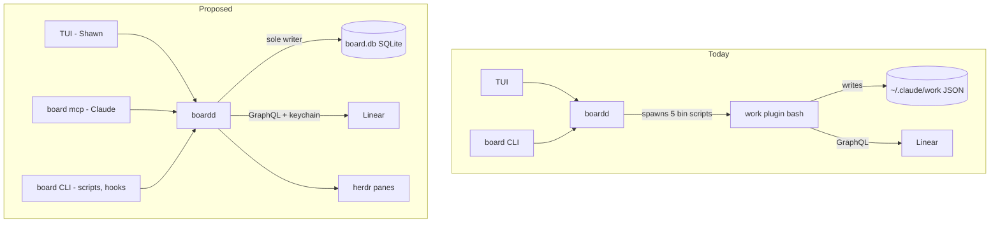
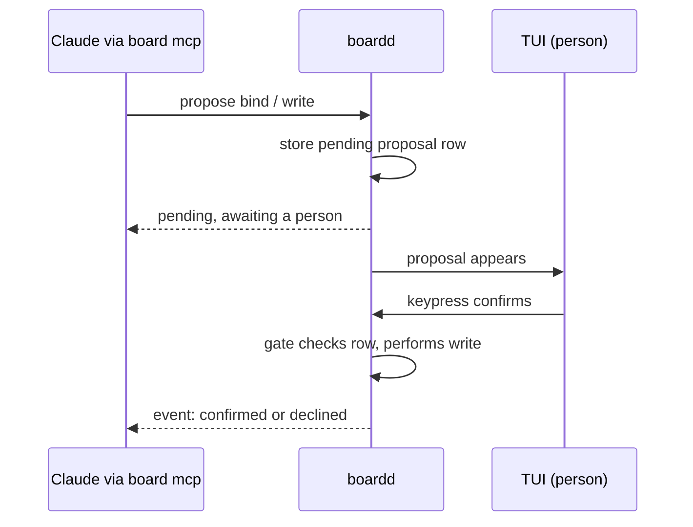

# Board Owns the Store ADR - Plan

## Goal Capsule

- **Objective:** Shawn and any future contributor can read one decision record that says who owns the work store, how Claude reaches the board, and how a person approves a Linear write. They can then decide whether to build it without reconstructing the argument from session transcripts.
- **Means:** a standalone decision doc under `docs/`, with pointer notes at every `design.md` passage it reopens (KTD1, KTD2).
- **Authority:** this plan's Requirements win on what the record must say; KTDs win on where and how it is written. Session-settled KTDs are not re-opened by the executor.
- **Stop conditions:** stop and report if writing the record surfaces evidence that a session-settled decision (KTD4, KTD8 through KTD12) cannot work. Stop if the docs gates cannot be made green without editing the pinned contract row in `docs/README.md`.
- **Execution profile:** docs only. No Rust, no schema, no protocol change. One PR.
- **Finish and ship:** the executor writes the docs, runs the docs gates in the sandbox, and opens the PR against `main`. This fork has no `dev` branch, so confirm the base before opening.

---

## Product Contract

### Summary

Write a decision record that reopens `docs/design.md` §9 item 7 ("No MCP — CLI only"). The record proposes that `boardd` becomes the only owner of the work store, that the store moves into boardd's SQLite, that MCP becomes a third client beside the TUI and the CLI, and that the work plugin's bash scripts become `board` calls. It carries a behaviour inventory of the plugin's bats suite so the cost of the move is on the page. It is a proposal: nothing is built by this plan.

### Problem Frame

The Rust board and the bash work plugin show the same Linear work through two models that were never joined. The plugin groups by `board.json` (4 levels by 8 fields). The board groups by one flat axis taken from a Linear custom view. The snapshot the plugin sends the board ignores `board.json` entirely: `plugins/work/bin/work-snapshot.sh:419` in shrimpshack hardcodes the mapping, and the script has no reference to board-config. Fixing that wire is the small answer. The larger answer is that one process should own the data, so the wire stops existing.

`docs/research.md:161` already planned for this: "tiny CLI > MCP for v1 … MCP wrapper later." The record is that "later", not a reversal. The same research line 160 already argued "JSON/md files race with concurrent writers", which is the case against two writers on `~/.claude/work`.

Research for this plan found that the handoff's framing of consent was wrong in two ways. The board holds no consent code today; it lives only in the plugin (`lib/record.sh`, `lib/board-store.sh`, `lib/binding.sh` in shrimpshack). And a nonce handed back to the same caller orders a write but does not prove a person saw it; the plugin says so itself (`lib/binding.sh:305-307`). Under MCP, Claude is the caller, so the record has to name where a person approves.

### Requirements

**The decision**

- R1. The record states the decision: boardd is the single owner and single writer of the work store, and the store's state becomes rows in boardd's SQLite (KTD9).
- R2. The record names the three clients of one owner: TUI (Shawn), MCP (Claude), and CLI (scripts and hooks). None of them owns data. The herdr panes are where boardd dispatches work, not clients.
- R13. The record states that the board adopts the plugin's grouping model (4 levels by 8 fields, with per-space overrides and a filter), and that a Linear custom view is only the fallback for a space with no grouping configured.
- R3. The record states that the board reads and writes Linear through its GraphQL API with the keychain key, never through Linear's own MCP server (KTD12).
- R4. The record states that the CLI and its skill stay beside MCP (KTD11).

**Consent**

- R5. The record states where a person approves a Linear write or a binding, and what that approval does and does not guarantee: it stops an agent using the board's own tools (MCP and the skill) from writing without a person, and it does not stop a same-user agent with Bash that deliberately works around it (KTD4).
- R6. The record states that write gating lives in the daemon, and that the MCP shim's tool list limits what Claude sees but is not a security boundary (KTD5).

**Failure and discovery**

- R7. The record states the failure model: `board mcp` and user-installed commands reuse the CLI's existing auto-start, so a stopped daemon is not an outage; a missing or unfindable `board` binary is (KTD8).
- R8. The record states how a Claude session finds the MCP server, and who installs it (KTD3).

**Cost and payoff**

- R9. The record lists what the change retires, with the concrete files, doc passages and contracts.
- R10. The record carries the bats behaviour inventory: per behaviour class, what it pins and whether it moves as-is, moves with a new harness, or becomes obsolete.
- R11. The record lists the open questions a follow-on migration plan must answer, and does not answer them itself (KTD2).

**Docs integrity**

- R12. Every `design.md` passage the record reopens carries a one-line pointer to it, marked as proposed, and no passage is rewritten as if the change shipped.

### Key Decisions

- **Decision plus consequences, migration deferred.** The record argues and decides; a separate plan designs the migration. Governs R11.
- **Consent reframed from "the nonce stays" to "a person confirms in the TUI", with its limit stated.** The handoff's wording rested on a nonce that does not prove a person; no board-side surface can stop a same-user agent with Bash either. Governs R5, R6.

### Scope Boundaries

- No code, schema, protocol, or test change.
- The record does not design the migration sequence, the SQLite tables, or the MCP tool list beyond naming rules.
- The shrimpshack repo is read-only for this work.

#### Deferred to Follow-Up Work

- The migration plan: table design, cut-over order, the transition window where old plugin and new board overlap.
- A board status pane using Claude Code function hooks (current card, run elapsed, pending questions). The record mentions it only where it overlaps: pending approvals are exactly what such a pane would show.
- The handoff's stale citations in `docs/handoff.md` (spawn line, script count, `non_default_mapping` line). The record carries the corrected facts; the brief itself is not edited.

### Outstanding Questions

These are the record's own open questions (R11), recorded here so the executor copies them rather than invents them:

- Where user-authored grouping config lives: rows in SQLite, or a section of the board's existing TOML config (`crates/board-core/src/config.rs` `RootConfig`). State is SQLite either way; this is about the hand-edited mapping only.
- Cut-over: whether the plugin reads through the board during a transition, or the move is one release.
- Which plugin hooks (`ground`, `board-behind`) stay as thin bash calling `board`, and which disappear.
- The fake-herdr split in the plugin (`tests/fixtures/fake-herdr.sh` reports 0.8.2 / protocol 20 in its status output but 0.9.0 / protocol 22 in its canned snapshot; `tests/fixtures/fake-herdr-socket.py` pins 0.9.0 / protocol 22): which ported tests inherit which.

---

## Planning Contract

### Key Technical Decisions

- KTD1. **One standalone doc at `docs/board-owns-the-store.md`, with a status line.** A top-level `docs/*.md` file is link-checked by `scripts/tests/test_docs.py`; a subfolder is not. There is no ADR convention to follow, and one record does not justify starting a `docs/adr/` folder. The status line reads `Proposed`. (session-settled: user-approved — chosen over a new `docs/adr/` folder: one record does not need a convention.)
- KTD2. **The record holds decision and consequences, not the migration.** Migration detail in a decision record goes stale the moment the migration plan starts. (session-settled: user-approved — chosen over a phased migration inside the record: keeps the decision stable while the plan changes.)
- KTD3. **The user installs the MCP server once, at user scope; the board writes no `.mcp.json`.** User scope covers every Claude session, including ones the board did not spawn. A project `.mcp.json` would need an approval per worktree and dirty every worktree the board creates. Only the user can install it, which the record says plainly. Attribution does not need per-worktree config: a spawned agent already carries `HERDR_PANE_ID`, `BOARD_CARD_ID` and `BOARD_RUN_ID` in its environment, and `board mcp` inherits them.
- KTD4. **A person approves in the TUI; MCP can propose, never confirm; the limit is stated.** A pending proposal becomes a daemon-owned row the TUI shows; a keypress there confirms it. No MCP tool and no non-interactive CLI verb confirms. Claude Code's permission prompt is not enough: a background agent auto-approves it. The record lists three known bypasses for a same-user agent with Bash: sending keys to the TUI pane through the herdr socket, calling the confirm method on the board socket, and reading the Linear key from the keychain to write Linear directly. The plugin accepts the same limit today (`lib/binding.sh:12-27`, `:305-307`). (session-settled: user-directed — chosen over an OS presence check such as Touch ID: stronger, but adds migration work and still leaves the keychain path open.)
- KTD5. **Gating lives in the daemon.** `docs/design.md:1033-1034` already says any socket client can call any method, and an agent with Bash can reach the socket without MCP. So consent state and the write gate are daemon rules on SQLite rows; the shim's tool list is presentation.
- KTD6. **The additive-schema rule moves to boardd's own protocol.** Once boardd reads Linear itself, the Linear document `schema` field is no longer a cross-process contract; it matters only during a transition. The two hard `schema != 1` rejects at `crates/board-daemon/src/ops/linear.rs:213` and `:243` must change together if the transition needs a bump (`docs/solutions/integration-issues/a-pinned-version-check-has-a-twin.md`). New fields crossing a process boundary need `Option<T>` or `null_as_empty` (`docs/solutions/integration-issues/serde-default-rejects-explicit-null.md`); today `LinearGroup` and the snapshot types have neither.
- KTD7. **MCP server and tool names avoid the word "linear".** The plugin's PostToolUse hook matches `mcp__.*[Ll][Ii][Nn][Ee][Aa][Rr].*__.*` (any letter case) (`plugins/work/hooks/hooks.json` in shrimpshack) and would fire on the board's own tools while the plugin is installed.
- KTD8. **Daemon down is covered by existing auto-start.** `connect_or_start` (`crates/board-cli/src/daemon.rs:16-35`) re-launches its own binary via `current_exe()`, so a `board mcp` subcommand gets auto-start for free. The shim must keep stdout for the MCP stream and never write through `crates/board-cli/src/render.rs`. (session-settled: user-directed — chosen over treating daemon-down as a new failure mode: the CLI already restarts it.)
- KTD9. **The work store becomes rows in boardd's SQLite.** Today `~/.claude/work` runs four record engines with their own locks and a shared `mkdir` lock. (session-settled: user-directed — chosen over JSON with the daemon as sole writer: "workstore is the app store".)
- KTD10. **Plugin scripts become `board` CLI or MCP calls; bats becomes Rust tests.** (session-settled: user-directed — chosen over the plugin and board both writing the store: two writers is the failure mode to design out.)
- KTD11. **CLI and skill stay beside MCP.** Scripts and hooks need a non-MCP door. (session-settled: user-approved — chosen over MCP replacing the CLI.)
- KTD12. **Linear through GraphQL and the keychain key, not Linear's MCP.** Linear's MCP tools are paginated and prose-shaped and do not guarantee the field set eight-field grouping needs. (session-settled: user-approved — chosen over Linear's MCP server: field completeness.)

### High-Level Technical Design

Ownership before and after:

Consent under MCP (KTD4, KTD5):

### Research Inputs

- Plugin store: four record engines (`record.sh`, `repos.sh`, `board-store.sh`, `board-config.sh`), one shared `mkdir` lock, plus a pid-owning lock in `board-sync.sh:82-115`. Contents: `bindings`, `board`, `board.json`, `descriptions`, `layouts`, `scopes`, `shadow.log`, `workspaces`, `write-enabled`.
- Plugin surface: 1 command, 10 model-blocked skills, 8 bin scripts, 3 hooks. boardd shells out to 5 of the bin scripts (`crates/board-daemon/src/ops/linear.rs:29-33`, spawn at `:594`).
- boardd SQLite is schema v15 (`crates/board-core/src/db/migrations.rs:11`) and holds no Linear data today.
- Bats suite: 38 files, 18,582 lines, 1,303 tests; about 3,050 lines are setup. Verdicts: ~2,300 lines move as-is, ~13,400 move as invariants with a new harness, ~2,900 plus slices become obsolete. Roughly 900 to 1,000 behaviours are worth porting.
- All shrimpshack facts are against `origin/main` at `223f27c`. The installed `work` 0.5.0 cache is an older build with the same version string.

---

## Implementation Units

### U1. Write the decision record

- **Goal:** `docs/board-owns-the-store.md` exists and states the decision, its consequences, and its open questions.
- **Requirements:** R1 through R9, R11, R13.
- **Dependencies:** none.
- **Files:** `docs/board-owns-the-store.md` (create).
- **Approach:**
  1. Header: title, `Status: Proposed`, date, and one line naming the passages it reopens (§9 item 7, §10, §13).
  2. Context: the two grouping models, the unjoined snapshot wire, the `research.md:161` escape hatch. Keep it to the Problem Frame's facts.
  3. Decision: one section per group of R1 through R8 and R13, each citing evidence by path. Consent gets its own section with the sequence from the High-Level Technical Design and a "Known limits" list of the three bypasses in KTD4.
  4. Precedent: Paper and Open Design are GUI apps that are also MCP servers and default tool calls to the user's current context. The board gets stronger context by construction because it spawned the agent (KTD3).
  5. What it retires (R9): `work-snapshot.sh` and the line-419 literal; the vendored snapshot fixtures and their sha256 `VERSION` pin asserted from both repos (`crates/board-core/tests/fixtures/linear-snapshot/`, `linear-issue/`); the lib-sourcing gate class (shrimpshack PR #94); the four record engines and their locks; display parity as a wire problem.
  6. Consequences: the cost (U2 inventory, by summary), the binary-on-PATH failure mode, the consent trip to the TUI for unattended flows.
  7. Rejected options: an OS presence check for approval (KTD4), making `work-snapshot.sh` read `board.json` (fixes the display gap but keeps two owners of the same data), MCP as a second owner, Linear's MCP as the board's Linear client, Claude Code's permission prompt as the consent surface, per-worktree `.mcp.json`.
  8. Open questions: copy the plan's Outstanding Questions.
- **Patterns to follow:** `docs/design.md` voice and heading depth. Shrimpshack references are code spans, never relative links (`test_docs.py` resolves every relative link in `docs/*.md`).
- **Test expectation:** none -- documentation only; the docs gates in the Verification Contract cover links and format.
- **Verification:** a reader who has not seen this session can answer, from the record alone: who writes the store, how Claude reaches the board, where a person approves, what happens when boardd is down, and what gets deleted.

### U2. Carry the bats behaviour inventory into the repo

- **Goal:** the per-class inventory of the plugin's tests lives in the repo, so the cost estimate outlives the scratch research.
- **Requirements:** R10.
- **Dependencies:** U1 (the record links to it).
- **Files:** `docs/board-owns-the-store.md` (append an appendix section), or `docs/board-owns-the-store-tests.md` (create) if the appendix pushes the record past a comfortable read. The executor picks by length.
- **Approach:**
  1. One table of the ten behaviour classes: class, files, lines/setup/tests, verdict.
  2. Per class, two or three lines: what it pins and why it moves, gets a new harness, or goes.
  3. Name the fakes (`fake-linear.sh` replaces curl, not the API; `fake-herdr.sh` vs `fake-herdr-socket.py` version split; `fake-security.sh`) and what each becomes.
  4. State the pin: facts are against shrimpshack `origin/main` `223f27c`.
  5. Do not list all 38 files; the class table is the durable level.
- **Patterns to follow:** table shape in `docs/testing.md`.
- **Test expectation:** none -- documentation only.
- **Verification:** the totals in the table sum to 38 files and 18,582 lines.

### U3. Point every reopened passage at the record

- **Goal:** anyone reading `design.md` or `research.md` finds the proposal where the old decision is stated.
- **Requirements:** R12.
- **Dependencies:** U1.
- **Files:** `docs/design.md` (modify), `docs/research.md` (modify), `docs/README.md` (modify).
- **Approach:**
  1. `docs/design.md` §9 item 7: append one sentence linking the record, marked proposed. Leave the decision text as it is.
  2. `docs/design.md` §10: the "no MCP needed" line gets the same pointer.
  3. `docs/design.md` §13: one pointer near the "never writes … a plugin record or a SQLite row" sentence (around line 935). The other §13 sentences (around 946 and 1094) are covered by that one note; do not scatter pointers.
  4. `docs/research.md:161`: pointer after "MCP wrapper later."
  5. `docs/README.md` doc table: add one row for the record. Do not touch the contract table row that pins schema v15 and protocol 22 (`test_docs.py:141-156`).
- **Patterns to follow:** existing relative links in `docs/design.md`.
- **Test expectation:** none -- documentation only.
- **Verification:** every pointer resolves; the design text still describes the shipped system.

### U4. Changelog and PR

- **Goal:** the change lands without a changelog entry, which `AGENTS.md` allows for a change with no user-visible effect.
- **Requirements:** R12.
- **Dependencies:** U1, U2, U3.
- **Files:** none beyond U1 through U3.
- **Approach:**
  1. Add no `CHANGELOG.md` entry: a proposal changes nothing a user can see. `test_docs.py` only accepts entries linking `nelsonPires5/herdr-board/pull/NN`, which this fork cannot supply before the PR exists.
  2. Do not commit `docs/handoff.md`; it is the spinoff brief and is modified in the working tree. Ask before including it.
- **Test expectation:** none -- documentation only.
- **Verification:** `CHANGELOG.md` is unchanged in the diff.

---

## Verification Contract

| Check | Command | Applies to |
|---|---|---|
| Docs rules and link resolution | `python3 -m unittest discover -s scripts/tests -p 'test_docs.py'`, run inside `./scripts/sandbox.sh` | U1 through U4 |
| Full gate list | `./scripts/sandbox.sh gates` | before handoff, per `AGENTS.md` |

Run gates through the sandbox, not host `cargo test` (`AGENTS.md`, "Development workflow"). Read the verdict line, not the log's silence. No Rust changes, so the cargo tiers are expected to pass unchanged; a cargo failure means something outside this plan moved.

## Definition of Done

- `docs/board-owns-the-store.md` exists with `Status: Proposed` and covers R1 through R9, R11 and R13.
- The behaviour inventory is in the repo and its totals match 38 files and 18,582 lines.
- Every reopened passage in `design.md` and `research.md` points at the record; none claims the change shipped.
- `docs/README.md` indexes the record; its contract table is unchanged.
- The docs gate passes in the sandbox.
- `docs/handoff.md` is not in the commit unless Shawn said to include it.
- No scratch or abandoned drafts remain in the diff.
