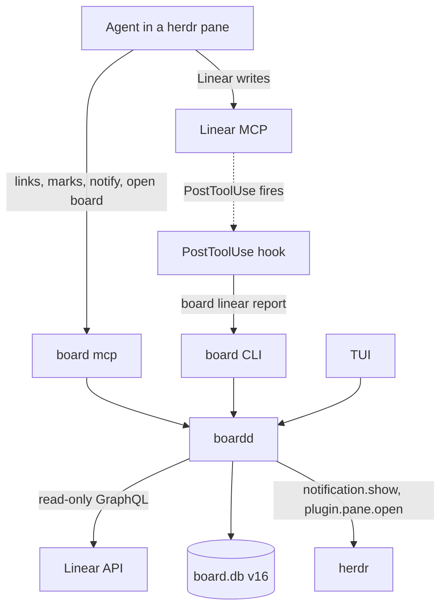
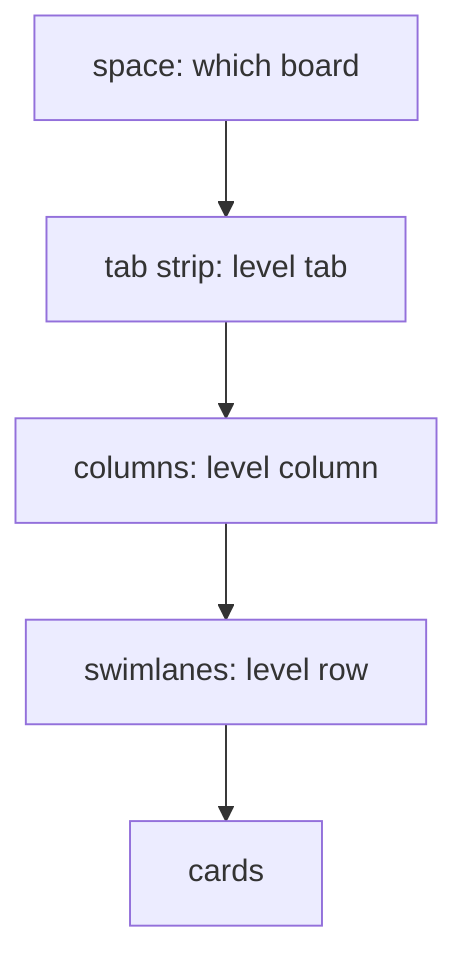

# Board Owns the Store Migration - Plan

## Goal Capsule

- **Objective:** Shawn works Linear from herdr with one source of truth. Agents create and update tickets through the official Linear MCP server; the board shows those tickets grouped the way he configured, knows which session, pane and worktree belongs to which issue, and lets agents point him at work without moving his view.
- **Means:** boardd owns local state in SQLite, reads Linear itself read-only, renders the plugin's level hierarchy as a Linear-style board view, and gains a `board mcp` door plus a hook-report verb (KTD1 through KTD13).
- **Authority:** `docs/board-owns-the-store.md` owns product intent; this plan's Requirements win on behaviour; KTDs win on mechanism. Session-settled KTDs are not re-opened by the executor.
- **Stop conditions:** stop and report if U1 shows a herdr or Claude Code behaviour that a settled KTD depends on does not hold (KTD6, KTD7, KTD8, KTD12). Stop if a gate cannot go green without editing a pinned contract outside U2's version bump.
- **Execution profile:** Rust across all five crates, docs, and e2e scenarios. Phased; U1 gates everything after it.
- **Finish and ship:** the executor lands this repo's phases 1 and 2 as PRs against `main` on the fork `shawnroos/herdr-linear-board`, with the sandbox gates and e2e green. Phase 3 is an outline for a separate shrimpshack change.

---

## Product Contract

### Summary

Build the board side of the decision record. boardd stores bindings, space and session scopes, scope repositories, grouping config, marks, notes, show-requests and Linear activity in SQLite, imported from `~/.claude/work` by a re-runnable command. It reads Linear itself through GraphQL, read-only, and renders the plugin's four levels as a board view: tabs, columns and swimlanes. A new `board mcp` server lets agents read and change links, mark cards, notify, ask to show, and open a board in a tab or split beside their own pane. A new `board linear report` verb lets a Claude Code hook report Linear MCP writes. Automatic herdr pane sync is deferred.

### Problem Frame

The record's context holds. Two findings from this plan's research sharpen it. The plugin's four levels place tickets into real herdr tabs and panes (`plugins/work/lib/board-plan.sh:771-844` in shrimpshack), so "the grouping model moves into the board" needs a display reading, which Shawn chose: the hierarchy renders like Linear's own board view. And the plugin keeps writing `~/.claude/work` until its own release changes, so the order of the cut-over matters.

### Requirements

**Local state**

- R1. boardd is the only writer of local state: space and worktree bindings, session scopes, scope repositories, grouping config, marks, notes, show-requests and Linear activity. All live in SQLite.
- R2. An idempotent, re-runnable import reads `~/.claude/work` into those tables through boardd, never overwrites a row the board already holds, reports what it imported and skipped, and never writes the JSON store.
- R3. A config fault never stops the daemon. Grouping config is validated on write; a bad write is refused with a named reason.

**Reading Linear**

- R4. boardd reads Linear through its GraphQL API, read-only, with the key from the macOS Keychain, and never through the plugin's scripts.
- R5. `linear.snapshot`, `linear.list` and `linear.issue` keep their names and result shapes; new fields are additive.

**The board view**

- R6. The TUI renders the configured hierarchy: tabs in the strip, columns, and swimlane rows across columns, with the configured filter. A space override replaces the global mapping.
- R7. A level set to `ticket` or `sub-ticket` shows ungrouped cards at that level.
- R8. With no grouping configured, the board keeps today's behaviour: a Linear custom view's grouping, or team columns.

**Agent doors**

- R9. `board mcp` offers the record's tool kinds: read, link, mark, notify, ask to show, open a board.
- R10. "Open a board" opens a tab or a split beside the caller's own pane, already showing the requested context, with focus off; it refuses overlay, popup and zoomed placements and reuses a pane it already opened for the same context.
- R11. No agent-facing tool focuses a pane or moves an open TUI. "Ask to show" moves the view only when the person presses the key.
- R12. `board linear report` accepts a Claude Code PostToolUse payload for a Linear MCP tool, records the activity, refreshes the issues every open board shows, and exits 0 on every path.
- R13. A reported `save_issue` links the calling session to the issue when that session resolves to exactly one known, unbound session; otherwise it becomes a suggestion mark the person or agent can accept. Other Linear writes record activity only.
- R14. Every write tool returns exactly what it changed; every link can be undone. Agent-facing pane actions act only on the caller's own herdr session and only on panes the board opened.

**Retirement**

- R15. The script path retires: the five bin-script calls, `linear.bind_handoff`, the plugin-root setting, and error code 7, with old spellings kept as ignored or deprecated aliases where the CLI requires it.

### Key Decisions

- **The hierarchy is a display model.** Tabs, columns and swimlanes, like Linear's board view; no pane moves. (session-settled: user-directed — chosen over the board taking over the plugin's pane sync: moves panes the board does not own.) Governs R6, R7, R8.
- **Automatic pane sync is deferred, not dropped.** (session-settled: user-directed — chosen over dropping it: keep the option.) Governs Scope Boundaries.
- **Linear MCP writes, the board links.** (session-settled: user-directed — chosen over the board as the agents' Linear client.) Governs R4, R9, R12.
- **Approval is Claude Code's tool permissions.** (session-settled: user-directed — chosen over TUI confirmation.) Governs R14.
- **Agents open boards beside their own pane, focus off.** (session-settled: user-directed — chosen over no view-affecting tools.) Governs R10, R11.
- **Auto-link only an unbound, known session; otherwise suggest.** (session-settled: user-approved — chosen over always auto-linking: rebinding a bound session silently is surprising.) Governs R13.
- **Grouping config lives in SQLite.** (session-settled: user-approved — chosen over a TOML section: a malformed config stops the daemon at startup.) Governs R3.

### Scope Boundaries

- No herdr pane moves, no pane sync, no `pane.move` wrapper.
- No Linear writes from boardd.
- The shrimpshack repo is not changed by this plan's executable units.

#### Deferred to Follow-Up Work

- Automatic pane sync, limited to panes the board created. A separate decision.
- A PreToolUse hook that fills the bound project or team into a new Linear ticket. Claude Code documents `hookSpecificOutput.updatedInput` for this; U1 confirms it live, and a follow-up adopts it.
- The two-`board`-binaries problem (see Risks). Named, not fixed here.

### Answers to the record's open questions

| Question | Answer |
|---|---|
| Where grouping config lives | SQLite, edited with `board grouping set/preview/show/export` (Key Decisions) |
| Which package ships the hook | The thin shrimpshack plugin keeps shipping `hooks/hooks.json`; its `board-behind` hook calls `board linear report`. The board ships the verb and a documented snippet for users without the plugin |
| Link automatically or suggest | Auto-link an unbound, known session; otherwise suggest (Key Decisions) |
| PreToolUse fill-in | Possible per the Claude Code hooks reference; verified in U1, adopted in a follow-up |
| Cut-over | The ordered sequence in Phase 3 |
| Which herdr fake ported tests use | boardd's `testkit` fake Herdr (0.9.0 / protocol 22). The plugin's fakes are not ported |

---

## Planning Contract

### Key Technical Decisions

- KTD1. **Schema v16 adds local-state tables; one migration block.** Fresh DBs build from `schema.sql`; upgrades add a guarded `if version < 16` block after the v15 loop and before the stamp (`crates/board-core/src/db/migrations.rs:314-561`). A newer DB is never stamped down, so an old binary still opens it. Tables: `linear_space_bindings`, `linear_worktree_bindings`, `linear_session_scopes`, `linear_scope_repos`, `linear_grouping` (global and per-space rows with explicit `position` for space order), `linear_marks`, `linear_notes`, `linear_show_requests`, `linear_activity`, `linear_board_panes`. A `linear_activity` row holds the tool name, a validated issue identifier, the attribution claims and a timestamp, never the raw payload, and the table keeps only the newest rows per space. `linear_board_panes` is keyed by (herdr socket, pane id). Exact columns are an execution detail.
- KTD2. **Import is an explicit daemon request, insert-only, re-runnable, never automatic.** `board import work-store [--dry-run]` sends one `linear.import {dry_run}` request; boardd reads `~/.claude/work` from its own environment (override `HERDR_LINEAR_STORE_DIR`), maps `workspaces/`, `contexts/`, `bindings/`, `scopes/` and `board.json`, inserts rows whose natural key is absent, reports existing keys as skipped, and emits `LocalStateChanged` for each affected space. Running it twice never overwrites a board edit. It drops retiring fields: `proposal`, `consent`, `consent_proposal`, `pending_consent`, `pending_placement`, `declined`, `pending_judgment`. It skips `board/`, `descriptions/`, `layouts/`, `shadow.log` and `write-enabled`. It honours the plugin's trust rule: a record not owned by the user, or group/other-writable, is skipped and reported. Pane-shaped levels translate per R7.
- KTD3. **Blocking HTTP with rustls; the client lives in `board-daemon`.** Handlers already run under `spawn_blocking` (`crates/board-daemon/src/server.rs:293-325`), so a blocking client fits. rustls avoids OpenSSL on the Linux CI runners and in the sandbox image. `board-core` gets only DTOs and the pure engine. The GraphQL base URL is overridable (`BOARD_LINEAR_API_URL`) so tests hit an in-process fake. Carry the script-era knobs: 8 s timeout, one retry, a page cap, and the plugin's rate-limit backoff. Linear allows 2,500 requests per hour for an API key, sent as `Authorization: <key>` with no `Bearer`. Choose the rustls crypto provider that builds in the `rust:1.97.0-slim-bookworm` sandbox image; check it during U5's `./scripts/sandbox.sh prepare`.
- KTD4. **Keychain through `/usr/bin/security` behind a seam.** Read with `find-generic-password -a linear-api-key -s work-linear -w`, never `-g`, with a timeout, per request (`plugins/work/lib/secrets.sh:27-41,106-126` in shrimpshack). The item's default ACL trusts `/usr/bin/security`, so an unsigned `board` using a keychain crate could prompt. Fallback: `LINEAR_API_KEY` in boardd's own startup environment, then `~/.secrets`. boardd logs which source it used on first use, never the value, because the first client to start boardd decides that environment. Tests inject a fake reader; nothing touches the real Keychain. On Linux the seam reports "no keychain" and uses the fallbacks.
- KTD5. **The grouping engine is pure and additive on the wire.** `board-core::engine::grouping` takes issues, config and `now`, and produces tabs, columns and swimlanes. `LinearSnapshot` gains optional `tabs` and per-group `lanes`, each `#[serde(default)]` with a null-tolerant reader (`docs/solutions/integration-issues/serde-default-rejects-explicit-null.md`). Existing `groups` stays filled, so an old TUI renders the columns of the first tab.
- KTD6. **`board mcp` uses the official `rmcp` SDK over stdio.** `rmcp` 3.2 requires tokio; `board-cli` takes tokio for the `mcp` module only. Update the workspace dependency comment that calls tokio "daemon only". The server holds no state, forwards every call to the daemon socket, never writes through `crates/board-cli/src/render.rs`, and logs to stderr only. Attribution reads `HERDR_SOCKET_PATH`, `HERDR_PANE_ID`, `HERDR_WORKSPACE_ID`, `BOARD_CARD_ID` and `BOARD_RUN_ID` from its environment and passes them as claims (KTD12). Read tools carry `readOnlyHint`; the plan does not depend on Claude Code honouring annotations, because per-tool permission rules already cover approval.
- KTD7. **Open-a-board goes through `plugin.pane.open` with fixed arguments.** Add typed `plugin_pane_open` and `plugin_pane_close` to `crates/board-herdr/src/client.rs` and its `diagnostic_method` label set, behind `herdr_conn.rs`. Arguments: `plugin_id: "herdr-board"`, `entrypoint: "board"`, placement `tab` or `split` only, `focus: false`, `target_pane_id` set to the caller's pane for a split, `workspace_id` set to the caller's workspace for a tab, and `env` built from a closed set: the daemon's own `BOARD_SOCKET` and `BOARD_DB`, plus shape-checked `BOARD_SHOW_*` context. Every call goes to the caller's herdr socket (`origin_socket`, the `ops/panes.rs` pattern); an origin pane that `pane.get` on that socket does not return is refused. boardd records the returned pane in `linear_board_panes` and re-checks it with `pane.get` before reuse. Close is keyed by context and acts only on a recorded pane; labels are never ownership (`AGENTS.md`). This depends on U1 findings (a) to (c).
- KTD8. **The report verb is `board linear report`, stdin JSON, always exit 0.** It parses the PostToolUse payload (`tool_name`, `tool_input`, `tool_response`, `cwd`, `session_id`), keeps a write only when the server name contains `linear` and the tool is not `get_`, `list_`, `search_` or `extract_`, reads the KTD12 claims from its own environment, and sends one request through `connect_or_start` within a short timeout. Only `save_issue` can link or suggest, using the identifier from the response shape U1 records; every other write records activity only. Hooks default to a 30 s timeout; the verb must finish well inside it. The plugin's matcher `mcp__.*[Ll][Ii][Nn][Ee][Aa][Rr].*__.*` does not match a server named `board`, so the board's own tools never trigger it.
- KTD9. **Local-state changes reach the TUI as a new event.** Add `Event::LocalStateChanged {space}`. Old clients skip unknown event lines (`crates/board-core/src/client/unix.rs:257`); do not add a `BoardChangedReason` value, which old clients would drop. In Linear mode the TUI acts on it with a cheap local-state read that returns the daemon's cached grouped issues (KTD11), not a fresh `linear.snapshot` (`crates/board-tui/src/runtime.rs:172-179`, `crates/board-tui/src/driver/linear.rs:395-404`).
- KTD10. **Retire the script path and `linear.bind_handoff`.** Binding becomes a `board mcp` and CLI write. Keep exit-code mapping for codes 1 to 7 stable; code 7 is no longer produced. `[daemon] work_plugin_root` and `BOARD_WORK_PLUGIN_ROOT` are accepted and ignored with one warning. Scenarios 40, 41 and 42 are rewritten in place; new scenarios start at 43 (`scripts/tests/test_docs.py:158-169`).
- KTD11. **boardd keeps one shared snapshot per space.** Every TUI, including agent-opened boards, reads the same cached grouped issues. `linear.activity.record` invalidates the affected space and schedules one debounced background refetch; when it completes, boardd emits `LocalStateChanged`. This is what makes a Linear MCP write move the card on screen, and it keeps GraphQL use to one fetch per space rather than one per open board.
- KTD12. **A calling session is (herdr socket, pane id).** `board mcp` and `board linear report` both send `HERDR_SOCKET_PATH` and `HERDR_PANE_ID`. "Known" means that pane is in a space the board has a binding for; a link writes the binding for the worktree containing the canonicalised `cwd`. When the pane claims are absent, the canonicalised `cwd` is matched to a known worktree. Auto-link happens only when this resolves to exactly one unbound session.
- KTD13. **Strings from agents and hooks are cleaned on write.** Every local-state write, `board.notify` and `linear.activity.record` strips control and format characters daemon-side (`board_core::text::strip_control_and_format`, `sanitise_json` for structured values), as `ops/panes.rs` already does. An issue identifier is accepted only in Linear's key or UUID shape.

### High-Level Technical Design

Components after phases 1 and 2:



The hierarchy on screen:



A Linear MCP write reaching the board:

```mermaid
sequenceDiagram
  participant A as Agent
  participant L as Linear MCP
  participant H as Hook
  participant D as boardd
  participant T as TUI
  A->>L: save_issue
  L-->>A: issue id
  H->>D: board linear report (tool, input, result, cwd)
  D->>D: record activity; link if session known and unbound, else suggest
  D->>T: LocalStateChanged
  T->>D: cheap local-state read
```

### Research Inputs

- Repo patterns, protocol and TUI event path: `crates/board-daemon/src/ops/mod.rs:52` (routes), `crates/board-core/src/client/traits.rs`, `crates/board-daemon/src/ops/tests/parity.rs:31` (fake-client parity guard), `crates/board-tui/src/app/linear.rs` (reducer), `crates/board-tui/src/driver/linear.rs:37-70` (Linear-mode effect allow list).
- herdr: `plugin.pane.open` fields per `docs/herdr-0.9.0-schema.json`; plugin identity `herdr-plugin.toml` (`id = "herdr-board"`, pane `board`, manifest placement `overlay`).
- Claude Code: hooks reference (PostToolUse payload, 30 s default timeout, `updatedInput` on PreToolUse); `claude mcp add --scope user`. Environment inheritance by stdio MCP servers and hooks is documented but unverified here; U1 checks it.
- Plugin store shapes: shrimpshack `plugins/work/lib/record.sh`, `lib/scope-record.sh`, `lib/repos.sh`, `lib/board-config.sh`; the live config on this box is `{"global":{"levels":{"tab":"parent","column":"ticket"},...}}`.

---

## Implementation Units

| U-ID | Title | Key files | Depends on |
|---|---|---|---|
| U1 | Verify runtime assumptions | `docs/herdr.md` | none |
| U2 | Schema v16 and version pins | `schema.sql`, `crates/board-core/src/db/` | U1 |
| U3 | Local-state protocol and ops | `crates/board-core/src/protocol.rs`, `crates/board-daemon/src/ops/` | U2 |
| U4 | Work-store import | `crates/board-daemon/src/import.rs`, `crates/board-cli/src/args/` | U3 |
| U5 | Native Linear read client | `crates/board-daemon/src/linear/` | U1 |
| U6 | Grouping engine | `crates/board-core/src/engine/grouping.rs` | U3 |
| U7 | Native snapshot, list and issue | `crates/board-daemon/src/ops/linear.rs` | U5, U6 |
| U8 | TUI hierarchy and local-state events | `crates/board-tui/src/` | U7 |
| U9 | herdr pane-open wrappers and board ops | `crates/board-herdr/src/client.rs`, `crates/board-daemon/src/ops/panes.rs` | U1, U3 |
| U10 | `board mcp` server | `crates/board-cli/src/mcp.rs` | U3, U9 |
| U11 | `board linear report` verb | `crates/board-cli/src/args/`, `crates/board-daemon/src/ops/` | U1, U3, U7 |
| U12 | Retire the script path and bind handoff | `crates/board-daemon/src/ops/`, `e2e/40-42` | U7, U8, U10 |
| U13 | New e2e scenarios | `e2e/43-*.sh`, `e2e/44-*.sh` | U9, U10, U11 |
| U14 | Docs, skill and record amendment | `docs/`, `skill/SKILL.md`, `CHANGELOG.md` | U2 to U13 |
| U15 | Shrimpshack cut-over (outline) | shrimpshack `plugins/work/` | U14 |

Parallelism: after U1, U2 and U5 run in parallel. After U3, the units U4, U6 and U9 are independent (disjoint files); U11 also waits on U7 for the snapshot cache. U7 waits on U5 and U6; U8 on U7; U10 on U9; U12 on U7, U8 and U10 (it shares `crates/board-tui/src/driver/linear.rs` with U8); U13 on the doors; U14 last.

### Phase 0 — verify

### U1. Verify runtime assumptions

- **Goal:** confirm the behaviours KTD6, KTD7 and KTD8 rest on, in the sandbox, before any design commits to them.
- **Requirements:** R9, R10, R12.
- **Dependencies:** none.
- **Files:** `docs/herdr.md` (append a dated "Observed" section), `docs/plans/` notes only if a KTD must change.
- **Approach:**
  1. In `./scripts/sandbox.sh shell`, against the container-local herdr: (a) does a request-time `placement: tab|split` override the manifest's `overlay`; (b) does a pane opened by `plugin.pane.open` get `HERDR_WORKSPACE_ID` (the TUI picks Linear mode from it, `crates/board-cli/src/scope.rs:15-23`); (c) does `env` reach the pane command.
  2. With a five-line stdio MCP server and a PostToolUse hook that print their environment: (d) do both inherit `HERDR_PANE_ID` and `HERDR_SOCKET_PATH` from the Claude session's pane; (e) does a PreToolUse `updatedInput` change an MCP tool's input. This step needs a real `claude` and may run on the host against a disposable workspace only (`AGENTS.md` hard rules); record where it ran.
  3. Desk check against Linear's public GraphQL schema: (f) does `CustomView` expose grouping and sub-grouping fields. If not, R8's custom-view fallback seeds columns from the view's filter only.
  4. (g) Record the real `tool_response` shape of `save_issue` for a create and an update, from both the claude.ai connector (`mcp__claude_ai_Linear__`) and `mcp__linear__`, so U11 extracts the identifier from an observed shape.
- **Execution note:** a finding that contradicts a KTD stops the plan (Goal Capsule stop condition).
- **Test expectation:** none -- verification spike; its output is the recorded observations.
- **Verification:** each of (a) to (g) has a recorded result with the exact command or request used.

### Phase 1 — the board owns local state and reads Linear

### U2. Schema v16 and version pins

- **Goal:** the database holds every local-state table, and every pin of the schema version moves together.
- **Requirements:** R1, R3.
- **Dependencies:** U1.
- **Files:** `schema.sql`, `crates/board-core/src/db/migrations.rs`, new `crates/board-core/src/db/linear_state.rs`, `crates/board-core/src/db/mod.rs`, `crates/board-core/tests/` (the 19 literal `15` asserts), `docs/README.md` contract row, `AGENTS.md`, `scripts/tests/test_docs.py` version matrix.
- **Approach:**
  1. Add the KTD1 tables to `schema.sql` and a guarded v16 block.
  2. Add query methods for each table, validation on write (grouping levels and filter per the plugin's default-deny rules), and the `position` order column for space overrides.
- **Patterns to follow:** existing guarded migration blocks and `Db::require_*` helpers.
- **Test scenarios:**
  - A fresh DB from `schema.sql` and an upgraded v15 DB produce the same v16 schema.
  - A v16 DB opened by the v15 code path is not stamped down.
  - Grouping write with two levels sharing a kind is refused with a named reason.
  - Grouping write with an empty filter, or `state-type-not`, is refused.
  - A space override replaces the global mapping on read; nothing merges.
  - Space overrides read back in `position` order.
  - Mark, note and show-request rows round-trip with their card and space keys.
- **Verification:** the gates pass with every schema pin reading v16.

### U3. Local-state protocol and ops

- **Goal:** clients can read and change local state over the socket, and changes announce themselves.
- **Requirements:** R1, R13, R14.
- **Dependencies:** U2.
- **Files:** `crates/board-core/src/protocol.rs`, `crates/board-core/src/client/traits.rs`, `crates/board-core/src/client/fake.rs`, `crates/board-daemon/src/ops/mod.rs`, new `crates/board-daemon/src/ops/linear_state.rs`, `crates/board-daemon/src/ops/errors.rs`, `crates/board-daemon/src/ops/tests/parity.rs`, `docs/protocol.md`.
- **Approach:**
  1. Methods: `linear.state.get`, `linear.bind`, `linear.unbind`, `linear.grouping.get/set/preview`, `linear.mark.set/clear`, `linear.note.set/clear`, `linear.show.request/accept/dismiss`, `linear.activity.record/list`.
  2. Every write returns the before and after of what it changed.
  3. Emit `Event::LocalStateChanged {space}` after each write (KTD9).
  4. Clean every incoming string per KTD13.
- **Patterns to follow:** `routes!` in `ops/mod.rs`, `ops/errors.rs` as the one place a domain failure becomes a protocol code.
- **Test scenarios:**
  - Bind returns the new binding and the prior one; unbind restores the prior state.
  - Binding an issue already bound to another session is refused with the holder named.
  - A mark on an unknown card is refused.
  - `show.accept` on a dismissed request is refused.
  - Each write emits exactly one `LocalStateChanged` for its space.
  - The fake client implements every new method, or the parity guard lists it.
  - An old client ignores the new event line.
  - A note containing an escape sequence is stored without it.
  - A mark naming a malformed issue identifier is refused.
- **Verification:** the daemon's ops tests and parity guard pass.

### U4. Work-store import

- **Goal:** Shawn's existing `~/.claude/work` state appears in the board after one command.
- **Requirements:** R2, R7.
- **Dependencies:** U3.
- **Files:** new `crates/board-daemon/src/import.rs`, `crates/board-daemon/src/ops/mod.rs`, `crates/board-core/src/protocol.rs`, `crates/board-core/src/client/fake.rs`, `crates/board-daemon/src/ops/tests/parity.rs`, `docs/protocol.md`, new `crates/board-cli/src/args/import.rs`, `crates/board-cli/src/args/mod.rs`, test fixtures under `crates/board-daemon/tests/fixtures/work-store/`.
- **Approach:**
  1. Implement KTD2 as the `linear.import` daemon method, with its mapping and drop list, including `workspaces/<session>/<ws>.json` and the legacy flat `workspaces/<ws>.json`. The CLI verb only sends the request.
  2. Translate `ticket` and `sub-ticket` levels to "ungrouped at this level".
  3. `--dry-run` prints the plan; the real run prints imported, skipped and why.
- **Patterns to follow:** the plugin's record shapes as listed in Research Inputs.
- **Test scenarios:**
  - Importing the fixture store twice yields identical rows.
  - A row edited in the board after the first import is not overwritten by the second, and is reported as skipped.
  - The CLI verb writes nothing to SQLite itself; the daemon performs the write.
  - A binding with `consent` and `proposal` fields imports without them.
  - A group-writable record is skipped and reported, not imported.
  - A record whose `version` is newer than 1 is skipped and reported.
  - `{tab: parent, column: ticket}` imports as tab by parent, columns ungrouped.
  - A flat and a session-keyed record for the same workspace import as one row, session-keyed winning.
  - `--dry-run` writes nothing.
  - A missing store directory reports "nothing to import" and exits 0.
- **Verification:** the import tests pass against a synthetic fixture that includes a `layouts/` directory, because the live one is empty.

### U5. Native Linear read client

- **Goal:** boardd reads Linear without the plugin.
- **Requirements:** R4.
- **Dependencies:** U1.
- **Files:** new `crates/board-daemon/src/linear/` (`client.rs`, `credential.rs`, `queries.rs`, `fake.rs` for tests), root `Cargo.toml` `[workspace.dependencies]`, `crates/board-daemon/Cargo.toml`.
- **Approach:**
  1. Blocking client with rustls and the KTD3 knobs; base URL from `BOARD_LINEAR_API_URL`.
  2. Credential seam per KTD4.
  3. Paged reads for issues in a project or view, projects, views, teams and one issue. Sanitise every string daemon-side (`board_core::text::sanitise_json`).
  4. Add the new dependencies to the lockfile and rebuild the sandbox image with `./scripts/sandbox.sh lock` and `prepare`.
- **Patterns to follow:** the script-era timeout and retry knobs at `crates/board-daemon/src/ops/linear.rs:35-41`.
- **Test scenarios:**
  - A paged read follows `pageInfo` to the end and stops at the page cap with a partial flag.
  - A 429 or rate-limit error backs off once, then reports rate-limited.
  - A timeout reports unavailable within the budget.
  - The key never appears in logs or error text.
  - The credential seam times out on a blocking reader and falls back to the environment.
  - On Linux the seam reports no keychain and uses the fallbacks.
  - Control characters and bidi bytes in titles are sanitised.
- **Verification:** the client tests pass against the in-process fake with the network disabled.

### U6. Grouping engine

- **Goal:** one pure function turns issues and config into tabs, columns and swimlanes.
- **Requirements:** R6, R7, R8.
- **Dependencies:** U3.
- **Files:** new `crates/board-core/src/engine/grouping.rs`, `crates/board-core/src/engine/mod.rs`, `crates/board-core/src/protocol.rs` (additive `tabs`, `lanes`), `crates/board-core/tests/grouping.rs`.
- **Approach:**
  1. Group by the configured field at each level; `null` renders as "No <field>".
  2. Apply the filter and the default `state-type-not: [triage, backlog]` when the filter names neither state nor state type.
  3. Keep `groups` filled from the first tab for old clients (KTD5).
- **Patterns to follow:** the plugin's pure engine contract (`plugins/work/lib/board-plan.sh:1-30` in shrimpshack) and its six `tests/fixtures/board/*.json` cases, ported as table tests.
- **Test scenarios:**
  - Tab by parent, columns by state, rows by assignee produces the expected nesting.
  - An issue with no assignee lands in the "No assignee" lane.
  - A space override replaces the global mapping for that space only.
  - `column: ticket` leaves columns ungrouped.
  - With no config, the engine returns the custom-view or team-column grouping unchanged.
  - Output is byte-stable for the same input.
  - An explicit `null` in an incoming DTO field reads as empty.
- **Verification:** the grouping table tests pass.

### U7. Native snapshot, list and issue

- **Goal:** the three Linear methods run on SQLite, the native client and the engine.
- **Requirements:** R4, R5, R8.
- **Dependencies:** U5, U6.
- **Files:** `crates/board-daemon/src/ops/linear.rs`, `crates/board-daemon/src/ops/tests/`.
- **Approach:**
  1. `linear.snapshot` reads bindings and grouping from SQLite, issues through U5, groups through U6, and keeps the `pane_status` attachment.
  2. `linear.list` reads spaces from SQLite plus herdr `workspace.list`, and projects and views through U5. Do not add values to the closed `LinearListStatus` enum.
  3. `linear.issue` is one GraphQL call.
  4. Add the KTD11 per-space cache, its invalidation by `linear.activity.record`, and the debounced refetch.
  5. When the binding tables are empty and the store directory exists, the snapshot carries a source warning naming `board import work-store`.
- **Test scenarios:**
  - A bound space returns grouped issues with `record.state == "bound"`.
  - Two TUIs reading one space cause one GraphQL fetch.
  - A reported `save_issue` causes exactly one refetch, then one `LocalStateChanged`.
  - An empty board with an existing store directory warns to run the import.
  - An unbound space returns the unbound record with no Linear call.
  - Linear unreachable returns the last-known source warning, not a crash.
  - `linear.issue` makes exactly one request.
  - Old snapshot fixtures still parse against the new DTOs.
- **Verification:** ops tests pass with the fake Linear.

### U8. TUI hierarchy and local-state events

- **Goal:** Shawn sees tabs, columns and swimlanes, plus marks, notes and show-requests, updating live.
- **Requirements:** R6, R11, R13.
- **Dependencies:** U7.
- **Files:** `crates/board-tui/src/runtime.rs`, `crates/board-tui/src/driver/linear.rs`, `crates/board-tui/src/app/linear.rs`, `crates/board-tui/src/view/linear.rs`, `crates/board-tui/src/view/linear_strip.rs`, `crates/board-tui/tests/linear/mod.rs`, insta snapshots.
- **Approach:**
  1. Forward `LocalStateChanged` as its own signal and act on it in Linear mode with a local-state read.
  2. Render swimlanes inside columns and the tab level in the strip.
  3. Show marks and notes on cards, a suggestion badge with accept and dismiss keys, and a show-request line with an accept key. Add the new effects to the Linear-mode allow list.
  4. Read `BOARD_SHOW_*` context from the pane environment on start (`crates/board-tui/src/origin.rs:22-40`) so an agent-opened board lands on its context.
- **Test scenarios:**
  - A snapshot with two lanes renders both lanes under each column.
  - A `LocalStateChanged` event triggers one local-state read, no new `linear.snapshot`, and the moved card appears in its new column.
  - Accepting a show-request moves the selection; dismissing does not.
  - Accepting a suggestion sends one bind request.
  - A board started with `BOARD_SHOW_ISSUE=ENG-123` opens with that card selected.
  - A narrow terminal truncates lanes without overlap (snapshot test).
- **Verification:** TUI snapshot and reducer tests pass.

### Phase 2 — agent doors

### U9. herdr pane-open wrappers and board ops

- **Goal:** boardd can open, reuse and close a board pane and send a notification for an agent.
- **Requirements:** R9, R10, R11.
- **Dependencies:** U1, U3.
- **Files:** `crates/board-herdr/src/client.rs`, `crates/board-herdr/src/types.rs`, `crates/board-daemon/src/ops/panes.rs`, `crates/board-daemon/src/ops/mod.rs`, `docs/protocol.md`.
- **Approach:**
  1. Typed `plugin_pane_open` and `plugin_pane_close`, added to the diagnostic label set.
  2. Ops `board.pane.open {context, placement, origin_socket, origin_pane}`, `board.pane.close {context, origin_socket}`, `board.notify {origin_socket, title, body}` per KTD7 and KTD13, reusing `ops/panes.rs`'s caller's-own-session pattern.
- **Test scenarios:**
  - `placement: overlay`, `popup` or `zoomed` is refused before any herdr call.
  - Every open request sends `focus: false`.
  - A split targets the origin pane.
  - A second open for the same context returns the recorded pane after `pane.get` confirms it.
  - A recorded pane that no longer exists is replaced, not reused.
  - Notify sends one `notification.show`.
  - An origin pane that `pane.get` on the origin socket does not list is refused before any `plugin.pane.open`.
  - A tab open sends the caller's `workspace_id`.
  - The opened pane's env carries the daemon's `BOARD_SOCKET` and `BOARD_DB` and no key outside the closed set.
  - Close for a context with no recorded pane is refused before any herdr call.
  - A recorded pane that no longer exists clears its row without a close.
- **Verification:** daemon tests pass against the testkit fake Herdr.

### U10. `board mcp` server

- **Goal:** agents reach the board through MCP.
- **Requirements:** R9, R10, R11, R14.
- **Dependencies:** U3, U9.
- **Files:** new `crates/board-cli/src/mcp.rs`, `crates/board-cli/src/args/mod.rs`, `crates/board-cli/Cargo.toml`, root `Cargo.toml`, `crates/board-cli/tests/mcp.rs`.
- **Approach:**
  1. `rmcp` stdio server per KTD6; tools map one-to-one onto U3 and U9 methods.
  2. Tool list: `state`, `panes_for_issue`, `bind`, `unbind`, `mark`, `note`, `notify`, `ask_to_show`, `open_board`, `close_board`. No focus tool.
  3. Attribution from the environment; connect through `connect_or_start` on the first tool call only, so an idle session does not start boardd.
- **Test scenarios:**
  - `initialize` then `tools/list` returns the ten tools with read-only hints on reads.
  - Nothing but JSON-RPC reaches stdout during a tool call.
  - `bind` passes `HERDR_SOCKET_PATH` and `HERDR_PANE_ID` and returns the before and after.
  - `open_board` with `placement: overlay` returns a tool error.
  - With no daemon running, `tools/list` works without starting one; the first tool call starts it.
- **Verification:** an MCP conformance-style test drives the server over stdio against a test daemon.

### U11. `board linear report` verb

- **Goal:** a Claude Code hook tells boardd about Linear MCP writes.
- **Requirements:** R12, R13.
- **Dependencies:** U1, U3, U7.
- **Files:** new `crates/board-cli/src/args/linear.rs` (or the existing linear args module), `crates/board-daemon/src/ops/linear_state.rs`, `crates/board-cli/tests/report.rs`.
- **Approach:**
  1. Parse the payload per KTD8; extract the issue identifier from the `save_issue` response shape U1 recorded, validated per KTD13.
  2. One `linear.activity.record` request through `connect_or_start` within a short timeout, carrying the KTD12 claims; the daemon links or suggests per R13 and KTD12, then invalidates the space's snapshot (KTD11).
- **Test scenarios:**
  - A `save_issue` payload from a known unbound pane links that session.
  - The same payload from a bound session creates a suggestion.
  - A `get_issue` payload records nothing.
  - A server name without `linear` records nothing.
  - A `save_comment` payload records activity and links nothing.
  - A `save_issue` create response yields the new identifier.
  - With no daemon running, a `save_issue` report starts boardd and records the activity.
  - Malformed JSON, a failed daemon start and a daemon timeout all exit 0 within the timeout.
  - A `mcp__claude_ai_Linear__save_issue` payload is accepted.
- **Verification:** CLI tests pass; every path exits 0.

### U12. Retire the script path and bind handoff

- **Goal:** nothing in boardd runs the plugin's scripts.
- **Requirements:** R15.
- **Dependencies:** U7, U8, U10.
- **Files:** `crates/board-daemon/src/ops/linear.rs`, `crates/board-daemon/src/ops/bind_handoff.rs` (remove), `crates/board-core/src/config.rs`, `crates/board-core/src/lib.rs` (`PLUGIN_VERSION_FLOOR`), `crates/board-tui/src/driver/linear.rs`, `crates/board-core/tests/fixtures/linear-snapshot/` and `linear-issue/`, `e2e/40-linear-mode.sh`, `e2e/41-linear-bind-handoff.sh`, `e2e/42-linear-issue.sh`, `e2e/lib.sh` (drop the `E2E_PLUGIN_VERSION_FLOOR` derivation, which exits 1 without the floor), `e2e/run-all.sh` (remove 41 from `PROVIDER_SCENARIOS`), `scripts/tests/test_e2e_ci.py`, `crates/board-cli/tests/integration/linear.rs`, `crates/board-cli/tests/integration/support.rs`, `crates/board-daemon/src/ops/tests/bind_handoff.rs`, `crates/board-daemon/src/ops/tests/linear.rs`, `crates/board-daemon/src/settings.rs`, `crates/board-daemon/src/settings/tests.rs`, `crates/board-tui/src/origin.rs`.
- **Approach:**
  1. Remove `ScriptRunner`, `run_script` and `child_env`; keep the exit-code mapping.
  2. Accept `work_plugin_root` and `BOARD_WORK_PLUGIN_ROOT` and warn once.
  3. The TUI's bind action calls `linear.bind` instead of the handoff.
  4. Rewrite scenarios 40 to 42 against the fake GraphQL server; 41 becomes "bind from the board". Keep filenames contiguous.
  5. Remove the cross-repo fixture hash pin.
  6. Before closing the unit, search for `PLUGIN_VERSION_FLOOR`, `work_plugin_root`, `BOARD_WORK_PLUGIN_ROOT`, `ScriptRunner` and `bind_handoff`; nothing may remain outside the deprecated-alias code.
- **Test scenarios:**
  - A config with `work_plugin_root` starts the daemon and logs one warning.
  - Rewritten scenario 40 shows a bound space's grouped board from the fake Linear.
  - Rewritten scenario 41 binds a space from the board and shows it bound.
  - Rewritten scenario 42 opens issue detail from one GraphQL call.
- **Verification:** `e2e/run-all.sh` in the sandbox passes all scenarios.

### U13. New e2e scenarios

- **Goal:** the new herdr-touching flows have live scenarios, as `AGENTS.md` requires.
- **Requirements:** R10, R12.
- **Dependencies:** U9, U10, U11.
- **Files:** `e2e/43-open-board-pane.sh`, `e2e/44-linear-report-link.sh`, `e2e/run-all.sh`, `e2e/README.md`, `scripts/tests/test_docs.py` catalog, and the catalog-range strings in `README.md`, `AGENTS.md`, `docs/README.md`, `docs/testing.md` and `docs/implementation.md`, which `test_docs.py:193-205` derives from the last scenario and must change in the same PR.
- **Approach:** each runs only against its own ephemeral `hb-e2e-*` session and disposable workspace, prefixing every herdr mutation with `HERDR MUTATION:` (`docs/testing.md`).
- **Test scenarios:**
  - 43: the scenario links the plugin into its ephemeral session (`HERDR MUTATION:`-prefixed `plugin link`); an agent pane calls `open_board` with `split`; a board pane appears in that tab connected to the scenario's own daemon socket, focus stays on the agent pane, and a second call reuses it.
  - 44: a hook payload for `save_issue` from a known pane links the session; the board shows the link.
- **Verification:** both scenarios pass in `./scripts/sandbox.sh gates`.

### U14. Docs, skill and record amendment

- **Goal:** the docs describe what ships, and the record matches the plan.
- **Requirements:** R1 through R15.
- **Dependencies:** U2 to U13.
- **Files:** `docs/protocol.md`, `docs/design.md` §9, §10, §13, `docs/configuration.md`, `docs/herdr.md`, `docs/install.md` (MCP and hook setup), `skill/SKILL.md`, `docs/board-owns-the-store.md`, `CHANGELOG.md`.
- **Approach:**
  1. Amend the record: the hierarchy is a display model; pane sync is a separate later decision; the plugin's `board-sync.sh`, `board-herdr.sh` and `board-plan.sh` stop running when the thin plugin ships; set its status to Accepted.
  2. Document `claude mcp add --scope user board -- board mcp`, the hook snippet, and `board import work-store`.
  3. One `CHANGELOG.md` entry per PR, per `AGENTS.md`.
- **Test expectation:** none -- documentation; `test_docs.py` covers links, catalog and version pins.
- **Verification:** the docs gate passes and no doc describes the script path as current.

### Phase 3 — shrimpshack cut-over (outline, separate change)

### U15. Shrimpshack cut-over

- **Goal:** the plugin stops writing `~/.claude/work`, and no writes are lost in the switch.
- **Requirements:** R2.
- **Dependencies:** U14 released.
- **Files:** shrimpshack `plugins/work/` (separate repo and plan).
- **Approach:** in this order:
  1. The board release with U4's import ships. The user runs `board import work-store` straight away, so the board is never blank; until then the snapshot warns to run it.
  2. The thin plugin release ships: its skills and hooks call `board`; `board-behind` calls `board linear report`; the bin scripts, the write path and `board-sync.sh`, `board-herdr.sh`, `board-plan.sh` stop running.
  3. The user updates the plugin, ends or restarts running Claude sessions (they keep the old hooks until restart), and runs `board import work-store` again. The import is insert-only, so the second run adds only what the old plugin wrote in the gap and never overwrites board edits.
  4. The plugin's bats suite shrinks to its hooks' thin shell tests.
- **Test expectation:** none here -- planned and tested in the shrimpshack change.
- **Verification:** after the second import, no `~/.claude/work` file is newer than it.

---

## Verification Contract

| Check | Command | Applies to |
|---|---|---|
| Full gates and live e2e | `./scripts/sandbox.sh gates` | every PR |
| Docs, catalog and version pins | `python3 -m unittest discover -s scripts/tests -p 'test_docs.py'` inside the sandbox | U2, U12 to U14 |
| Sandbox image after new crates | `./scripts/sandbox.sh lock` then `./scripts/sandbox.sh prepare` | U5, U10 |
| Runtime spike | recorded observations in `docs/herdr.md` | U1 |

Run gates through the sandbox, never host `cargo test` (`AGENTS.md`). Read the verdict line; an unfinished run is not a pass.

## Definition of Done

- U1's seven observations are recorded, and no settled KTD was contradicted.
- boardd runs no plugin script; the three Linear methods run natively.
- The TUI shows tabs, columns and swimlanes from the configured hierarchy, and marks, notes and show-requests update live.
- `board mcp`, `board linear report` and `board import work-store` work end to end, with scenarios 43 and 44 passing.
- Scenarios 01 to 44 pass in `./scripts/sandbox.sh gates`.
- The record is amended and marked Accepted; every doc describes the native path.
- No scratch code, abandoned approaches or debug logging remain in the diff.

## Risks

| Risk | Mitigation |
|---|---|
| Two `board` binaries (the plugin checkout's `target/release/board` and `~/.local/bin/board`) start different daemon versions | Named here; the first to find no daemon becomes the daemon (`crates/board-cli/src/daemon.rs:37-38`). Deferred fix: point the manifest at the installed binary or add a version handshake |
| Keychain read prompts or blocks, or a fallback key comes from the wrong environment | `/usr/bin/security` shell-out with a timeout and fallbacks; the key source is logged on first use (KTD4) |
| U1 finds `placement` cannot override the manifest | Stop; the fallback is a second `[[panes]]` entry with `placement = "tab"` in `herdr-plugin.toml` |
| MCP servers or hooks do not inherit `HERDR_PANE_ID` | Stop; attribution falls back to `cwd` matched against known worktrees |
| Linear rate limit with many agents on one key | 2,500 per hour; snapshots cache and refresh on reported writes rather than polling |
