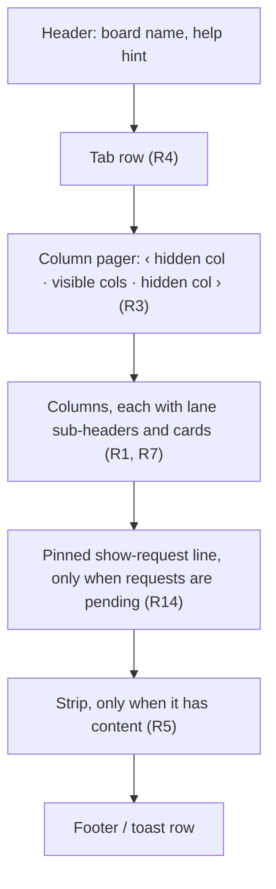
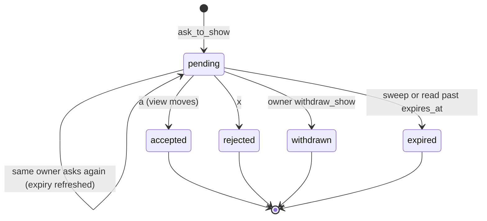
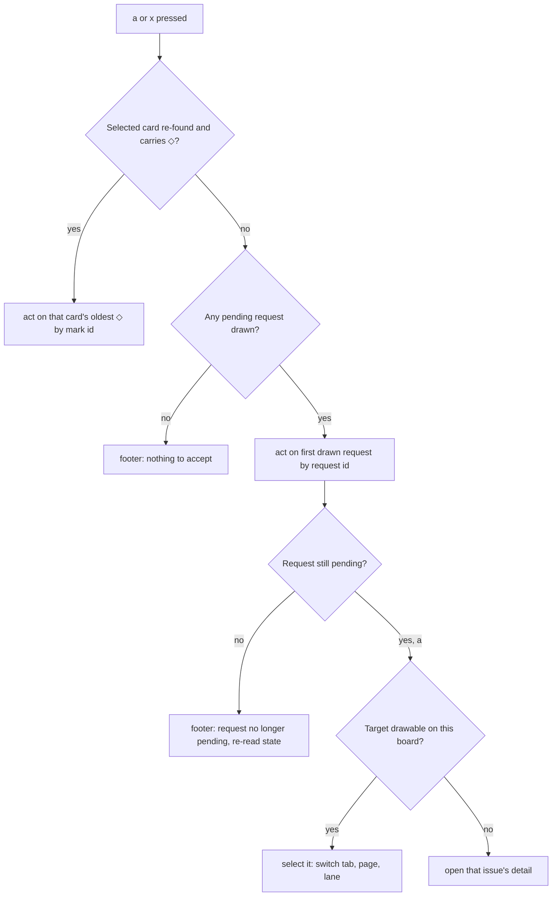
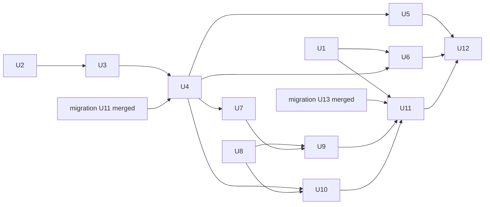

# Linear-Mode TUI Design - Plan

## Goal Capsule

- **Objective:** When Shawn switches into a herdr space, the board tells him in a few seconds where the work stands: what is moving, what needs him, and what is waiting in the backlog. Agents' signals appear on the cards they are about and never vanish before he sees them.
- **Means:** The Linear-mode board TUI (migration U8 of `docs/plans/2026-09-29-2127-feat-board-owns-the-store-migration-plan.md`), the local-state changes it needs, and a status line plus a session side pane beside each agent (KTD10, KTD11).
- **Target branch:** `feature/board-owns-the-store-migration`, based on `941cd3a` (sandbox gates green). This plan's work lands on that branch, not on `feature/tui-design`.
- **Product authority:** Shawn. The decision record `docs/board-owns-the-store.md` and the migration plan stay authoritative for everything this plan does not change.
- **Stop conditions:** stop and ask if U1 finds that Claude Code's status-line command does not inherit `HERDR_PANE_ID`, `HERDR_SOCKET_PATH` and `HERDR_WORKSPACE_ID`, or that herdr reuses pane ids without any distinguishing marker. Each changes KTD2 or KTD11. (U1 ran on 2026-09-30: neither fired; the inherited-pane-id case it found is handled by adding the Claude session id to the owner key, KTD2.)
- **Coordination:** the migration session owns migration U11 (`board linear report`), the non-TUI part of migration U12, migration U13 (e2e scenarios 43 and 44) and migration U14 (docs). This plan's U4 starts only after migration U11 merges, and its U11 only after migration U13 merges (KTD13).
- **Who finishes:** `ce-work` executes, then the review loop; Shawn merges.

---

## Product Contract

**Product Contract preservation:** changed: R3, R4, R8, R12, R14, R21, R26, AE6 and the last Scope Boundaries bullet; added R30, R31, R32. R3 and R4 now count cards needing attention on hidden pages and tabs, R14 names the live target of `a`/`x`, R32 keeps a cleared mark's text readable, and R26 defines run time; these came from document review and were accepted with the move to autonomous execution. R8 became three agent-set kinds plus one system kind after the decision that the suggestion mark is system-only. R12 names the board's detail screen as the only place that clears marks, so the session side pane (which always shows its own issue) cannot erase an agent's marks. R21 no longer claims `R` is unchanged, since R23 turns it into a force refresh. R30 and R31 give agents a way to withdraw and to re-ask without flooding the pinned line. All other IDs and meanings are unchanged.

### Summary

The Linear-mode board shows columns as its main structure, with lanes grouped inside each column, and pages through columns that do not fit. Agents' marks, notes and show-requests appear on the cards they are about, and one accept key and one reject key act on them. A status line in each Claude Code session and a session side pane beside each agent show the same signals for that agent's own issue and lane.

### Problem Frame

Shawn works across several herdr spaces at once, with agents running in panes in each. Every switch into a space costs context: which cards are in flight, which agent is waiting on him, and what sits in the backlog that he has forgotten. The board today renders columns only. Agents cannot flag anything on a card. The one way the TUI tells him something is a single toast that disappears after about 4 seconds, so a message that arrives while he is in another space is never seen.

The migration makes the board own the work store, which gives it tabs, lanes, marks, notes and show-requests to display. The migration plan's U8 unit names what must render but not how it looks, which keys act on it, or how it fits a narrow herdr pane.

### Actors

- A1. Shawn: switches between spaces, reads the board to re-orient, and acts on agents' signals.
- A2. An agent (Claude Code session in a herdr pane): marks a card, attaches a note, asks to show an issue, or opens a board beside its own pane. It points and never moves Shawn's view.
- A3. The board daemon: holds local state, announces changes, and caches Linear reads.

### Key Decisions

- **Lanes sit inside each column, not across the board.** Columns stay the main structure, and each column groups its cards under lane sub-headers. Lanes do not line up across columns, and that cost was accepted. Governs R1, R2. (session-settled: user-directed — chosen over full-width lane bands and over flat columns with a lane tag: column-first reading fits every pane width)
- **Columns that do not fit are paged, not folded or pinned.** Governs R3. (session-settled: user-directed — chosen over an always-on count bar, folded edge columns and a pinned Backlog column: paging keeps every column a real column)
- **Named mark kinds.** Needs you, question and done are agent-set, and each gets a glyph, instead of two kinds plus free text. Governs R8, R9. (session-settled: user-directed — chosen over the two built kinds plus a note and over a single attention flag: the kind should be readable without opening the card)
- **The suggestion mark is system-only.** Only the Linear-write report creates it, and it always carries the session that `a` binds. Governs R8, R20. (session-settled: user-directed — chosen over agents suggesting a bind and over a general-purpose suggestion: `a` on a suggestion always does one defined thing)
- **Marks sit in a left gutter.** Governs R10. (session-settled: user-directed — chosen over badges at the row end and over a mark line under the title: one column of glyphs to scan)
- **Acting on a card clears its marks.** Governs R12. (session-settled: user-directed — chosen over an explicit clear key, clearing on a column move, and both)
- **A show-request is a pinned line plus a badge on the target card.** Governs R14, R15. (session-settled: user-directed — chosen over the line alone, the badge with a header count, and today's toast)
- **Untouched show-requests expire.** Governs R18. (session-settled: user-directed — chosen over expiry when the asking pane closes, over clearing only on skip, and over both)
- **One accept key and one reject key, and the selected card wins.** Governs R19. (session-settled: user-directed — chosen over separate keys per signal type, and over the pinned request always winning)
- **Tabs get their own row.** Governs R4, R5. (session-settled: user-directed — chosen over merging tabs into the strip and over naming the tab in the header only)
- **The status pane is designed here.** Governs R26 to R29. (session-settled: user-directed — chosen over leaving it a separate proposal)
- **The side pane opens on the bound issue.** Governs R27, R28. (session-settled: user-directed — chosen over opening on the lane list, and over showing the board cursor's lane for unbound sessions)
- **Empty and stale states render in the board body, not in a toast.** A toast is gone before a returning user sees it. Governs R23, R24.

### Requirements

**Board layout**

- R1. The board renders the active tab's columns, and each column groups its cards under lane sub-headers that show the lane name and its card count in that column.
- R2. With no lane grouping configured, columns render without lane sub-headers.
- R3. When not every column fits, the header row pages through columns with arrows at each edge, and each arrow names the next hidden column and its card count, plus the number of hidden cards carrying a needs-you, question or suggestion mark or a show-request badge (for example `‹ Backlog 12 !1`).
- R4. The board's tabs render as their own row under the header, with the active tab marked and each other tab showing its count of cards needing attention (same rule as R3), and `[` and `]` cycle tabs.
- R5. The existing strip keeps its job (unbound spaces and unmapped herdr tabs) and renders only when it has something to show.
- R6. The layout works at three widths without overlap: a full tab (about 140 cells), a split beside an agent (about 80 cells), and a sidebar (about 44 cells, one column per page).
- R7. Each card shows its identifier, a run badge when an agent is running on it, and its title.

**Marks and notes**

- R8. An agent can set three mark kinds on a card, each with its own glyph: needs you `!`, question `?`, done `✓`. The board itself sets a fourth, suggestion `◇`, when a reported Linear write cannot link a session automatically.
- R9. A card can carry several marks at once, including marks of the same kind from different agents.
- R10. Marks render in a 2-cell gutter left of the card identifier, in the priority order `!` `?` `◇` `◉` `✓`, and a card with more than two shows the first plus `+`.
- R11. A card with a note shows the latest note as one line under the title, prefixed `›`.
- R12. When Shawn opens a card's detail on the board (`Enter` or a click), the needs-you, question and done marks it showed at that moment clear; marks that arrive later stay. A detail opened by accepting a request or by landing clears nothing. A suggestion clears only on accept or dismiss. An agent can clear its own marks at any time.
- R13. `n` and `N` move the selection to the next and previous card with any mark or show-request badge, across pages and tabs.
- R32. The card detail lists every mark the card carried when it opened, each with its glyph, the agent that set it and its text, and they stay listed on that screen after they clear.

**Show-requests**

- R14. Pending show-requests render as one pinned line above the footer, oldest first. The line names who asked and the target issue, shows the accept and reject keys, and counts the other pending requests. When the selected card carries a suggestion, the pinned line's key hints dim and the footer shows `a bind · x dismiss`, so the live target of `a`/`x` is always visible.
- R15. A show-request's target card carries the `◉` badge in its gutter while the request is pending.
- R16. The view moves to a requested card only when Shawn presses the accept key. No agent action moves the selection, page, or tab.
- R17. Accepting a show-request moves the selection to its card, changing tab and page as needed. Accepting or rejecting a request removes both its line entry and its badge.
- R18. A show-request that nobody acts on expires after a configurable time, 30 minutes by default.
- R30. An agent can withdraw its own pending show-request, which removes its line entry and badge without moving the view.
- R31. An agent that asks again for an issue it already has a pending request for refreshes that request instead of adding a second entry.

**Keys**

- R19. `a` accepts and `x` rejects. They act on the selected card's suggestion when it has one, and otherwise on the oldest pinned show-request.
- R20. Accepting a suggestion sends one bind request. Rejecting it clears the suggestion mark.
- R21. The new keys (`a`, `x`, `n`, `N`, `[`, `]`, `<`, `>`) appear in the help screen and in `docs/tui-interactions.md`, and none of them changes an existing Linear-mode key. `<` and `>` jump a whole column page. `R` is the one existing key whose meaning changes (R23).

**Live state and edge states**

- R22. Local-state changes (marks, notes, show-requests, bindings) appear on an open board without a manual refresh.
- R23. When Linear is unreachable, the board keeps showing the last good read and marks the affected issues as visibly stale. `R` forces a refresh that skips the daemon's read cache, and `r` keeps its current behaviour.
- R24. When the work store exists but has not been imported, the board body shows the message that names `board import work-store`, not a toast and not a bare status word.
- R25. A board opened by an agent lands on the context it was given (space, issue or card) with that card selected, and opening it does not take focus from Shawn's pane.

**Status line and side pane**

- R26. Each Claude Code session shows a one-line board status: the bound issue, its column, the run time (time since the session was bound to the issue), the marks on that card, and the number of pending show-requests in the session's space.
- R27. A side pane in a bound session opens on the single-issue view of its bound issue, and a key flips it to the session's lane list, grouped by column. With no lane grouping, the list covers the session's whole tab.
- R28. In an unbound session, the side pane shows a short "not bound — `/work:bind`" hint instead of a list.
- R29. The status line and the side pane use the same glyphs and names as the board (R8, R15).

### Board regions

The board stacks these regions from top to bottom at every width. Lanes nest inside each column; they never span columns.



Directional sketches of every option considered are in the Paper file "herdr-board TUI — lane layout decision sketch": boards A, B and C (lane layouts), M (mark placement) and S (show-request surface). B, M1 and S3 were chosen.

### Key Flows

- F1. Re-orient after a space switch
  - **Trigger:** Shawn switches into a space where the board is open.
  - **Actors:** A1, A3
  - **Steps:** The board already reflects every change made while he was away. He reads the column pager for the whole column set, the lanes inside the visible columns for what is moving, the gutter for what needs him, and the pinned line for pending asks. `n` walks the marked cards.
  - **Covered by:** R1, R3, R10, R13, R14, R22
- F2. An agent asks to show a card
  - **Trigger:** An agent asks to show ENG-155.
  - **Actors:** A2, A1
  - **Steps:** The pinned line appears, naming the agent and ENG-155, and ENG-155 gets `◉`. Nothing moves. Shawn presses `a` with no suggestion selected, and the board selects ENG-155, paging and switching tab as needed. The line entry and the badge go.
  - **Outcome:** Shawn sees what the agent pointed at, and only because he pressed the key.
  - **Covered by:** R14, R15, R16, R17, R19
- F3. Accept a suggested link
  - **Trigger:** A reported Linear write cannot auto-link, so the card gets a `◇` suggestion.
  - **Actors:** A2, A1
  - **Steps:** Shawn selects the card and presses `a`. The board sends one bind request, and the suggestion clears.
  - **Covered by:** R8, R19, R20

### Acceptance Examples

- AE1. **Covers R19.** Given a pending show-request for ENG-160 and the selected card ENG-153 carrying a suggestion, when Shawn presses `a`, then the ENG-153 suggestion is accepted and the ENG-160 request stays pinned.
- AE2. **Covers R19, R17.** Given a pending show-request for ENG-160 and a selected card with no suggestion, when Shawn presses `x`, then the ENG-160 request and its badge are removed and the selection does not move.
- AE3. **Covers R12.** Given a card with `!` and `◇`, when Shawn opens the card, then `!` clears and `◇` stays.
- AE4. **Covers R10.** Given a card with done, needs-you and question marks, the gutter shows `!+`.
- AE5. **Covers R18.** Given a show-request nobody acts on, after the configured time it leaves the pinned line and its badge goes.
- AE6. **Covers R3, R6.** Given a sidebar-width board on the In progress page, with one Todo card marked needs-you, the pager reads `‹ Todo 4 !1` on the left and `In review 1 ›` on the right.
- AE12. **Covers R32, R12.** Given ENG-148 carries `?` with text "which lane order?" from agent A, when Shawn opens its detail, then the detail lists `?`, agent A and the text, and the list stays after the mark clears.
- AE7. **Covers R27, R28.** Given an unbound session, the side pane shows the bind hint. Given a session bound to ENG-148 on a board without lane grouping, flipping to the list shows the whole tab grouped by column.
- AE8. **Covers R23.** Given Linear is unreachable, the board shows the last good read with stale issues marked. `R` retries without waiting for the daemon's cache to expire.
- AE9. **Covers R9.** Given agent A set `!` on ENG-148, when agent B also sets `!` on ENG-148, then the card holds both marks, and when A clears its own marks, B's `!` stays.
- AE10. **Covers R12.** Given Shawn opened ENG-148 while it showed `!`, when an agent sets `?` on ENG-148 while the detail is open, then `?` is still on the card after he returns to the board.
- AE11. **Covers R31, R30.** Given agent A has a pending request for ENG-160, when A asks again for ENG-160, then the pinned line still counts one request for it, and when A withdraws it, the entry and badge go and the selection does not move.

### Success Criteria

- After switching into a space, Shawn can say what is moving, what needs him, and what is in the backlog within about 5 seconds, without opening a card.
- No show-request or mark disappears before Shawn has had a chance to see it, except by expiry (R18) or its own agent withdrawing it (R12, R30).

### Scope Boundaries

- The board never moves, focuses or reflows a herdr pane, and no agent tool moves an open TUI. This comes from the decision record and is unchanged.
- There is no confirm or approve step in the TUI for board writes. Claude Code's tool permissions are the approval.
- Editing Linear issues from the board is out of scope.
- Through the `board mcp` tools, agents cannot accept a show-request, clear another agent's marks, set a request's expiry, or force a Linear refresh.
- The board keeps its existing handling of a daemon disconnect; no new daemon-down screen is added.

#### Deferred to Follow-Up Work

- Mouse support for the new surfaces (tab row, pager arrows, pinned line).
- `board linear` CLI verbs for mark, unmark, ask and withdraw, for shell agents and hooks. Agent write parity stays MCP-only in this plan.
- Telling an agent when its request was accepted or rejected (a push notification). Agents can read the outcome through `state`.

### Dependencies / Assumptions

- The migration branch's snapshot carries tabs and lanes per column, reports `not_imported` with a message, and marks stale issues (verified at `941cd3a`).
- Show-requests and marks already carry a free-text author (`requested_by`, `created_by`), which names who asked in R14. Ownership for R9 and R30 is a separate field (KTD2).
- Agent-opened boards receive `BOARD_SHOW_SPACE`, `BOARD_SHOW_ISSUE` and `BOARD_SHOW_CARD` from the daemon (migration U9, verified). Nothing reads them yet.
- Claude Code's status-line command inherits the session's herdr environment, the way hooks and MCP servers do. Unverified; U1 checks it.

### Sources / Research

- `docs/board-owns-the-store.md` — hierarchy decision and "What `board mcp` offers"; the status pane appears under Related.
- `docs/plans/2026-09-29-2127-feat-board-owns-the-store-migration-plan.md` — U8 and the units it depends on.
- `docs/tui-interactions.md` — current keymap and layout modes.
- `docs/solutions/integration-issues/serde-default-rejects-explicit-null.md` and `docs/solutions/integration-issues/a-pinned-version-check-has-a-twin.md` — null-tolerant wire parsing and pinned-version sweeps, both apply to U2 to U4.
- `docs/herdr.md` "Opening a plugin pane by API" and "Claude Code hooks and stdio MCP servers" — request-time placement, `focus: false`, env reaching the pane, and inherited hook environment.

---

## Planning Contract

### Key Technical Decisions

- KTD1. **Amend schema v16 in place; do not bump to v17.** v16 has not shipped to `dev`. `schema.sql` gains the new columns and the four-value mark `CHECK`. `migrations.rs` gains a guarded rebuild of `linear_marks` and `linear_show_requests`, detected by column presence via `pragma_table_info` (the v15 pattern). It runs as its own step on every open at `SCHEMA_VERSION` and after the v16 block for older databases, never inside the `version < 16` block, because `migrate()` skips that block for databases already stamped 16. A v17 bump would add a version pin sweep for no user benefit.
- KTD2. **Ownership is the writer's herdr socket, pane id and Claude session id, recorded apart from the display author.** (session-settled: user-directed — chosen over keying on socket and pane alone: U1 found nested and background-job sessions inherit another pane's `HERDR_PANE_ID`, while `CLAUDE_CODE_SESSION_ID` is per session.) It comes from the caller's claims, which `board mcp` fills from its own environment. `replace_mark` keys on (space, issue, kind, owner), and owner-scoped removal (`unmark`, `withdraw`) is a separate protocol path from the TUI's id-keyed methods. Ownership is attribution that keeps cooperating agents from clearing each other's rows through the MCP tools. Claims are self-reported and boardd trusts every same-user process on its socket, so ownership is not an access-control boundary. A write with no claims gets no owner and only the person can clear it. If U1 finds herdr reuses pane ids, the owner key adds a pane-creation marker.
- KTD3. **Show-requests store `expires_at`, and reads filter on an injected `now`.** A daemon sweep also marks overdue requests `expired` and emits one `LocalStateChanged` per affected space, so an open board updates while nothing else changes. The TTL is board-wide config (a `[linear]` setting, default 30 minutes). Agents cannot set it, because a per-request TTL would let a background agent pin the line for hours.
- KTD4. **Show-requests record an outcome, and re-asks dedupe.** Outcomes: accepted, rejected, withdrawn, expired. `show.accept` and `show.dismiss` stop sharing one handler. A re-ask by the same owner for the same issue refreshes `expires_at` and the reason while keeping the id and `created_at`, so the pinned line's order stays stable (R31).
- KTD5. **The TUI reads marks, notes and requests with `linear.state.get`, separate from `linear.snapshot`, and overlays them by identifier.** It uses its own in-flight flag and queue. Many `LocalStateChanged` events during one read collapse into one queued read. Marks for identifiers not in the snapshot are kept and appear when the card does. The daemon also sends `LocalStateChanged` after it refetches a space's snapshot following a reported Linear write (`schedule_refetch`); that announcement gains an optional `snapshot: true` field, and the TUI answers it with one non-forced `linear.snapshot` served from the daemon's cache. A binding change in a state read also queues a snapshot, because bindings change columns. `LocalStateChanged` never forces a Linear refetch.
- KTD6. **The cursor is (tab key, column key, lane key, identifier), re-found after every read.** Order: same lane, any lane in the column, any column, then clamp. `a` and `x` resolve their target at keypress, by mark id or request id, never by position.
- KTD7. **The TUI writes local state only through daemon requests on the Linear allow list.** The module invariant at the top of `app/linear.rs` changes from "writes nothing to SQLite" to "writes local state only through boardd, never Linear". Each new write gets its own `Effect` variant, which the closed `linear_denies` classification forces into place.
- KTD8. **Marks clear by the ids shown when the detail opened.** A new bulk `linear.mark.clear {ids}` form clears them. Only the board's detail screen (`Enter` or click) triggers it. Session mode, accept and landing never clear. A failed clear leaves the marks and shows no toast; the next open retries.
- KTD9. **Force refresh is a `force` field on `linear.snapshot`, and the daemon calls `cache.invalidate` before reading.** `R` pressed during an in-flight read queues a forced follow-up instead of being dropped. An older daemon ignores the unknown field, so `R` degrades to `r`.
- KTD10. **The side pane is `board tui` in a session mode, opened as a herdr split beside the agent.** The opener passes the agent's herdr socket, pane id, workspace id and cwd in the pane's env, because the split's own `HERDR_PANE_ID` is not the agent's. Session mode reads the new `linear.session.get` and never writes. (session-settled: user-directed — chosen over a Claude Code mod drawn inside the session: reuses the agent-board pane opening, works for any agent, one renderer)
- KTD11. **The status line is a `board linear status-line` command that Claude Code's `statusLine` setting runs.** It makes one `linear.session.get` read with a short timeout (about 200 ms), never auto-starts the daemon, and takes identity from the inherited `HERDR_PANE_ID`, `HERDR_SOCKET_PATH` and `HERDR_WORKSPACE_ID`. The daemon composes the session read from SQLite plus the snapshot it already has cached for that space: on a cold or failed cache it omits the column and never starts a Linear or herdr call. The cwd resolves to its git worktree root before the binding lookup, so an agent in a subdirectory of its worktree still reads as bound. Daemon down prints `board: daemon down`; no herdr environment prints nothing.
- KTD12. **The MCP `mark` tool takes a required `kind` from {needs_you, question, done} and refuses anything else.** Suggestions stay the activity report's job. New tools `unmark {issue, kind?}` and `withdraw_show {issue}` act on the caller's own rows only. `state` returns ownership, each pending request's expiry, and the caller's own recently resolved requests with their outcome. A successful `bind` of the suggested session clears the matching `◇`.
- KTD13. **This plan executes on the migration branch and owns migration U12's two TUI edits.** U1 to U3 and U8 may start before migration U11 merges, under the file claim; U4 onward waits for migration U11, and U11 (the e2e scenario) waits for migration U13, which edits the same e2e catalog pins first. The TUI bind action switches from the bind handoff to `linear.bind`, and `origin.rs` gains `plugin_root`. The migration session keeps clear of the schema, protocol, local-state, `mcp.rs` and `board-tui` files while this plan runs. (session-settled: user-directed — chosen over handing the local-state changes to the migration session, and over splitting by crate)

### High-Level Technical Design

These diagrams convey the shape; unit prose is authoritative.

**Signal path.** Agents write through `board mcp`; the daemon writes SQLite and announces the change; every reader pulls the cheap local-state read.

```mermaid
flowchart LR
  AG["Agent (Claude Code)"] -->|mark / unmark / ask_to_show / withdraw_show| MCP["board mcp"]
  HK["Linear write report hook"] -->|activity.record creates ◇| D
  MCP --> D["boardd local-state ops (owner from claims)"]
  D --> DB[("SQLite v16")]
  D -->|LocalStateChanged {space}| EV["event stream"]
  SW["expiry sweep"] --> D
  EV --> TUI["Board TUI"]
  EV --> SP["Session side pane"]
  TUI -->|linear.state.get / linear.snapshot| D
  SP -->|linear.session.get| D
  SL["Status line command"] -->|linear.session.get, 200 ms| D
  TUI -->|a / x / open card / R| D
```

**Show-request lifecycle.** A request leaves `pending` exactly once, and the outcome is recorded.



**`a` / `x` target resolution at keypress.**



### Assumptions

- Herdr pane ids are unique within a session for the life of the daemon. U1 checks; KTD2 adds a marker if not.
- Linear-mode stacking, column widths and the 72-cell threshold stay as they are; R6 fits inside them.
- The migration session's U11 does not change the shape of `linear_activity_record` beyond parsing hook payloads.

### Sequencing

U1, U2 and U8 start at once: U1 is a spike, and U8 needs only the snapshot shape already on the branch. U2, U3 and U4 run in order on the local-state side, and U4 waits for migration U11. The TUI units after U8 need U4's protocol. U11 also waits for migration U13. U12 closes.



Parallel-safe: U1 with U2 and U8. After U4, U5, U6 and U7 are parallel-safe: U5 and U6 edit different `board-cli` files and U7 edits `board-tui`. U9 and U10 both edit `app/linear.rs` and `view/linear.rs`, so run them one after the other after U8.

### System-Wide Impact

- **Agent parity:** the agent surface changes shape (`mark` gains `kind`, two new tools). `crates/board-cli/tests/integration/mcp.rs` pins ten tools by name and becomes twelve.
- **Old clients:** new event lines and fields are skipped by older clients; `force` is ignored by older daemons. New wire fields follow the null-tolerant rule from `docs/solutions/integration-issues/serde-default-rejects-explicit-null.md`.
- **Pinned versions:** no schema or protocol number changes (KTD1). The e2e catalog grows by one scenario, which moves the `test_docs.py` catalog pin, `e2e/README.md` and the "scenarios 01–NN" text together.
- **Kanban mode:** `a` (archive) and `x` (cancel run) keep their kanban meaning; the Linear arms live in the Linear reducer only.

### Risks

- **Two sessions editing one branch.** The migration session is still landing migration U11 to U14. Mitigation: KTD13's file claim and gates.
- **Mark tests that cannot fail.** TUI snapshot tests inject marks directly, so they pass even when per-owner replace is broken. Mitigation: U5 tests R9 through the MCP path with two callers.
- **Status line cost.** Claude Code runs the command on every refresh in every session. Mitigation: KTD11's short timeout, no auto-start, and one read.

---

## Implementation Units

| U-ID | Title | Key files | Depends on |
|---|---|---|---|
| U1 | Observe status-line input and pane-id reuse | `docs/herdr.md` | — |
| U2 | Amend schema v16 for kinds, owners, expiry, outcome | `schema.sql`, `crates/board-core/src/db/migrations.rs` | — |
| U3 | Local-state writes and reads in board-core | `crates/board-core/src/db/linear_writes.rs`, `linear_state.rs`, `protocol.rs`, `client/` | U2 |
| U4 | Daemon ops, expiry sweep, force refresh, session read | `crates/board-daemon/src/ops/linear_state.rs`, `ops/linear/native.rs` | U3, migration U11 |
| U5 | Agent tools in `board mcp` | `crates/board-cli/src/mcp.rs`, `skill/SKILL.md` | U4 |
| U6 | `board linear status-line` and `session` verbs | `crates/board-cli/src/args/`, `render.rs` | U1, U4 |
| U7 | Live local state in the TUI | `crates/board-tui/src/runtime.rs`, `driver/linear.rs` | U4 |
| U8 | Tabs, paged columns, lanes and card cursor | `crates/board-tui/src/app/linear.rs`, `view/linear.rs` | — |
| U9 | Marks, notes, pinned line and `a`/`x`/`n` keys | `app/linear.rs`, `view/linear.rs`, `view/mod.rs` | U7, U8 |
| U10 | Stale, not-imported, force refresh and landing | `app/linear.rs`, `origin.rs`, `driver/mod.rs` | U4, U8 |
| U11 | Session side pane | `crates/board-tui/src/app/session.rs`, `crates/board-daemon/src/ops/panes.rs` | U1, U4, U9, U10, migration U13 |
| U12 | Docs, changelog and e2e catalog | `docs/`, `CHANGELOG.md`, `e2e/` | U5, U6, U11 |

### U1. Observe status-line input and pane-id reuse

- **Goal:** record two runtime facts that KTD2 and KTD11 rest on, before U2 and U6 commit to them.
- **Requirements:** R26, R9 (through KTD2, KTD11).
- **Dependencies:** none.
- **Files:** `docs/herdr.md` (append a dated "Observed" section).
- **Approach:**
  1. Point a Claude Code `statusLine` command at a script that prints its stdin and environment, in a disposable herdr workspace (AGENTS.md hard rules). Record the stdin JSON fields and whether `HERDR_PANE_ID`, `HERDR_SOCKET_PATH` and `HERDR_WORKSPACE_ID` are present, plus how often the command runs.
  2. From `herdr api schema --json` and a disposable workspace, check whether a closed pane's id can be handed to a new pane in the same session, and whether ids restart after the disposable herdr session is stopped and started again on the same socket path.
  3. Start a Claude session from inside an existing agent pane (a background job and a nested `claude`) and record whether its `HERDR_PANE_ID` names its own pane or the parent's.
- **Execution note:** a finding against KTD2 or KTD11 triggers the Goal Capsule stop condition.
- **Test expectation:** none -- observation spike; its output is the recorded facts with the exact commands used.
- **Verification:** both facts are recorded in `docs/herdr.md` with where they ran.

### U2. Amend schema v16 for kinds, owners, expiry, outcome

- **Goal:** the database can hold four mark kinds, per-owner marks, notes and requests, and a request's expiry and outcome (KTD1 to KTD4).
- **Requirements:** R8, R9, R18, R30, R31.
- **Dependencies:** none (run beside U1; fold in U1's pane-marker finding before U3).
- **Files:** `schema.sql`, `crates/board-core/src/db/migrations.rs`, `crates/board-core/src/db/linear_state.rs` (`MarkKind` gains `Question`, `Done`), `crates/board-core/tests/db/migrations.rs`.
- **Approach:**
  1. `linear_marks`: `kind` CHECK over attention, question, done, suggestion; add owner socket and owner pane columns.
  2. `linear_notes`: add the same owner columns.
  3. `linear_show_requests`: add owner columns, `expires_at`, and `outcome` (null while pending).
  4. A guarded rebuild for databases stamped v16 before this change, detected by column presence, run as its own step on every open (KTD1), not inside the `version < 16` block.
- **Patterns to follow:** the v15 guarded-on-column-presence block in `migrations.rs`; `CREATE ... IF NOT EXISTS` style of the existing v16 block.
- **Test scenarios:**
  - A fresh database from `schema.sql` and a database stamped with the pre-amendment v16 produce the same schema after open.
  - Pre-amendment v16 rows (marks, notes, requests) survive the rebuild with null owners and a pending state.
  - A mark with kind `question` round-trips; a kind outside the four is refused by the database.
  - Opening a database already stamped 16 with the pre-amendment tables runs the rebuild; opening it again does nothing.
  - A failed rebuild rolls back whole and leaves the pre-amendment table shape intact.
- **Verification:** the migration tests pass and every schema pin still reads v16.

### U3. Local-state writes and reads in board-core

- **Goal:** the core layer enforces per-owner replace, owner-scoped removal, dedupe, outcomes and expiry, and exposes the new protocol shapes.
- **Requirements:** R8, R9, R12, R18, R20, R30, R31 (KTD2, KTD3, KTD4, KTD8).
- **Dependencies:** U2.
- **Files:** `crates/board-core/src/db/linear_writes.rs`, `crates/board-core/src/db/linear_state.rs`, `crates/board-core/src/protocol.rs`, `crates/board-core/src/client/traits.rs`, `crates/board-core/src/client/fake.rs`, `crates/board-core/tests/db/` and `crates/board-core/tests/fake_client.rs`.
- **Approach:**
  1. `replace_mark` keys on (space, issue, kind, owner).
  2. Add owner-scoped `unmark` (all kinds when no kind is given) and `withdraw` writes, and a bulk mark clear by ids.
  3. Split show accept and dismiss so each records its outcome; add the dedupe-refresh on re-ask.
  4. `pending_show_requests` filters on an injected `now` against `expires_at`; add an `expire_overdue(now)` write that returns the affected spaces.
  5. Binding the session named in a `◇` clears every `◇` on that issue.
  6. Add the SQLite half of the session read: for a (space, socket, pane, cwd), with the cwd resolved to its git worktree root (the `scope.rs` rev-parse helper), return the bound issue if any, its marks and the space's pending request count. U4 composes the rest (KTD11).
  7. Protocol types: mark kind enum with the four values, owner and expiry fields on read results, `force` on `LinearSnapshotParams`, params for the new methods. Every new field is null-tolerant.
- **Patterns to follow:** `Db::require_*` helpers; existing `linear_mark_set` transaction; one typed wrapper per method in `client/traits.rs`.
- **Test scenarios:**
  - Covers AE9. Owner A and owner B each set `attention` on one issue: two marks exist; A's `unmark` leaves B's.
  - Owner A sets `attention` twice: one mark, text updated.
  - Covers AE11. Owner A asks twice for ENG-160: one pending request, same id, later `expires_at`.
  - Accept records `accepted`, dismiss records `rejected`, withdraw records `withdrawn`; answering a non-pending request is refused with a named reason.
  - Owner B cannot withdraw owner A's request.
  - Covers AE5. A request past `expires_at` is not returned as pending for that `now`; `expire_overdue` marks it `expired` and returns its space.
  - Bulk clear by ids removes only those ids; an id already gone is skipped, not an error.
  - Binding the suggested session clears the `◇`; binding another session leaves it.
  - Session read for an unbound pane returns no issue; for an unknown socket returns nothing, not an error.
  - Session read from a subdirectory of a bound worktree returns the bound issue.
  - Each new read-result row parses with every non-optional field set to `null`.
  - The fake client implements every new method.
- **Verification:** core tests pass, and the fake client and the database agree on every scenario above.

### U4. Daemon ops, expiry sweep, force refresh, session read

- **Goal:** boardd routes the new methods, enforces ownership from claims, sweeps expired requests, and honours `force` on snapshot reads.
- **Requirements:** R9, R12, R17, R18, R22, R23, R30 (KTD2, KTD3, KTD9).
- **Dependencies:** U3; the migration session's U11 merged (KTD13).
- **Files:** `crates/board-daemon/src/ops/linear_state.rs`, `crates/board-daemon/src/ops/mod.rs`, `crates/board-daemon/src/ops/errors.rs`, `crates/board-daemon/src/ops/linear/native.rs`, `crates/board-daemon/src/ops/tests/linear_state.rs`, `crates/board-daemon/src/ops/tests/linear_native.rs`, `crates/board-daemon/src/ops/tests/parity.rs`, `crates/board-daemon/src/config` (the `[linear]` TTL setting).
- **Approach:**
  1. Route `linear.mark.unmark`, `linear.show.withdraw`, `linear.session.get`, and the bulk form of `linear.mark.clear`; give accept and dismiss their own handlers.
  2. Owner comes from the caller's claims for every agent-side write; the id-keyed methods stay person-side.
  3. A periodic sweep calls `expire_overdue(now)` and announces each returned space once.
  4. `force: true` on `linear.snapshot` calls `cache.invalidate` for the key before `read_space`.
  5. Every write keeps announcing exactly one `LocalStateChanged` for its space; the announcement after a post-report refetch carries `snapshot: true` (KTD5).
  6. `linear.session.get` composes U3's SQLite half with the column from the snapshot already cached for that space, omitting the column on a cold or failed cache (KTD11). Run time is measured from the worktree binding's creation time (R26).
- **Patterns to follow:** `routes!` in `ops/mod.rs`; `ops/errors.rs` as the one place a domain failure becomes a protocol code; `schedule_refetch` for `invalidate` use.
- **Test scenarios:**
  - Each new write emits exactly one `LocalStateChanged` for its space.
  - `unmark` from a caller with no claims is refused; the id-keyed clear still works for the person.
  - The sweep with a fixed clock expires one overdue request and announces its space once; a second sweep announces nothing.
  - `force: true` within the 15-second window causes a fresh read; without it the cached read returns.
  - A forced read that fails returns the last good read marked stale, as today.
  - A reported save_issue produces one refetch and one `LocalStateChanged` carrying `snapshot: true`; an ordinary mark write's announcement does not carry it.
  - `linear.session.get` on a cold cache makes no Linear or herdr call and returns no column; on a warm cache it returns the cached column.
  - The parity guard passes with every new method faked.
- **Verification:** daemon ops tests and the parity guard pass.

### U5. Agent tools in `board mcp`

- **Goal:** agents can set every agent kind, clear their own marks, and withdraw or refresh their own requests, and see ownership and expiry.
- **Requirements:** R8, R9, R12, R30, R31 (KTD12).
- **Dependencies:** U4.
- **Files:** `crates/board-cli/src/mcp.rs`, `crates/board-cli/tests/integration/mcp.rs`, `skill/SKILL.md`.
- **Approach:**
  1. `mark` takes a required `kind` from needs_you, question, done; `text` becomes optional detail.
  2. Add `unmark {issue, kind?}` and `withdraw_show {issue}`, both owner-scoped through U4's methods.
  3. `state` reports each mark's kind and whether the caller owns it, each pending request's expiry, and the caller's own recently resolved requests with their outcome (KTD12).
  4. `skill/SKILL.md` documents the tools and "agents point, the person moves the view".
- **Patterns to follow:** existing tool definitions and caller-claims handling in `mcp.rs`; its note that the server name must not contain "linear".
- **Test scenarios:**
  - Covers AE9. Two MCP callers set `needs_you` on one issue; `state` shows two marks, each flagged owned for its caller.
  - `mark` with kind `suggestion` or an unknown kind is refused and writes nothing.
  - `unmark` from caller A leaves caller B's marks.
  - Covers AE11. `ask_to_show` twice then `withdraw_show` from the same caller: one request, then none, outcome `withdrawn`.
  - Caller B's `withdraw_show` for A's request is refused.
  - After the person rejects caller A's request, A's `state` lists it with outcome `rejected`; caller B's `state` does not list it.
  - The tool list test names twelve tools.
- **Verification:** MCP integration tests pass through the real server path, not injected fixtures.

### U6. `board linear status-line` and `session` verbs

- **Goal:** a Claude Code session can show one line of board status, and scripts can read a session's board context.
- **Requirements:** R26, R29 (KTD11).
- **Dependencies:** U1, U4.
- **Files:** `crates/board-cli/src/args/discovery.rs` (or a new `args/linear_session.rs`), a handler under `crates/board-cli/src/`, `crates/board-cli/src/render.rs`, `crates/board-cli/tests/integration/linear.rs`.
- **Approach:**
  1. `board linear session` prints the session read through `render.rs` (table or `--json`).
  2. `board linear status-line` reads identity from the environment (as observed in U1), makes one read with a short timeout, and prints one line, for example `ENG-148 · In progress · 12m · !? · ◉1`. A missing column (cold cache) is left out of the line.
  3. Neither verb auto-starts the daemon.
- **Patterns to follow:** `render.rs` single output path; `UnixClient::connect(paths::socket_path())` with `set_read_timeout` for the bounded read. Do not use `context.rs` client resolution, which calls `connect_or_start()` and starts the daemon.
- **Test scenarios:**
  - Bound session with two marks and one pending request prints issue, column, run time, `!?` and `◉1`.
  - Unbound session prints `board: not bound`.
  - Daemon not running prints `board: daemon down` and exits 0 within the timeout.
  - No herdr environment prints nothing and exits 0.
  - `board linear session --json` matches the protocol shape.
- **Verification:** CLI integration tests pass; the command is fast enough for Claude Code's refresh (measured in U1's setup).

### U7. Live local state in the TUI

- **Goal:** an open Linear board shows local-state changes without a manual refresh (R22), using a separate read from the snapshot (KTD5).
- **Requirements:** R22.
- **Dependencies:** U4.
- **Files:** `crates/board-tui/src/runtime.rs`, `crates/board-tui/src/driver/linear.rs`, `crates/board-tui/src/driver/dispatch.rs`, `crates/board-tui/src/app/linear.rs`, `crates/board-tui/src/app/effect.rs`, `crates/board-tui/tests/linear/mod.rs`.
- **Approach:**
  1. `SubscriptionSignal` gains `LocalStateChanged { space }`; `forward_events` matches on the event instead of discarding it; the coalescer keeps a set of spaces.
  2. The driver acts on a signal for its workspace (or any-space) with one `linear.state.get`, under its own in-flight and queued flags; a signal carrying `snapshot: true` queues one non-forced `linear.snapshot` instead (KTD5).
  3. `LinearState` holds the local state and overlays it on cards by identifier at render.
  4. A binding change in the read queues a snapshot.
- **Execution note:** start by rewriting the test that pins "board changed sends nothing" into the new contract, test-first.
- **Patterns to follow:** `request_or_queue` and `arrived` in `app/linear.rs`; `Pending` and `deliver_pending_*` test hooks in `driver/linear.rs`.
- **Test scenarios:**
  - A `LocalStateChanged` for this workspace without the snapshot flag triggers exactly one `linear.state.get` and no `linear.snapshot`.
  - A `LocalStateChanged` carrying `snapshot: true` triggers exactly one non-forced `linear.snapshot`, and a card an agent moved in Linear appears in its new column.
  - Three events during an in-flight state read produce exactly one follow-up read.
  - An event for another workspace triggers nothing.
  - A state read whose bindings differ from the last queues one snapshot.
  - Marks for an identifier missing from the snapshot are kept and render once a later snapshot contains it.
- **Verification:** runtime unit tests and Linear driver tests pass with `RecordingClient` method logs.

### U8. Tabs, paged columns, lanes and card cursor

- **Goal:** the board renders tabs, paged columns and lanes inside columns at all three widths, with a cursor that follows the card (KTD6).
- **Requirements:** R1, R2, R3, R4, R5, R6, R7.
- **Dependencies:** none (the snapshot shape is on the branch).
- **Files:** `crates/board-tui/src/app/linear.rs`, `crates/board-tui/src/view/linear.rs`, `crates/board-tui/src/view/linear_strip.rs`, `crates/board-tui/src/widgets/mod.rs`, `crates/board-tui/tests/linear/mod.rs`, new fixtures under `crates/board-core/tests/fixtures/linear-snapshot/` with tabs and lanes.
- **Approach:**
  1. Read `tabs` instead of the legacy `groups`; track the active tab; `[` and `]` cycle it.
  2. Replace the sliding column window with pages; the pager row names the hidden neighbour column and its count on each side, plus the attention count of hidden cards (R3); `<` and `>` jump a page and `h`/`l` flip at the edge. Tab labels carry the same count (R4) once U9's local state is available; until then they show none.
  3. Render lane sub-headers with per-column counts; skip them when a column has no lanes.
  4. Store the cursor as (tab, column, lane, identifier) and re-find it after each snapshot; an issue in several lanes is selected in the first one.
  5. The strip renders only with content, in both of its views.
- **Patterns to follow:** existing `draw_board` region math, `Zone::LinearGroup`, `click_card` re-find by identifier.
- **Test scenarios:**
  - Snapshot: two lanes render inside each column at 140, 80 and 44 cells, with no overlap.
  - 44-cell board on In progress with no marks: pager reads `‹ Todo 4` and `In review 1 ›`.
  - `]` then `[` returns to the first tab; the cursor is re-found on the same identifier.
  - A snapshot that reorders the selected column keeps the cursor on the same identifier.
  - The selected card leaves the column: the cursor moves to another card in the same column.
  - No lane grouping: columns render without sub-headers (R2).
  - The strip takes no rows when there are no unbound spaces or unmapped tabs.
- **Verification:** new insta snapshots are reviewed and accepted, existing Linear snapshots updated only where the layout intentionally changed.

### U9. Marks, notes, pinned line and `a`/`x`/`n` keys

- **Goal:** marks, notes and show-requests render on the board, and `a`, `x`, `n`, `N` act on them (KTD6, KTD7, KTD8).
- **Requirements:** R3 and R4 (attention counts), R8, R10, R11, R12, R13, R14, R15, R16, R17, R19, R20, R21, R32.
- **Dependencies:** U7, U8.
- **Files:** `crates/board-tui/src/app/linear.rs`, `crates/board-tui/src/app/effect.rs`, `crates/board-tui/src/driver/linear.rs`, `crates/board-tui/src/view/linear.rs`, `crates/board-tui/src/view/mod.rs` (`HELP_KEYS`), `crates/board-tui/tests/linear/mod.rs`, `crates/board-tui/tests/help.rs`, `crates/board-tui/tests/interaction_contract.rs`.
- **Approach:**
  1. Draw the 2-cell gutter and the note line; draw the pinned line between body and strip.
  2. `a`/`x` follow the resolution flow in the High-Level Technical Design; accepted requests select the target (tab, page, lane) or open its detail when it cannot be drawn.
  3. Accepting a `◇` sends `linear.bind` built from the mark's detail (migration U12's TUI edit, KTD13); a `◇` with no bind target refuses with a footer message.
  4. `Enter` on a card sends the bulk clear for the `!`/`?`/`✓` ids it showed (KTD8), and the detail keeps the list of those marks with agent and text for as long as it stays open (R32).
  5. `n`/`N` walk marked and badged cards across tabs and pages, in tab, pager then lane order, wrapping, and switch tab and page as accept does.
  6. Attention counts on pager arrows and tab labels (R3, R4) come from the overlaid local state.
  7. The footer shows `a bind · x dismiss` and the pinned line's key hints dim while the selected card carries `◇` (R14).
  8. Add `Effect` variants for mark clear, show accept, show dismiss and bind; place them in `linear_allows` and `linear_denies`; update the module invariant (KTD7).
- **Patterns to follow:** `bind_detail_card` for the bind path; `draw_bottom` region reservation; `HELP_KEYS` rows after the Linear sentinel.
- **Test scenarios:**
  - Covers AE4. A card with done, needs-you and question renders `!+` in the gutter.
  - Covers AE1. Request pinned for ENG-160, selected ENG-153 has `◇`: `a` sends one `linear.bind` and no show accept.
  - Covers AE2. Request pinned, selected card without `◇`: `x` sends one show dismiss; the selection does not move.
  - Covers F2. `a` on a request for a card on another tab switches tab and page and selects it.
  - The request's target is not in the view: `a` accepts and opens its detail.
  - The request was withdrawn after drawing: `a` shows "request no longer pending" and re-reads state.
  - Covers AE3 and AE10. `Enter` on a card with `!` and `◇` sends a clear for the `!` id only; a `?` set during the detail stays.
  - A snapshot reorders cards between render and `a`: the action targets the card Shawn saw.
  - `n` from the last marked card on the active tab moves to the first marked card on the next tab, switching tab and page; from the last one overall it wraps.
  - Covers AE6. 44-cell board on In progress with one needs-you Todo card: pager reads `‹ Todo 4 !1`; a tab with one marked card shows `!1` on its label.
  - Covers AE12. Opening a card with `?` from agent A lists `?`, agent A and its text; the list is still shown after the clear completes.
  - With a `◇` card selected and a request pinned, the footer reads `a bind · x dismiss` and the pinned line's key hints are dimmed.
  - The pinned line truncates the title, not the keys or `+N`, at 44 cells.
  - Help lists every new key; the interaction contract test's Linear rows include them.
- **Verification:** Linear driver tests, help coverage and interaction contract tests pass; snapshots reviewed.

### U10. Stale, not-imported, force refresh and landing

- **Goal:** edge states render in the board body, `R` bypasses the cache, and agent-opened boards land on their context.
- **Requirements:** R23, R24, R25 (KTD9).
- **Dependencies:** U4, U8.
- **Files:** `crates/board-tui/src/app/linear.rs`, `crates/board-tui/src/view/linear.rs`, `crates/board-tui/src/origin.rs`, `crates/board-tui/src/driver/mod.rs` (`LinearStart`), `crates/board-cli/src/main.rs` (pass landing context), `crates/board-tui/tests/linear/mod.rs`, `crates/board-tui/tests/interaction_contract.rs`.
- **Approach:**
  1. Split the `r`/`R` arm; `R` sends `force: true`, or queues a forced read when one is in flight.
  2. `not_imported`: the not-bound screen prints `linear.message` as its body.
  3. Read `BOARD_SHOW_SPACE`, `BOARD_SHOW_ISSUE`, `BOARD_SHOW_CARD` into the start context (and `plugin_root`, migration U12's `origin.rs` edit); apply the landing once after the first good snapshot. Card wins over issue.
- **Patterns to follow:** `source_warnings`, `draw_not_bound`, `OriginContext::from_environment`.
- **Test scenarios:**
  - Covers AE8. Linear unavailable: cards show `~stale`; `R` sends a snapshot with `force: true`.
  - `R` during an in-flight read queues one forced read; `r` during an in-flight read still toasts.
  - `not_imported` renders the daemon's message in the body.
  - `BOARD_SHOW_ISSUE=ENG-123` opens with ENG-123 selected; a later snapshot does not re-apply it.
  - A landing target absent from the view opens its detail instead.
- **Verification:** Linear driver tests and snapshots pass; the interaction contract records the `R` change.

### U11. Session side pane

- **Goal:** a herdr split beside an agent shows that agent's issue, flips to its lane list, or shows the bind hint (KTD10).
- **Requirements:** R27, R28, R29.
- **Dependencies:** U1, U4, U9, U10, migration U13 (it adds scenarios 43 and 44, and the catalog check needs contiguous numbers).
- **Files:** `crates/board-tui/src/app/session.rs` (new), `crates/board-tui/src/view/session.rs` (new), `crates/board-tui/src/lib.rs`, `crates/board-cli/src/args/` (a `board tui --session` flag), `crates/board-daemon/src/ops/panes.rs` (pass agent socket, pane, workspace id and cwd env when opening a session pane), `crates/board-cli/src/mcp.rs` (`open_board` gains a session mode), `crates/board-tui/tests/session/mod.rs` (new), `e2e/NN-session-side-pane.sh` (new, numbered next after migration U13's scenarios, expected 45), `e2e/run-all.sh`.
- **Approach:**
  1. Session mode reads `linear.session.get` for the agent identity in its env, and re-reads on `LocalStateChanged` for its space.
  2. Bound: the single-issue view, reusing the issue page renderer; `Tab` flips to the lane list grouped by column (whole tab without lanes).
  3. Unbound: the bind hint.
  4. Keys: `Tab` flips view, `j`/`k` move in the list and scroll the issue view, `?` help, `q` closes the pane. No open, accept or write keys.
  5. States: the same loading and not-imported bodies as the board (U10), fitted to the split width; on a daemon disconnect it keeps the last read, as the board does.
  6. Session mode sends no writes, and its allow list admits reads only.
  7. The opener places it as a split with focus off, as agent boards open today.
- **Patterns to follow:** `linear_issue.rs` renderer; the agent-board opening path in `ops/panes.rs`; `linear_allows` style closed allow list.
- **Test scenarios:**
  - Covers AE7. Unbound session renders the hint; bound session on a board without lanes flips to the whole tab by column.
  - A binding made while the pane is open switches it from hint to issue view on the next event.
  - A `!` set on the bound issue shows in the pane and is still on the board afterwards (no clear from session mode).
  - The session-mode allow list refuses every write effect.
  - `Tab` flips between the issue view and the lane list; help lists only session-mode keys.
  - `not_imported` renders the daemon's message in the split.
  - e2e: an agent-opened session pane in a disposable workspace shows the bound issue and does not take focus.
- **Verification:** session tests pass; the new e2e scenario passes in the sandbox and is listed in `e2e/run-all.sh`.

### U12. Docs, changelog and e2e catalog

- **Goal:** docs, changelog and the e2e catalog describe what shipped.
- **Requirements:** R21 (docs half), all R-IDs indirectly.
- **Dependencies:** U5, U6, U11.
- **Files:** `docs/protocol.md`, `docs/tui-interactions.md`, `docs/board-owns-the-store.md` ("What `board mcp` offers" and the show-request wording), `docs/configuration.md` (the `[linear]` TTL), `CHANGELOG.md`, `e2e/README.md`, `scripts/tests/test_docs.py`, `docs/README.md`, `README.md`, `docs/testing.md`, `docs/implementation.md`, `AGENTS.md` (scenario range).
- **Approach:**
  1. Protocol doc: four mark kinds, ownership (as attribution, KTD2), outcomes, expiry, `force`, the `snapshot` flag on `LocalStateChanged`, the new methods.
  2. Interaction doc: Linear-mode rows for every new key and the `R` change; the session-mode key table.
  3. One Unreleased changelog entry in the enforced format.
  4. Every file that repeats the scenario range moves with U11's new scenario, after migration U13's edits.
- **Test expectation:** none -- docs; `test_docs.py` is the check.
- **Verification:** `test_docs.py` passes; the migration session's U14 can build on these pages without re-editing them.

---

## Verification Contract

| Check | Command | When |
|---|---|---|
| All gates (fmt, clippy, tests, Python doc tests) | `./scripts/sandbox.sh gates` | every unit before handoff |
| Live e2e suite, including the new session-pane scenario | run through the sandbox per `docs/sandbox.md` | U11, U12, final |
| TUI snapshot review | `cargo insta review` inside the sandbox shell | U8, U9, U10, U11 |
| Doc pins | `python3 scripts/tests/test_docs.py` (part of gates) | U12 |

Run long checks through `~/.claude/tools/honest-run/run.sh` and read its verdict line, not the log's silence. Never run tests, e2e or the TUI against the host's herdr or board (AGENTS.md).

## Definition of Done

- Every unit's verification holds, and `./scripts/sandbox.sh gates` plus the live e2e suite pass on the branch head.
- Every AE (AE1 to AE12) has a passing test that names it.
- R9 is proven through the MCP path with two callers, not only through injected fixtures.
- The interaction contract, help table and `docs/tui-interactions.md` agree on every Linear-mode key.
- The migration session has been told when U4 and U11 land, so its U12 to U14 can proceed.
- Code from abandoned approaches is removed from the diff.
