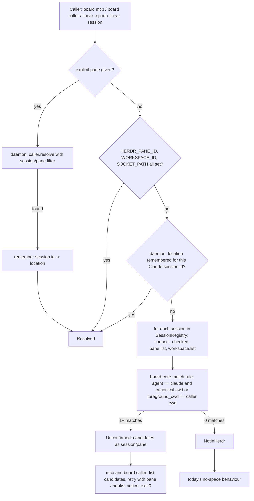

# Caller Pane Resolution - Plan

## Goal Capsule

- **Objective:** A Claude Code session in a herdr pane can open the board beside itself, bind its worktree under the right space, and have its Linear writes and session context attributed to its pane, even when Claude Code did not pass herdr's variables to it.
- **Means:** One caller-pane resolver: an explicit pane, then env, then a choice the daemon remembers for the Claude session, then a folder lookup across every herdr session that only offers candidates for the caller to confirm (KTD1, KTD2, KTD10).
- **Authority:** This plan, then `AGENTS.md` and `docs/protocol.md`. Settled decisions (Key Decisions below) are not reopened.
- **Stop conditions:** Stop and report if herdr 0.9.x stops exposing `agent` and `cwd` on `pane.list`, or if a fix would need a herdr mutation or a Board protocol bump.
- **Execution profile:** Rust workspace, test-first per crate, every gate through `./scripts/sandbox.sh`, never against the host herdr.
- **Who ships:** The agent opens the PR to `main` on `shawnroos/herdr-linear-board`. A maintainer runs Prepare Release for v0.18.1. Agents never create tags. U7 follows in the shrimpshack repo after the release.

---

## Product Contract

### Summary

The board learns where a calling Claude session sits even when the session's environment lacks `HERDR_PANE_ID`, `HERDR_WORKSPACE_ID` and `HERDR_SOCKET_PATH`. It asks the daemon, which looks across every herdr session for Claude panes in the caller's directory and returns them as candidates. The caller confirms one with a new `pane` argument; the daemon remembers that choice for the Claude session, so later tool calls and the hooks use it without asking again. `board mcp`, `board caller`, the `board linear report` hook and `board linear session` use the resolver. The status line and run-identity checks stay env-only.

### Problem Frame

Claude Code pre-starts "warm spare" processes from its daemon. A `claude` typed in a herdr pane takes over a spare, and that session's tools, hooks and MCP servers run without any `HERDR_*` variable, although the pane's shell has them. This was reproduced on 2026-10-08 with Claude Code 2.1.294 and herdr 0.9.3. A plain shell in the pane printed `HERDR_PANE_ID=w2:p2`, `HERDR_WORKSPACE_ID=w2` and `HERDR_SOCKET_PATH=...`. In the same pane, the claimed session's `env` held none of them.

Every board surface that reads only those variables is blind there:
- `board mcp` `open_board` fails with "board.pane.open requires a non-empty origin_pane".
- mark, note and ask_to_show are refused for `space ""`, and `state` silently returns an empty space.
- `board linear report` records activity with no space, so auto-link never fires.
- `board linear session` exits 64, so the SessionStart grounding is empty.

The work plugin's `/work setup` reports "not in herdr" for the same reason. The failure is not specific to one person or space: any session that claims a spare is affected.

### Key Decisions

- **Both repos ship a fix:** board v0.18.1 now, then work plugin 0.6.2 consumes it. (session-settled: user-approved — chosen over a setup-only fix or an upstream report alone: the board's own hooks and MCP tools are broken in these sessions, not just setup.) Governs R1, R9.
- **Never guess between several matching panes.** (session-settled: user-approved — chosen over taking the focused or first pane: a wrong pane misattributes writes and opens the board in someone else's tab.) Governs R4, R5.
- **Env comes before any lookup; the lookup runs only when env is missing.** (session-settled: user-approved — chosen over always asking herdr: env is exact and free when present.) Governs R2.
- **A folder match is offered, never used, until the caller confirms it once.** (session-settled: user-directed — chosen over using a single match automatically, or using it for reads only: a Claude session outside herdr in the same folder would otherwise take over another pane's identity.) Governs R4, R5, R11.
- **An explicit `pane` overrides env.** (session-settled: user-directed — chosen over env always winning: the caller named the pane on purpose, and nested sessions can inherit a parent's pane id.) Governs R2, R3.
- **The Claude Code defect is reported upstream as a written report, not worked around in Claude Code.** (session-settled: user-approved — chosen over code-only: the root cause is Claude Code's spare claim.) Governs R10.

### Requirements

**Resolution**
- R1. The board resolves a caller to a herdr location (socket, workspace, tab, pane) when the caller's env lacks herdr's variables.
- R2. When no `pane` is given and `HERDR_PANE_ID`, `HERDR_WORKSPACE_ID` and `HERDR_SOCKET_PATH` are all set, they are used unchanged and no lookup runs.
- R3. A caller may name its pane explicitly. An explicit pane wins over env, the remembered choice and the lookup, and is validated against herdr.
- R4. The folder lookup considers only panes whose agent is `claude` and whose `cwd` or `foreground_cwd` equals the caller's directory after canonicalization, across every herdr session the daemon can list.
- R5. The folder lookup never resolves a caller on its own. Any number of matches returns an "unconfirmed" result that lists each candidate's session, workspace label, pane id and terminal title, plus a session-qualified pane value (`<session>/<pane id>`) the caller passes back as `pane`.
- R11. A pane the caller confirms with `pane` is remembered by the daemon for that Claude session id, and every later resolve for the same session id uses it. The memory lasts until the daemon restarts.
- R6. The lookup is read-only: it never mutates herdr.

**Surfaces**
- R7. `board mcp` tools use the resolved location for claims, default space and `origin_pane`. Every tool that uses the caller's location accepts an optional `pane`. An unconfirmed result is a tool error that lists the candidates and tells the agent to ask the person whether this session runs in one of them (or in herdr at all) before passing `pane`.
- R8. `board linear report` and `board linear session` use the resolver within their existing time budgets and never fail because of it. They use a remembered choice (R11) and never confirm a pane themselves. `linear session` prints a short notice naming the candidates and how to confirm one when the result is unconfirmed, and exits 0 when it finds no space.

**Follow-on and report**
- R9. Work plugin 0.6.2 detects herdr through the same lookup, via a `board caller --json` command that board v0.18.1 ships, and asks the person to confirm a candidate when the result is unconfirmed.
- R10. A written bug report for Claude Code describes the spare-claim environment loss, with reproduction steps.

### Acceptance Examples

- AE1. **Covers R2.** Given a session whose env has all three variables, when it calls `open_board`, the board opens beside `HERDR_PANE_ID` and the daemon receives no lookup request.
- AE2. **Covers R1, R4, R5, R11.** Given a session with no `HERDR_*` env in directory D, and exactly one Claude pane with cwd D, when it calls `open_board` without `pane`, the tool fails, names that one candidate, and opens nothing. Retrying with `pane` set to its `<session>/<pane id>` value opens the board beside it, and a later `mark` without `pane` is recorded under that pane's space.
- AE3. **Covers R3, R5, R7.** Given two Claude panes with cwd D, the unconfirmed error names both. Retrying with one candidate's `<session>/<pane id>` value opens the board beside that pane only.
- AE6. **Covers R8, R11.** After the session confirmed pane P, a `board linear report` hook carrying the same Claude session id records activity under P's space.
- AE7. **Covers R2, R3.** A session with full env that passes `pane` set to a different pane opens the board beside the named pane.
- AE4. **Covers R8.** Given no matching pane, `board linear report` exits 0 with empty stdout and records activity without a space, as it does today.
- AE5. **Covers R4.** A shell pane (agent not `claude`) with cwd D is never a match.

### Scope Boundaries

- `helpers::actor_pane_id` (`board done`, `board comment`) stays env-only. The daemon treats a pane match as proof of run identity, so an inferred pane would widen trust. Daemon-spawned agent panes always carry env.
- The TUI (`board-tui/src/origin.rs`), `board-core/src/scope.rs` and `board tui --session` (`main.rs`) stay env-only. They run in plugin panes that herdr starts with full env.
- The `board linear session --status-line` mode stays env-only. Its 200 ms budget cannot hold a daemon round trip plus a herdr call per session.
- Out of scope: env that is present but wrong (nested or background Claude sessions inheriting a parent's `HERDR_PANE_ID`, recorded in `docs/herdr.md`). Env-first cannot detect it.

### Deferred to Follow-Up Work

- Matching by Claude session id instead of cwd. herdr 0.9.3 does not populate `agent_session` for Claude panes a person started (checked live on 2026-10-08), so there is no exact key today.

---

## Planning Contract

### Key Technical Decisions

- KTD1. **Precedence lives in a board-cli helper; the herdr lookup is a new daemon method.** `docs/protocol.md` says the daemon owns all herdr interaction, and board-cli does not depend on board-herdr. The helper applies explicit pane → env → daemon (remembered choice, then folder lookup) and returns `Resolved`, `Unconfirmed { candidates }` or `NotInHerdr`. It takes the caller's cwd as an argument, because each surface gets cwd differently: process cwd for mcp, and for the hooks `CLAUDE_PROJECT_DIR` (the session's launch directory) when set, else the hook payload or stdin cwd. The launch directory is used because herdr's pane cwd is where `claude` started; a session that later `cd`s into a subdirectory or worktree would otherwise stop matching. Governs R1–R3.
- KTD2. **The daemon method searches every herdr session from `SessionRegistry`.** The spare also loses `HERDR_SOCKET_PATH`, so the caller's session is unknown. The handler lists sessions, connects to each through `herdr_conn::connect_checked` (the 0.9.x / protocol-22 gate), runs `pane.list` and `workspace.list` (for the workspace labels R5 needs), and filters. A session that fails to connect is skipped and logged by the daemon; it never fails the whole lookup. Results carry the socket, because pane and workspace ids repeat across sessions. Model the handler on `pane.focus` in `crates/board-daemon/src/ops/panes.rs`. Governs R4, R6.
- KTD3. **The match rule is a pure function in board-core.** It takes plain pane records (agent, cwd, foreground_cwd, ids, title) and the caller's canonical cwd, and returns the outcome. The daemon maps `PaneInfo` into those records, so the rule is testable without a fake herdr and keeps herdr types out of board-core. Governs R4, R5.
- KTD4. **`board-herdr::PaneInfo` gains `foreground_cwd`** with `#[serde(default)]`. herdr 0.9.3 sends it on `pane.list` (checked live). `agent_session` is not added, because nothing populates it for these panes (Deferred).
- KTD5. **`board mcp` resolves per tool call and caches only a `Resolved` result** for the life of the process. It never resolves at startup, because `initialize` / `tools/list` must not start boardd. `Unconfirmed` and `NotInHerdr` are not cached, because a pane can appear or be confirmed later. A `Resolved` result reached through an explicit `pane` replaces the cache. Governs R7.
- KTD6. **An explicit `pane` is session-qualified and resolved by the same daemon method.** Pane ids repeat across herdr sessions (`w1:p2` exists in each), so candidates print `<session>/<pane id>`, using the session name from `SessionRegistry`, and `pane` accepts that form. The method filters by session and pane id together. A bare pane id searches every session and returns unconfirmed candidates if it repeats. Validation then happens where it already does: `board.pane.open` calls `pane.get` on the resolved socket. Governs R3, R5.
- KTD9. **`board caller --json` is the shell-callable surface of the resolver.** The work plugin is bash and cannot call MCP tools or daemon methods, so the board ships one read-only verb. It runs the KTD1 helper with the process cwd and an optional `--pane`, and prints the state (`resolved`, `unconfirmed` or `not_in_herdr`) with the location or candidates. With `--pane`, a successful resolve is remembered for the caller's Claude session (KTD10), which is how setup confirms the person's choice. Governs R9.
- KTD10. **The daemon remembers confirmed locations in memory, keyed by Claude session id.** Every caller already sends `CLAUDE_CODE_SESSION_ID` (mcp) or the hook payload's `session_id` (hooks) in its claims. `caller.resolve` with a `pane` that resolves stores session id → location; without a `pane` it returns the stored location before any folder lookup. The map lives in the daemon process, not SQLite, so no schema change is needed (KTD8); a daemon restart clears it and the agent confirms again. A caller without a session id gets no memory and confirms per process. Governs R11.
- KTD7. **`board linear session` without a space prints a notice and exits 0** instead of exiting 64. It is a SessionStart hook verb, and a hook that fails leaves the session with no context. `board linear snapshot` keeps its exit-64 shape, which is pinned in `tests/integration/linear.rs`, and gains only the resolver fallback. Governs R8.
- KTD8. **No protocol or schema bump.** A new daemon method and optional MCP arguments are additive under Board socket protocol v1 and SQLite schema v16. The herdr gate stays at 0.9.x / protocol 22.

### High-Level Technical Design

### Assumptions

- herdr reports `agent: "claude"` for a pane whose foreground process is a `claude` front end that claimed a spare. Observed live: pane `w2:p1` showed `agent: claude`.
- `herdr session list --json` (used by `SessionRegistry`) lists the default session and the named sessions under `~/.config/herdr/sessions/`.
- `CLAUDE_CODE_SESSION_ID` in a claimed spare's `board mcp` equals the `session_id` its hooks receive. KTD10 depends on this. It is not provable in the sandbox, so U4 verifies it on the host with a read-only check before U5 relies on it. If it fails, hooks keep today's no-space behaviour and mcp memory is per process.

### Sequencing

U1 and U2 have no dependencies on each other and can run in parallel. U3 needs both. U4 needs U3. U5 needs U3 and U4's session-id check. U6 needs U4 and U5. U7 needs the v0.18.1 release.

---

## Implementation Units

### U1. Decode foreground_cwd on herdr panes

- **Goal:** `PaneInfo` carries `foreground_cwd` from herdr 0.9.x.
- **Requirements:** R4 (KTD4).
- **Dependencies:** none.
- **Files:** `crates/board-herdr/src/types.rs`, `crates/board-herdr/tests/` (decode test).
- **Approach:** Add an optional field with a serde default, so older payloads still decode. Leave the protocol-20 `schema.json` fixture and its `test_docs.py` pin unchanged.
- **Test scenarios:**
  - A `pane.list` payload with `foreground_cwd` decodes it.
  - A payload without it decodes to `None`, and every other field is unchanged.
- **Verification:** The board-herdr tests pass in the sandbox.

### U2. Pure caller-match rule and protocol types

- **Goal:** board-core owns the match rule and the `caller.resolve` request/result types, plus the client wrapper and the fake client.
- **Requirements:** R4, R5, R11 (KTD3, KTD8, KTD10).
- **Dependencies:** none.
- **Files:** `crates/board-core/src/engine/` (new module for the match rule), `crates/board-core/src/protocol.rs`, `crates/board-core/src/client/traits.rs`, `crates/board-core/src/client/fake.rs`, `crates/board-core/tests/` (match rule tests).
- **Approach:**
  1. Params: caller cwd, optional `pane` (`<session>/<pane id>` or a bare pane id), optional Claude session id.
  2. Result: one tagged enum: resolved location, unconfirmed candidates, or not in herdr. Unreachable herdr sessions are logged by the daemon, not returned.
  3. The rule canonicalizes paths (resolve symlinks, strip trailing slash) before comparing, and checks `cwd` and `foreground_cwd`. Folder matches always produce candidates, never a resolved location (R5).
- **Patterns to follow:** `BoardPaneOpenParams` in `protocol.rs`, the `board_pane_open` wrapper in `client/traits.rs`, and existing pure rules in `engine/`.
- **Test scenarios:**
  - Covers AE2. One Claude pane with matching cwd returns one unconfirmed candidate, not a resolved location.
  - Covers AE3. Two Claude panes with matching cwd in different sessions return both as candidates, each with its `<session>/<pane id>` value.
  - Covers AE5. A non-claude pane with matching cwd is ignored.
  - A pane matching only on `foreground_cwd` is a candidate.
  - A path through a symlink, or with a trailing slash, still matches.
  - A `<session>/<pane id>` filter returns exactly that pane as resolved; a bare id present in two sessions returns both as candidates.
  - Zero panes returns not in herdr.
- **Verification:** The board-core tests pass. The fake client implements the method, so the parity guard in `crates/board-daemon/src/ops/tests/parity.rs` stays green.

### U3. Daemon caller.resolve method and session memory

- **Goal:** boardd answers `caller.resolve` by searching every herdr session read-only, and remembers confirmed locations per Claude session.
- **Requirements:** R1, R3, R4, R5, R6, R11 (KTD2, KTD6, KTD10).
- **Dependencies:** U1, U2.
- **Files:** `crates/board-daemon/src/ops/panes.rs`, `crates/board-daemon/src/ops/mod.rs` (route), the daemon state that holds the session-memory map, `crates/board-daemon/src/ops/tests/panes.rs`, `docs/protocol.md`.
- **Approach:**
  1. With a `pane`: look it up (step 3), and on a single hit store session id → location when a session id was sent, then return resolved.
  2. Without a `pane`: return the stored location for the session id when one exists.
  3. Otherwise list sessions from `SessionRegistry`. For each, `connect_checked`, then `pane.list` and `workspace.list`, then map to board-core records with the session's name, socket and workspace label. Apply the U2 rule.
  4. A session that cannot connect, or fails the version gate, is skipped and logged.
  5. Document the method under `### panes`, add it to the client-boundary method list, and add it to the gate list in `docs/protocol.md`.
- **Patterns to follow:** `pane.focus` in `ops/panes.rs`; `testkit.rs` `herdr_server()` for fake herdr sockets.
- **Test scenarios:**
  - Two fake herdr sessions, each with one Claude pane in cwd D, return two candidates with their sockets.
  - A matching pane in one session and an unreachable second session return that one candidate; the unreachable session does not fail the call.
  - A session on the wrong herdr protocol is skipped and never queried for panes.
  - No request other than reads (the gate's version calls, `pane.list` and `workspace.list`) reaches any fake herdr.
  - Candidates carry the workspace label from `workspace.list`.
  - A `<session>/<pane id>` filter resolves that pane when the same pane id exists in two sessions.
  - Covers AE6. A resolve with `pane` and session id S, then a resolve with only session id S, returns the remembered location without querying herdr.
  - A remembered location for session S is not returned for session T.
  - A resolve with `pane` but no session id resolves and remembers nothing.
- **Verification:** The daemon tests pass, and `docs/protocol.md` lists the method.

### U4. Caller resolver in board-cli, board mcp and board caller

- **Goal:** `board mcp` and `board caller` work in a session without herdr env, and ask the caller to confirm a pane when it was only found by folder.
- **Requirements:** R2, R3, R5, R7, R9, R11 (KTD1, KTD5, KTD6, KTD9).
- **Dependencies:** U3.
- **Files:**
  - `crates/board-cli/src/caller.rs` (new): the precedence helper. It also folds the duplicate `env_text` / `env_id` helpers in `mcp.rs` and `linear_report.rs`.
  - `crates/board-cli/src/mcp.rs`: `Caller::from_environment` uses the helper; `pane` is added to every tool that uses the caller's location (`state`, `panes_for_issue`, `mark`, `unmark`, `note`, `ask_to_show`, `withdraw_show`, `open_board`, `close_board`, `bind`, `unbind`) and to `notify`, which needs only a herdr socket that a `<session>/<pane id>` value supplies; the `space` docstrings stop saying "this pane's HERDR_WORKSPACE_ID".
  - `crates/board-cli/src/commands/caller.rs` (new) plus its clap entry under `crates/board-cli/src/args/`: the `board caller --json` verb (KTD9), with output through `render.rs`.
  - `crates/board-cli/tests/integration/mcp.rs`, `crates/board-cli/tests/integration/caller.rs` (new).
- **Approach:**
  1. Fill `claims.herdr_pane_id`, `herdr_workspace_id` and `herdr_socket` from the resolved location, so space defaults, writes and `origin_pane` all follow one source.
  2. Send `CLAUDE_CODE_SESSION_ID` as the session id on every resolve.
  3. Render an unconfirmed result as a tool error that lists the candidates and their `pane` values, and tells the agent to confirm with the person that this session runs in one of them before retrying. It never suggests retrying without asking.
  4. `recording_boardd` answers one request; add a multi-request variant for tests that make two calls.
- **Execution note:** Before U5 starts, confirm KTD10's assumption from the board's own data, not by reading another process's environment. Evidence so far: Claude Code's record for the spare (pid 93006) carries the same session id as the w2 session's transcript, which is what hooks receive as `session_id`. The remaining check: activity rows that session wrote through `board mcp` and through `board linear report` carry the same Claude session id. Record the result in the PR.
- **Test scenarios:**
  - Covers AE1. With full env and no `pane`, `open_board` sends `board.pane.open` with the env pane, and the daemon sees no `caller.resolve`.
  - Covers AE7. With full env and `pane` naming another pane, the call resolves through the pane filter and opens beside the named pane.
  - Covers AE2. With no env and one candidate, `open_board` returns an error naming it, and `board.pane.open` is never sent.
  - Covers AE2. Retrying with that candidate's `<session>/<pane id>` opens; a later `mark` without `pane` is recorded under that pane's space and makes no folder lookup.
  - Covers AE3. With two candidates, the error names both; a retry with one opens beside that pane only.
  - After an unconfirmed result, the next call resolves again.
  - `board caller --json` prints `resolved`, `unconfirmed` with candidates and their `<session>/<pane id>` values, and `not_in_herdr`, one test each.
  - `board caller --json --pane <value>` prints `resolved` and the daemon remembers it for the session id.
  - `board caller --json` with full env prints the env location without contacting the daemon.
  - `initialize` and `tools/list` still never start boardd (existing pin).
  - The tool list still has 12 tools, and each caller-location tool's schema includes `pane`.
- **Verification:** The board-cli tests pass in the sandbox.

### U5. Hooks use the resolver

- **Goal:** `board linear report` and `board linear session` attribute work to the confirmed pane in a session without herdr env.
- **Requirements:** R8, R11 (KTD1, KTD7, KTD10).
- **Dependencies:** U3, and U4's session-id check.
- **Files:**
  - `crates/board-cli/src/commands/linear_report.rs`
  - `crates/board-cli/src/commands/linear_session.rs`
  - `crates/board-cli/src/commands/discovery.rs` (snapshot fallback only)
  - `crates/board-cli/tests/integration/report.rs`
  - `crates/board-cli/tests/integration/linear.rs`
- **Approach:**
  1. Both hooks send the hook payload's `session_id` and the KTD1 cwd. They never pass `pane`, so they only use a remembered choice and never confirm one.
  2. `linear report`: the resolve call gets its own read timeout of at most 1 s, capped by what remains of `REPORT_TIMEOUT`. On timeout or error it drops that connection and sends `linear.activity.record` on a fresh connection with today's claims, so the activity record is never lost to the lookup.
  3. `linear session`: when unconfirmed, it prints a one-line notice naming the candidates and saying the agent asks the person which one is this session before confirming it with `pane`. With no space, it prints a notice and exits 0 (KTD7).
  4. The status-line mode is untouched.
- **Test scenarios:**
  - Covers AE4. `linear report` with no env and no remembered location exits 0 with empty stdout and records activity without a space.
  - Covers AE6. `linear report` with no env and a remembered location for its session id records activity with that space and pane, so auto-link can fire.
  - `linear report` with no env and one folder candidate but no remembered location records activity without a space.
  - `linear report` whose resolve call stalls still exits 0 within `REPORT_TIMEOUT`, and the activity row is still recorded, without a space.
  - `linear report` whose payload cwd is a subdirectory of the pane's cwd, with `CLAUDE_PROJECT_DIR` set to the pane's cwd, finds the pane as a candidate.
  - `linear session` with a remembered location prints that space's session context.
  - `linear session` with an unconfirmed result prints a notice naming the candidates and exits 0.
  - `linear session` with no env and no daemon still prints nothing that fails, and does not start the daemon (existing pin).
  - `linear snapshot` with no space and no match keeps its exit-64 error shape.
  - Status line with no env prints nothing (existing pin).
- **Verification:** The board-cli tests pass in the sandbox.

### U6. Live scenario, docs and changelog

- **Goal:** A real herdr run proves the fallback, and the docs describe it.
- **Requirements:** R1, R5, R7, R10, R11.
- **Dependencies:** U4, U5.
- **Files:**
  - `e2e/46-caller-without-herdr-env.sh` (new), `e2e/run-all.sh`, `e2e/README.md` catalog row.
  - Range strings "01–46" in `docs/README.md`, `AGENTS.md`, `README.md`, `docs/testing.md` and `docs/implementation.md`.
  - `scripts/tests/test_docs.py` if a pin needs it.
  - `docs/herdr.md` and `docs/design.md` identity sections.
  - `CHANGELOG.md` Unreleased.
  - `docs/upstream/claude-code-spare-env.md` (the R10 report).
- **Approach:**
  1. Copy `e2e/43-open-board-pane.sh`. In the scenario's ephemeral session, create a disposable pane that reports `agent: claude` with cwd D, as `e2e/fake-bin/managed-agent-report.py` does.
  2. Run `board mcp` with every `HERDR_*` variable unset, cwd D and a fixed `CLAUDE_CODE_SESSION_ID`. To prove the memory lives in the daemon, not the mcp process cache, the later checks use a second process with the same session id (`board caller --json`).
  3. Assert `open_board` without `pane` refuses and names the candidate, then a retry with its `<session>/<pane id>` opens beside it.
  4. Add a second Claude pane in D, then assert a fresh session id gets both candidates.
  5. Prefix every herdr mutation with `HERDR MUTATION:`.
- **Test scenarios:**
  - Covers AE2. One Claude pane in D: refusal names it; retry with `pane` opens beside it; a separate `board caller --json` with the same session id reports that pane as resolved.
  - Covers AE3. Two Claude panes in D: refusal names both; retry with `pane` opens beside the chosen one.
- **Verification:** `./scripts/sandbox.sh gates` passes, including the live suite with scenario 46. The `test_docs.py` pins pass.

### U7. Work plugin 0.6.2 uses the lookup (shrimpshack)

- **Target repo:** shrimpshack (`plugins/work`), after board v0.18.1 is released.
- **Goal:** `/work setup` and `/work` find the herdr pane in a session without herdr env.
- **Requirements:** R9.
- **Dependencies:** v0.18.1 released and installed.
- **Files:** `plugins/work/bin/setup-check.sh`, `plugins/work/skills/setup/SKILL.md`, `plugins/work/commands/work.md`, `plugins/work/tests/unit/setup-check.bats`, `plugins/work/tests/fixtures/fake-board.sh`, `plugins/work/tests/unit/wire.bats`, the plugin manifests and the README row.
- **Approach:**
  1. `in_herdr` uses env first. Otherwise it runs `board caller --json` (KTD9) and reads its state.
  2. `resolved` gives `ok` with `pane` and `workspace` fields. `unconfirmed` gives `unknown` with a `candidates` array. `not_in_herdr` gives `missing`. The state enum does not change.
  3. The skill asks the person to confirm a candidate (even when there is only one), runs `board caller --json --pane <value>` to record it, then passes the pane to `open_board`.
  4. The check requires board 0.18.1 or later.
- **Test scenarios:**
  - Env present gives `ok` from env.
  - Env absent with a remembered location gives `ok` with the pane.
  - Env absent with one candidate gives `unknown` with that candidate.
  - Env absent with two candidates gives `unknown` with both.
  - Env absent with no match gives `missing`.
  - `/work` and `setup-check.sh` agree, through the existing wire test.
- **Verification:** `bash plugins/work/tests/run-tests.sh all` passes. A live `/work setup` in a spare-claimed session reaches the space binding.

---

## Verification Contract

| Gate | Command | Proves |
|---|---|---|
| Rust and docs gates | `./scripts/sandbox.sh prepare` then `./scripts/sandbox.sh gates` | U1–U6 unit, integration and live e2e, including scenario 46 |
| Python doc pins | part of the sandbox gates (`scripts/tests/test_docs.py`) | catalog range, CHANGELOG format, version matrix unchanged |
| Plugin tests | `bash plugins/work/tests/run-tests.sh all` (shrimpshack) | U7 |
| Live check | `/work setup` in a herdr pane whose Claude claimed a spare | Objective |

Nothing runs against the host herdr or the user's sessions.

## Definition of Done

- Every unit's verification holds, and the sandbox gates pass on the PR head.
- The CHANGELOG Unreleased entry, `docs/protocol.md`, `docs/herdr.md` and `docs/design.md` describe the fallback.
- The upstream report exists at `docs/upstream/claude-code-spare-env.md`.
- No abandoned-attempt code remains in the diff.
- v0.18.1 is released by the maintainer workflow, and U7 ships as work 0.6.2.

## Sources & Research

- Reproduction evidence: the claimed session's process chain, `herdr pane process-info --pane w2:p1`, a plain shell's env in the same tab, and the claimed session's transcript `env` output (2026-10-08).
- Claude Code 2.1.294 applies the claimant's env on spare claim and logs dropped variables, but `HERDR_*` did not arrive. Root cause is upstream (R10).
- Every env read site, with what it uses the value for: `crates/board-cli/src/mcp.rs:57-110`, `commands/linear_report.rs:63-108`, `commands/linear_session.rs:36-92`, `commands/discovery.rs:86-91`, `helpers.rs:63-69`, `crates/board-daemon/src/ops/runs.rs:34-40`.
- herdr session listing: `crates/board-daemon/src/session.rs` `SessionRegistry`; the gate is `crates/board-daemon/src/herdr_conn.rs`.
- Prior rule "auto-link only on exactly one match" and "the report verb always exits 0": `docs/plans/2026-09-29-2127-feat-board-owns-the-store-migration-plan.md` (KTD12, KTD8).
